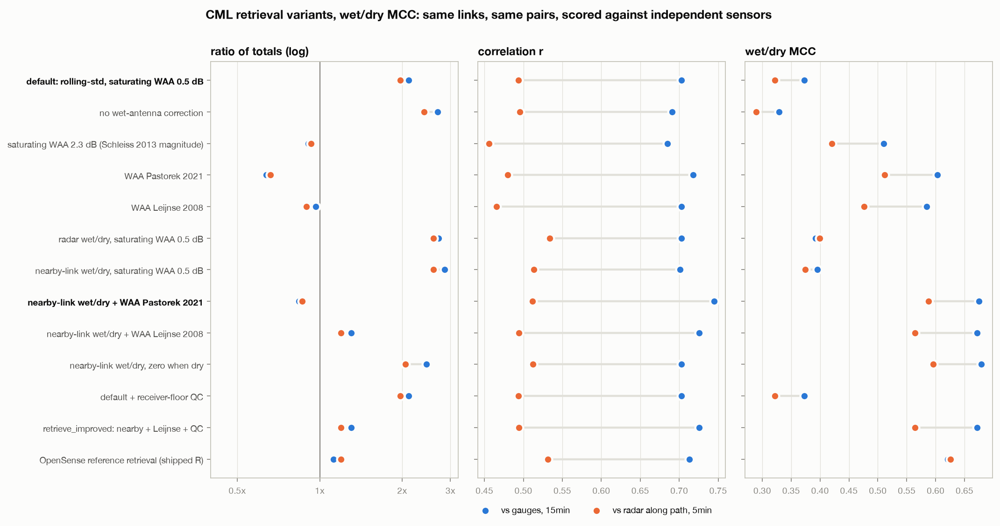
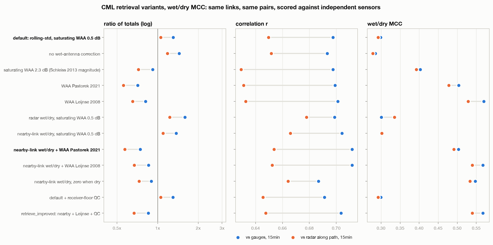
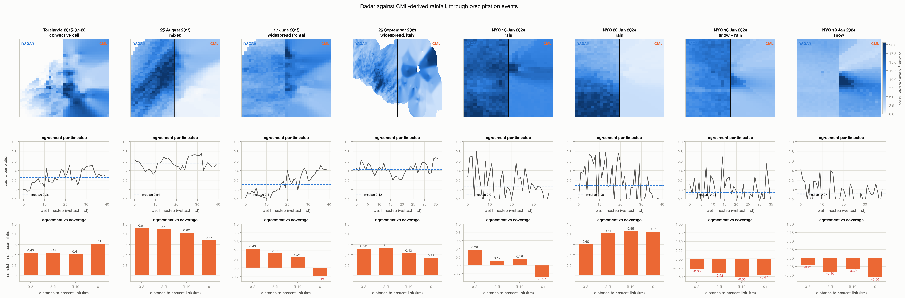

# OpenSense Pipeline — from raw CML data to merged rainfall maps

> **Frozen.** This was FieldSense's first end-to-end version; [`maps/multisensor`](../multisensor/),
> [`maps/radar_adjustment`](../radar_adjustment/) and [`maps/nyc`](../nyc/) supersede it. Its
> results are kept as computed. They predate one fix in `core/opensense/retrieval.py`
> (October 2026): the default "saturating" wet-antenna model was inverted by 8 fixed-point
> steps that do not converge on low-sensitivity links (about 15 GHz and below, or short 20-30
> GHz links), where light rain came back as 0. A rerun would raise light rain on those links,
> mostly on OpenRainER and OpenMesh.

End-to-end path from **published open data** to **merged rainfall maps**, built
on the [OpenSense](https://opensenseaction.eu/) software ecosystem
([`poligrain`](https://github.com/OpenSenseAction/poligrain),
[`mergeplg`](https://github.com/OpenSenseAction/mergeplg)) and run on two
independent datasets from two countries.

```
fetch  →  ingest  →  CML retrieval  →  [synthetic benchmark]  →  merge  →  maps
                          ↑
             scored against radar and gauges with poligrain
```

The bracketed stage is the point of the design. See *Why a synthetic stage*.

**Start with `notebooks/02_end_to_end.ipynb`.** It takes one day of OpenMRG
through every stage (pull, look, retrieve, score, improve, map) in about a
minute and under 50 lines of code: every cell is a call into `core.opensense`.

## Findings at a glance

- **Which map wins depends on which sensor is weaker.** Against held-out
  gauges, the dense Swedish network alone beats radar and every merge (RMSE
  4.45 vs 6.16 mm/h); on the sparse Italian network merging only edges
  radar overall (7.90 vs 8.00), and all of its gain is within 5 km of a
  link (−11% within 2 km; beyond 5 km radar alone is best).
- **The retrieval's magnitude is set by the wet-antenna term, and the
  default does not transfer.** The ratio to the OpenSense reference moves
  from 1.93 to 0.74 across plausible settings; `retrieve_improved`
  (nearby-link wet/dry, Leijnse wet antenna, receiver-floor QC) improves
  link-level detection and correlation on both networks, but not merged-map
  RMSE, so it stays opt-in.
- **Radar is not always the reference.** Over Manhattan the CML retrieval
  correlates +0.53 with personal weather stations and ~0 with KOKX radar,
  whose beam passes far above the city. In snow the CML signal carries no
  precipitation information at all.
- **Traps recorded below:** end-stamped OpenRainER references,
  poligrain reading link length in coordinate units, low bands whose rain
  signal sits below the RSL quantization.

## Contents

1. [Running it](#running-it) - install, example subsets, full records
2. [The data](#the-data) - OpenMRG and OpenRainER
3. [CML retrieval](#cml-retrieval) - the chain, its traps, what sets the magnitude
4. [Checking the retrieval against OpenSense's own](#checking-the-retrieval-against-opensenses-own)
5. [Improving the retrieval with the OpenSense ecosystem](#improving-the-retrieval-with-the-opensense-ecosystem)
6. [Radar against CML maps, through precipitation events](#radar-against-cml-maps-through-precipitation-events)
7. [Why a synthetic stage](#why-a-synthetic-stage)
8. [Results](#results) - synthetic and real merging, distance to links, mergeplg `main`
9. [Figures](#figures), [Layout](#layout), [Notes](#notes), [Related](#related), [References](#references)

## Running it

```bash
python -m venv .venv
.venv/bin/pip install -e ".[opensense,notebooks,dev]"       # core + OpenSense stack
.venv/bin/pip install -r projects/maps/archive_pipeline/requirements.txt
.venv/bin/python -m pytest                                   # the whole suite, offline
```

### The library in ten lines

Everything reusable lives in `core/opensense/`; the scripts in `src/` are
experiments built on it.

```python
from core.opensense import example_data, retrieval as rt, wet_dry, evaluation as ev

data = example_data.load("openmrg", "8d", time=slice("2015-07-28", "2015-07-28"))
cml, radar, gauges = data["cml"], data["radar"], data["gauge_municipal"]

out = rt.retrieve_dataset(cml)                            # R, A_obs, waa, baseline, wet
rain = rt.combine_sublinks(out).R                         # (time, cml_id), mm/h

radar_path = ev.radar_along_links(radar.R, cml)           # poligrain GridAtLines
ev.skill_table({"default": rain}, {"radar": (radar_path, "5min")})   # ratio, r, MCC
```

The improved retrieval (see *Improving the retrieval*) is one more line.
`nearby_links` needs about a day of history, so give it more than the window
you score:

```python
mask = wet_dry.fill_undecided(wet_dry.nearby_links(cml), cml)
out = rt.retrieve_dataset(cml, rt.RetrievalConfig.for_interval(10, waa_model="pastorek2021"),
                          wet=mask)
```

There are **two tiers of data acquisition**, and which you want depends on
whether you are exercising the code or doing the science.

### Example subsets — seconds, ~57 MB

The curated subsets the OpenSense community publishes. Already on the
OpenSense-1.0 convention, so no retrieval chain is needed to look at them.

```bash
.venv/bin/python -m core.opensense.example_data --list
.venv/bin/python -m core.opensense.example_data --dataset openmrg --subset 8d
.venv/bin/python -m core.opensense.example_data --all
```

```python
from core.opensense import example_data
data = example_data.load("openmesh", "20d")     # dict: cml, pws, asos
data["cml"].frequency_ghz                       # normalized on load
example_data.load("openmrg", "8d", time=slice("2015-07-28", "2015-07-28"),
                  components=("cml", "radar"))  # a window, before reading
```

`examples/` at the repository root has a notebook per dataset: reading it,
its structure, the traps in its files, and first plots with `poligrain`.

| dataset | subsets | components |
|---|---|---|
| `openmrg` | `8d`, `5min_2h` | cml, radar, gauge_municipal, gauge_smhi |
| `openrainer` | `8d` | cml, radar, gauge |
| `openmesh` | `1d`, `1w`, `20d` | cml, pws, asos *(20d only)* |
| `ams_pws` | `full_period` | pws, gauge |

### Full records — 8.4 GB, the actual experiments

```bash
.venv/bin/python -m core.opensense.fetch --list        # look, don't fetch
.venv/bin/python -m core.opensense.fetch --dataset openmrg
.venv/bin/python projects/maps/archive_pipeline/src/run_pipeline.py
```

Downloads resume and are md5-verified, and an already-verified file is
skipped, so re-running costs nothing.

### Choosing where the pipeline reads from

```bash
# the full archives already on disk — never touches the network
.venv/bin/python projects/maps/archive_pipeline/src/run_pipeline.py --source raw --offline

# the small subsets instead; downloads ~57 MB on first use, then cached
.venv/bin/python projects/maps/archive_pipeline/src/run_pipeline.py --source example
```

`--source raw` (the default) reads the extracted Zenodo archives.
`--source example` runs the identical pipeline on the curated subsets — same
retrieval chain, same merge methods, same figures. `--offline` refuses to
download anything and fails with the command to run instead, so a machine that
already has the data never re-fetches it.

Results are namespaced by source (`openmrg_2_maps.png` vs
`openmrg_2_maps_example.png`), because the subsets cover a different period
from the curated events and would otherwise overwrite them.

## The data

| | OpenMRG (Sweden) | OpenRainER (Italy) |
|---|---|---|
| region | Gothenburg | Emilia-Romagna |
| DOI | [10.5281/zenodo.7107689](https://doi.org/10.5281/zenodo.7107689) | [10.5281/zenodo.22829808](https://doi.org/10.5281/zenodo.22829808) |
| license | CC-BY-SA-4.0 | CC-BY-4.0 |
| CML | 728 sublinks → 364 links, raw TSL/RSL at **10 s** | 151 links × 2 sublinks, raw TSL/RSL at **1 min** |
| radar | 48 × 37 at ~2 km, 5 min, pseudo-dBZ | 290 × 373 at ~1 km, 15 min, mm |
| gauges | 10 municipal | 319 AWS |
| download | 318 MB zip (4.6 GB unpacked) | 1.44 GB of 4.6 GB |

Time labels: OpenRainER's 15-minute radar and gauge accumulations are stamped at the
interval end; every convention and file location is in [`DATA.md`](../../../DATA.md).

The two have **opposite sensor balances** — OpenMRG is link-rich and
gauge-poor, OpenRainER the reverse — which is exactly why running both is
worth the effort.

Neither ships rainfall. Both ship raw transmitted and received power, so the
retrieval chain is part of the pipeline, not a preprocessing step someone else
did.

## CML retrieval

Per sublink: total loss `A = TSL − RSL` → rolling-standard-deviation wet/dry
→ dry-weather baseline → wet-antenna removal → `R = (A_rain/(kL))^(1/α)` with
ITU-R P.838-3 coefficients from `core/itu_p838.py` → average the two
directions of each link.

**Validation against gauges**, matched pairs within 3 km (OpenMRG) / 5 km
(OpenRainER), same retrieval parameters for both:

| | median CML/gauge ratio | corr(CML, gauge) | corr(radar, gauge) |
|---|---|---|---|
| OpenMRG, 25 Aug 2015 | 0.79 | 0.80 | 0.52 |
| OpenRainER, 26 Sep 2021 | **1.01** | 0.81 | 0.60 |

On both datasets the CML retrieval tracks the gauges **better than the radar
does**, which is the entire premise of opportunistic sensing.

### Traps worth recording

Each of these produced a silently wrong answer rather than an error. The last
three were found while consolidating the code, and each now has a test in
`tests/`.

**Radar was being scaled twice.** OpenMRG stores pseudo-dBZ with
`scale_factor=0.4`, `add_offset=-30`, and the dataset readme documents the
transform — but xarray applies it automatically on read. Applying it again
drove the radar field to a flat 0.0 mm/h while gauges read 24 mm/h. The file
also carries its own Z-R coefficients (`zr_b = 1.5`, not the textbook 1.6),
now preferred over the default.

**Units differ between every source, and are sometimes undeclared.**
OpenRainER's raw files declare `length` in metres and `frequency` in MHz;
OpenMRG's use km and GHz. Feeding metres into `k·L` and MHz into the ITU-R
table retrieves exactly zero rain everywhere — no error, no warning. Worse,
the *example subsets* ship MHz with **no units attribute at all**, and
polarization is spelled `Vertical`, `vertical` or `v` depending on the file.

`core/opensense/conventions.py` holds the full table of who disagrees with whom, reads the
declared units where present, and falls back on magnitude where absent —
nothing terrestrial transmits at 7,456 GHz, so that value is MHz.

**Per-sublink metadata was matched to the wrong sublink.** The OpenSense
files store `frequency` and `polarization` as `(sublink_id, cml_id)` and the
signals as `(time, sublink_id, cml_id)`. Two scripts flattened the signals as
(link, sublink) and the metadata as stored, so on the example subsets **every
one of the 364 OpenMRG links** had its second sublink retrieved with another
link's frequency (link 10001: 29.2 GHz treated as 38.5 GHz). Retrieved totals
came out 13% high. `retrieval.retrieve_dataset` now broadcasts metadata by
dimension *name*, and `validate_retrieval.py` and `run_pipeline.py --source
example` both go through it. The raw-archive ingests were never affected.

**OpenRainER's example radar `R` is an accumulation.** The subset names the
variable `R`, the name OpenMRG uses for a rate, but declares `units: mm` and
`accum_time_h: 0.25`. Read as mm/h it is 4x too low. `example_data` now
converts from the declared units, so `--source example` results for OpenRainER
change; the raw-archive ingest always did the ×4.

**poligrain reads `length` in the units of the coordinates.**
`get_closest_points_to_line` searches `length/2 + max_distance` around each
link midpoint, in metres. With `length` in km, as this pipeline and the
normalized OpenSense files carry it, that radius shrinks from 3 km to 1.002 km
for a 4 km link. On OpenMRG it matches 43 links to gauges where 86 are within
1 km of a path. `evaluation.closest_gauges` always passes metres.

**A receiver at its floor is not a measurement.** When a link loses signal,
RSL clips at the receiver's sensitivity (−90 dBm on OpenMRG and OpenMesh,
−100 to −103 dBm on OpenRainER) and the recorded loss becomes a lower bound.
Retrieved as rain, one outage produced 4,270 mm on a single link. The
detector in `core/opensense/quality.py` flags a sublink sitting within 1 dB
of its own minimum, at least 20 dB below its median level, for 10 minutes
or more. A real fade touches its deepest point briefly; a clipped receiver
lingers. That flags 3 of 728 OpenMRG sublinks, 24 of 302 OpenRainER and none
of OpenMesh's. It is off in the default chain so published results
reproduce, and on in `retrieve_improved`.

**Zeroing rain on the dry flag deletes steady rain.** The rolling-standard-
deviation classifier keys on *fluctuation*, and widespread stratiform rain
attenuates steadily, so hours of real rain get labelled dry. Subtracting the
baseline everywhere is sufficient; that alone moved CML/gauge totals from 0.24
to 0.65.

### What actually sets the magnitude

Two parameters dominate, and both are recorded with their sensitivity rather
than quietly tuned. Measured on OpenMRG, 25 August:

| baseline window | wet-antenna max | CML/gauge ratio | corr |
|---|---|---|---|
| 1 h | 0.5 dB | 0.68 | 0.80 |
| 3 h | 0.0 dB | 0.94 | 0.80 |
| 3 h | **0.5 dB** ← used | **0.79** | **0.79** |
| 3 h | 1.0 dB | 0.64 | 0.78 |
| 3 h | 2.3 dB (Schleiss et al. 2013) | 0.35 | 0.75 |

A one-hour centred median absorbs a multi-hour event into its own dry
reference. And the literature 2.3 dB wet-antenna value is far too aggressive
for this network: a 2 km link at 23 GHz develops only ~2.7 dB of rain
attenuation at 10 mm/h, so subtracting 2.3 dB removes most of the signal.

Correlation is flat at 0.75–0.80 across the entire range. **These knobs move
magnitude, never skill** — which is why the merge comparison downstream is
robust to them.

## Checking the retrieval against OpenSense's own

The retrieval had no independent check: it was scored against rain gauges,
which are sparse point sensors measuring something different from a path
average, so a disagreement could not be attributed to either side.

The OpenMRG `8d` subset closes that gap. It ships raw `tsl`/`rsl` **and** a
reference rain rate `R` that the OpenSense community retrieved from exactly
those signals: 364 links at 10 s over 2015-07-22 to 07-29, a window that
contains the Torslanda event. Both retrievals see identical input.

```bash
.venv/bin/python projects/maps/archive_pipeline/src/validate_retrieval.py --offline
.venv/bin/python projects/maps/archive_pipeline/src/validate_retrieval.py --offline --sweep
```

**The chain has the right skill and the wrong magnitude.** Over the full 8 days
(22.5 M link-timesteps):

| | full 8 days | Torslanda window |
|---|---|---|
| correlation with the reference | 0.939 | 0.958 |
| wet/dry agreement | 81.0% | 81.0% |
| mean rain, ours / reference | 0.441 / 0.266 mm/h | 1.171 / 0.713 mm/h |
| ratio of totals | **1.66** | **1.64** |

An earlier version of this table read correlation 0.878 and ratio 1.75. Both
came from the sublink-ordering bug above, which scrambled half of every
link's frequencies; fixed, the two retrievals agree more closely than they
appeared to. The magnitude gap remains, and
`retrieval_vs_reference_torslanda.png` shows its shape: the same timing, the
same peaks, uniformly scaled up. That is a calibration error, not a skill
error.

### The wet-antenna default is not transferable

`--sweep` varies the saturating wet-antenna term against the reference:

| waa_max_db | ratio to reference (8d) | ratio (Torslanda) | corr (8d) |
|---|---|---|---|
| 0.0 | 1.93 | 1.79 | 0.920 |
| 0.5 *(current default)* | 1.58 | 1.54 | 0.939 |
| 1.5 | 1.04 | 1.13 | 0.954 |
| 2.3 *(Schleiss et al. 2013)* | 0.74 | 0.88 | 0.948 |

Against the reference, 1.5 dB fits. Against the aug25 **gauges**, 0.5 dB gives
0.79 and 1.5 dB gives 0.53. No single static value satisfies both, and the
next section shows why: the constant was compensating for a baseline error.
**The default is left at 0.5 dB** so the results elsewhere in this README
stay reproducible.

## Improving the retrieval with the OpenSense ecosystem

`src/retrieval_benchmark.py` asks which *algorithmic* change fixes the
magnitude without losing skill, using methods the OpenSense ecosystem already
provides, not a retuned constant:

| step | options | from |
|---|---|---|
| wet/dry mask | rolling std *(default)*, radar along the path, nearby links (Overeem et al. 2016) | `poligrain`, `pycomlink` |
| wet-antenna | saturating 0.5 dB *(default)* or 2.3 dB, Pastorek et al. 2021, Leijnse et al. 2008 | `pycomlink` |

Every variant runs on the same 364 links over all 8 days and is scored on
**the same pairs** against references that do not share its errors, all
matched with `poligrain`:

- **gauges**: every link whose *path* passes within 1 km of a municipal
  gauge (86 links), at 15 minutes. The primary criterion, since it is the
  only direct measurement.
- **radar along the path**: `GridAtLines`, every link, 5 minutes. The radar
  has its own bias here, so read it for correlation and wet/dry skill.
- **day-to-day stability**: the ratio to gauges on each of the four days
  with at least 1 mm, reported as a spread factor.

```bash
.venv/bin/python projects/maps/archive_pipeline/src/retrieval_benchmark.py            # 8 days, ~2 min
.venv/bin/python projects/maps/archive_pipeline/src/retrieval_benchmark.py --quick    # one day
```

| variant | ratio to gauges | r (gauges) | MCC (gauges) | MCC (radar) | daily spread |
|---|---|---|---|---|---|
| default: rolling-std, saturating 0.5 dB | 2.11 | 0.703 | 0.373 | 0.321 | 1.26× |
| no wet-antenna correction | 2.69 | 0.691 | 0.329 | 0.290 | 1.20× |
| saturating 2.3 dB | 0.91 | 0.685 | 0.510 | 0.421 | 1.58× |
| Pastorek 2021 | 0.64 | 0.718 | 0.603 | 0.511 | 1.46× |
| Leijnse 2008 | 0.97 | 0.703 | 0.584 | 0.476 | 1.58× |
| radar wet/dry | 2.72 | 0.703 | 0.392 | 0.399 | 1.10× |
| nearby-link wet/dry | 2.85 | 0.701 | 0.395 | 0.374 | 1.18× |
| **nearby-link wet/dry + Pastorek 2021** | **0.84** | **0.745** | 0.675 | 0.588 | **1.09×** |
| nearby-link wet/dry + Leijnse 2008 | 1.30 | 0.726 | 0.671 | 0.564 | 1.10× |
| nearby-link wet/dry, zero when dry | 2.45 | 0.703 | 0.679 | 0.596 | 1.21× |
| default + receiver-floor QC | 2.11 | 0.703 | 0.373 | 0.321 | 1.26× |
| **`retrieve_improved`: nearby + Leijnse + QC** | 1.30 | 0.726 | 0.671 | 0.564 | 1.10× |
| *OpenSense reference retrieval* | *1.12* | *0.713* | *0.621* | *0.626* | *1.18×* |



**One combination improves every axis at once.** The nearby-link mask with
the Pastorek wet-antenna model moves the ratio from 2.11 to 0.84, correlation
with gauges from 0.703 to 0.745 (above the OpenSense reference's 0.713),
wet/dry skill from 0.37 to 0.68, and holds 0.73-0.90 across the four wet days.
Its retrieval agrees with the reference at r = 0.98.

**Neither half works alone, and the reason is the useful result.** A better
wet/dry mask on its own makes the over-read *worse*, 2.11 to 2.85. The
rolling-std mask calls steady rain dry, the baseline learns it, and that leak
had been partly cancelling the missing wet-antenna correction. A wet-antenna
model on its own fixes the 8-day average but becomes *less* transferable,
spread 1.46-1.58×: on 25 July Leijnse reads 0.38 of the gauges, on 29 July
1.22, because it is correcting a baseline error that differs day to day. With
a mask that stops the leak, the wet-antenna model is left correcting only the
wet antenna, and it transfers. This is also why no static `waa_max_db` could
satisfy both the reference and the gauges above.

### On a second network: OpenRainER

The same ten variants on the OpenRainER 8-day subset (Emilia-Romagna, August
2022) test whether any of this transfers. It is a very different network:
151 links across ~300 km instead of 364 in one city, 1-minute sampling with
1 dB quantization, 319 gauges (88 links within 2 km of one), 15-minute radar.

```bash
.venv/bin/python projects/maps/archive_pipeline/src/retrieval_benchmark.py --dataset openrainer   # ~30 s
```

| variant | ratio to gauges | r (gauges) | MCC (gauges) | MCC (radar) |
|---|---|---|---|---|
| default: rolling-std, saturating 0.5 dB | 1.30 | 0.698 | 0.299 | 0.292 |
| saturating 2.3 dB | 0.92 | 0.698 | 0.403 | 0.393 |
| Pastorek 2021 | 0.71 | 0.699 | 0.504 | 0.478 |
| Leijnse 2008 | 0.81 | 0.701 | 0.570 | 0.529 |
| nearby-link wet/dry | 1.37 | 0.704 | 0.300 | 0.302 |
| nearby-link wet/dry + Pastorek 2021 | 0.74 | 0.712 | 0.503 | 0.491 |
| nearby-link wet/dry + Leijnse 2008 | 0.86 | 0.712 | 0.567 | 0.540 |
| default + receiver-floor QC | 1.30 | 0.691 | 0.300 | 0.292 |
| **`retrieve_improved`: nearby + Leijnse + QC** | **0.85** | **0.703** | **0.568** | **0.540** |



**What transfers:** a wet-antenna model sharply improves wet/dry skill on both
networks (MCC +0.2 to +0.3), and the nearby-link mask with a wet-antenna model
gives the best correlation on both.

**What does not:** Pastorek's magnitude. It reads low on both networks, 0.84
and 0.74. On OpenRainER that is further from 1 than the default's 1.30 in
log terms, so it does not beat the default everywhere.

**Nearby-link + Leijnse, with receiver-floor QC, beats the default on every
score in these tables on both networks.** Ratio to gauges 2.11 → 1.30 and
1.30 → 0.85, correlation 0.703 → 0.726 and 0.698 → 0.703, gauge MCC
0.37 → 0.67 and 0.30 → 0.57, radar MCC 0.32 → 0.56 and 0.29 → 0.54. The
correlation gain on OpenRainER is marginal; the detection gain is not. Leijnse is the physically
based model, a water film on the radome with no free magnitude parameter,
which is a plausible reason it transfers where a fitted constant does not.
It is available in one call:

```python
from core.opensense import retrieval as rt
out = rt.retrieve_improved(cml)     # nearby-link wet/dry + Leijnse 2008 + floor QC
```

It is **not** the default of `retrieve_dataset`. Partly so the numbers in this
README reproduce, and mainly because of the next section: better detection
and correlation did not turn into better rainfall maps.

Caveats, stated plainly. Two networks, one summer week each. On OpenRainER
only two days reach 1 mm at the matched links, so its day-to-day spread (not
tabulated) carries no information. The nearby-link method decides only 53% of
OpenRainER link-samples, against 97% on OpenMRG, because a sparse network
often has too few neighbours within 15 km; rolling-std fills the rest. On a
network sparser still, the mask would add little.

### Does the improved retrieval improve the maps? Not on these events

The whole merge validation (the seven methods, held-out gauges, the same
events) was re-run with `retrieve_improved` as the CML input, changing
nothing else:

```bash
.venv/bin/python projects/maps/archive_pipeline/src/run_pipeline.py --offline --skip-benchmark --val-select gauge
.venv/bin/python projects/maps/archive_pipeline/src/run_pipeline.py --offline --skip-benchmark --val-select gauge --retrieval improved
```

`--val-select gauge` matters. The published validation pools the 20 wettest
timesteps *as judged by the CML retrieval*, so two retrievals get scored on
different timesteps. That showed up as radar-only, whose input does not
change, scoring differently in the two runs (RMSE 6.16 against 7.18 on
OpenMRG). Ranking by gauge rain gives both runs the same timesteps, and
radar-only then scores identically.

| event | best method | default retrieval | improved retrieval |
|---|---|---|---|
| OpenMRG, 25 Aug 2015 | CML only, block kriging | RMSE **4.73**, r 0.668, bias −0.81 | RMSE 5.26, r **0.747**, bias +3.08 |
| OpenRainER, 26 Sep 2021 | merge: difference kriging | RMSE **8.01**, r 0.722, bias −0.66 | RMSE 8.06, r 0.721, bias −0.94 |

On OpenMRG the improved chain raises correlation for every method that uses
the CMLs (+0.05 to +0.08) and adds a +3 mm/h bias that costs more RMSE than
the correlation gains. On OpenRainER it is a tie. Two things qualify the
OpenMRG row: the default's 0.5 dB wet-antenna value and 3-hour baseline were
tuned **on this event against these gauges**, so the default is scored
in-sample; and the benchmark's July week put the improved chain's ratio to
gauges at 1.30. A single event cannot say which is closer to the truth in
general, only that the magnitude calibration, not the wet/dry mask, is what
decides a map's RMSE.

**What is robust:** the merge ranking. Under both retrievals and both
timestep selections, CML-only kriging wins on OpenMRG and difference kriging
on OpenRainER, so the conclusions of *Results* do not hinge on the
retrieval.

**The outage behind the first attempt.** The first improved run, before QC,
scored OpenRainER CML-only IDW at RMSE 19.4 against 9.9. One link, 54, fell
to its receiver floor at −100 dBm for ~16 hours. The default chain's
rolling-std mask called that flat plateau dry and the baseline climbed onto
it, so it returned ~0, right by accident. The nearby-link mask saw wet
neighbours, called it wet, and retrieved 60 dB of outage as 180 mm/h for
seven hours: 4,270 mm on one link against a nearby gauge's 191. The better
mask did not cause the error, it removed the accident hiding it.
`core.opensense.quality.censored_at_floor` now masks samples at a sublink's
floor (see *Traps*), and `retrieve_improved` applies it.

## Radar against CML maps, through precipitation events

Both sensors claim the same field and disagree. `src/compare_radar_cml.py`
puts them on the **same grid** — radar as published, CML interpolated onto it
line-aware — across eight events, three datasets and two precipitation phases.

```bash
.venv/bin/python projects/maps/archive_pipeline/src/compare_radar_cml.py --all
.venv/bin/python projects/maps/archive_pipeline/src/compare_radar_cml.py --nyc   # phase only
```

Every row also carries a **control**: the same CML retrieval scored against
co-located point sensors. When CML and radar disagree either could be at
fault, and the control separates them.

| event | regime | CML vs radar | CML vs gauges | CML/radar accumulation |
|---|---|---|---|---|
| Torslanda 2015-07-28 | convective cell | +0.25 | **+0.76** | 1.79 |
| 25 August 2015 | mixed | +0.54 | **+0.79** | 0.62 |
| 17 June 2015 | widespread frontal | +0.11 | **+0.35** | 1.27 |
| 26 September 2021 | widespread, Italy | +0.42 | **+0.90** | 1.19 |
| NYC 13 Jan 2024 | rain | +0.07 | **+0.53** | 0.67 |
| NYC 28 Jan 2024 | rain | +0.08 | **+0.39** | 0.15 |
| NYC 16 Jan 2024 | snow + rain | -0.05 | **-0.00** | 0.61 |
| NYC 19 Jan 2024 | snow | -0.07 | **-0.05** | 1.77 |

### Europe: moderate agreement, unstable magnitude

Per-timestep spatial correlation runs 0.11 to 0.54 — two instruments
measuring the same rain, concurring on a quarter to a half of the spatial
variance. The accumulation ratio swings 0.62 to 1.79 with no consistent sign,
which is the same conclusion the wet-antenna sweep reaches from the other
direction: whatever bias each carries is event-dependent.

The Italian control is the strongest in the table: the sparse OpenRainER
network correlates **+0.90** with co-located gauges on 26 September (it read
+0.39 before the timestamp correction described under *Real data*), while the
same links agree with the radar at +0.42. On that day the disagreement with
radar is mostly the radar's.

Agreement generally falls with distance from the link network — 25 August
runs 0.91 at 0–2 km down to 0.68 beyond 10 km, and 17 June goes negative.
Torslanda inverts it, 0.43 rising to 0.61, and the reason matters more than
the number: it is the convective case, one cell over a mostly dry domain, so
far from the network both sensors report near-zero and correlate on agreeing
that nothing is happening. **That is agreement about absence, not skill**, and
it is a standing hazard for any correlation computed over a mostly-dry field.

### New York: the retrieval works, the radar reference does not

The NYC events use an **RSL-only** retrieval, because OpenMesh publishes no
transmitted power. Against radar they look like a total failure — correlation
0.08, 0.08, −0.05, −0.07, indistinguishable from zero.

The control says otherwise. On the two rain days the same retrieval correlates
**+0.53 and +0.39** with co-located personal weather stations. The retrieval
is working; KOKX is simply a poor reference over Manhattan. It sits ~80 km
away, so its beam passes well above the city, and a 1.2 km composite cannot
resolve a link network spanning ~20 km of it.

### In snow, the CML signal carries no precipitation information

This is the part worth stating plainly. On the snow and mixed days the
retrieval correlates with **nothing** — not radar (−0.05, −0.07) and not the
point sensors (−0.00, −0.05). Against the same control that gives +0.53 in
rain.

Two things are going on and this data cannot separate them:

- **The physics is wrong by construction.** ITU-R P.838-3 is a *rain*
  relation. Dry snow scatters far less per mm/h of melted water than rain;
  wet snow scatters more than either. A retrieved "rain rate" on a snow day
  is an attenuation proxy wearing the wrong units, which is why
  `ingest_openmesh.PHASE_NOTE` says so on every dataset it writes.
- **The reference is also wrong.** Tipping-bucket PWS do not measure snow
  reliably — the 19 January event yields only **2 usable gauge pairs** out of
  37 stations, because the rest report nothing while it snows.

The accumulation ratio does flip direction — 0.15–0.67 on rain days against
1.77 on the snow day, CML reading *higher* than radar in snow, which is what
wet snow on a radome would do. It is a suggestive direction, not a result,
and with correlation at zero it should not be treated as one.

### The band-selection trap

The first NYC run returned CML/radar ratios of 30–114× on days including
plain rain. The cause was not phase: **a 5.7 GHz sublink on a 2 km path
develops 0.029 dB at 10 mm/h**, roughly thirty times *below* the 0.3 dB
quantization of the reported RSL. Inverting the power law there divides by
`k·L ≈ 8e-4`, so one quantization step of noise returns ~40 mm/h, and a
median across three bands with one like that returns the noise.

`ingest_openmesh` now selects, per link, the most sensitive band that
develops at least 0.6 dB at 5 mm/h — twice the quantization step. That leaves
**28 of 75 links usable**, almost all V-band (58–69 GHz) with a few at 24 GHz,
and drops the peak retrieval from 178 to 45 mm/h. Two thirds of this network
cannot measure rain at all, which is a property of the network rather than a
shortcoming of the method.



## Why a synthetic stage

Merge methods cannot be honestly ranked on real data. There is no true
rainfall field — only other sensors, each with its own error. Scoring against
gauges compares a field to ten points (OpenMRG), says nothing about the space
between them, and is circular whenever the gauges were an input.

So the methods are scored first where truth is exact:

- **rainfall** — synthetic, from `projects/simulation/regimes`: stratiform,
  convective and frontal regimes, rescaled to the mesoscale domain the radar
  actually covers.
- **sampling** — real: the actual OpenMRG link endpoints, lengths,
  frequencies and polarizations, and the actual radar grid.
- **degradation** — physical: CMLs get the ITU-R forward model and back
  (so path-averaging bias survives), radar gets beam smoothing, a
  range-dependent multiplicative bias and multiplicative noise.

A note on that last point, because it decided the result. An earlier version
simulated an **unbiased** radar. With nothing to correct, radar-only won every
regime by construction and the benchmark measured nothing. Radar QPE bias is
the entire reason merging exists, so the synthetic radar now reads ~35% low
with the bias worsening by range.

## Results

### Synthetic truth — the ranking

Field RMSE (mm/h), averaged over 3 field realizations. "⚠" marks methods
producing physically impossible rates (> 300 mm/h).

| method | stratiform | convective | frontal |
|---|---|---|---|
| Merge: difference IDW (additive) | 0.98 | **4.74** | 6.64 |
| Merge: difference kriging (additive) | **0.97** | 5.09 | 6.77 |
| Merge: difference IDW (multiplicative) | 0.98 | 41,022 ⚠ | **4.10** |
| Merge: kriging with external drift | 1.16 | 53.1 ⚠ | 5.81 |
| Radar only | 1.65 | 5.81 | 6.29 |
| CML only, IDW | 1.55 | 7.85 | 10.42 |
| CML only, block kriging | 1.64 | 8.67 | 10.79 |

Against synthetic truth, **merging beats radar-only in every regime**, and
beats CML-only by more. **Additive difference IDW** is the method to reach for:
top-two on two of three regimes, never worst, never unstable.

**Multiplicative merging is a coin flip.** Best of all methods on the frontal
band (4.10), catastrophic on convective cells — RMSE 41,022 mm/h with 8.6% of
pixels physically impossible. It divides by the radar field, so one near-zero
radar pixel under a raining link sends the estimate to five figures. The
artifacts are visible as dark blotches in its panel of `openmrg_2_maps.png`.

### Real data — it depends on which sensor is weaker

Scored against held-out gauges, pooled over the 20 wettest timesteps:

| | radar only | best CML-only | best merged | winner |
|---|---|---|---|---|
| **OpenMRG** (n=200) | RMSE 6.16, r=0.35 | RMSE **4.45**, r=0.66 | RMSE 4.69, r=0.64 | CML |
| **OpenRainER** (n≈5,600) | RMSE 8.00, r=0.73 | RMSE 9.81, r=0.47 | RMSE **7.90**, r=0.71 | merge, narrowly |

In Sweden the dense 364-link network is much better than the radar
(r=0.66 against 0.35), and merging lands between its two inputs: it dilutes
the good sensor with the poor one. In Italy the two are closer and the
overall result is nearly a tie: difference kriging edges radar-only by 1%
RMSE at slightly lower correlation. The tie hides a clear split by distance
from the links (below): merging wins near the network and radar wins away
from it.

**The practical answer: merge when the sensors are comparable, and not when
one is clearly better.** Merging corrects the weaker sensor's errors where
the stronger one has information. When one sensor dominates, there is little
left to correct and the weaker one's noise comes along.

> **Correction (27 September 2026).** An earlier version had merging beat
> OpenRainER's radar by 10% (7.90 against 8.81), and by 5-19% in every
> distance band. The radar-only score was computed on a damaged field:
> mergeplg 0.1.0's kriging with external drift sets every zero-rain cell of
> the radar it is given to NaN, and `merging.run` passed it the same array
> that "radar only" returns. Dry cells then dropped out of radar-only's score
> (4,606 of ~5,600 pairs kept), which removed its easy correct zeros. Every
> method now gets its own copy (`tests/test_merging.py` covers this); merge
> scores did not change, radar-only did. On OpenMRG no scored radar pixel was
> zero at the gauges, so its scores are unchanged.

> **Correction (September 2026).** An earlier version of this section had
> OpenRainER's radar winning outright (RMSE 8.62 against 8.98 merged, CML-only
> r=0.35) and concluded that merging never beats the better sensor. That came
> from a timestamp error. OpenRainER stamps its 15-minute gauge and radar
> accumulations at the **end** of the interval, and the CML was averaged over
> windows stamped at the start, so it sat one step out of line with both
> references. Lagging the 1-minute CML against each reference shows it: at
> lag 0 the CML-gauge correlation was 0.35, one step back 0.69, while radar
> and gauges agreed at lag 0. `ACCUMULATION_LABEL` in `ingest_openrainer.py`
> and `evaluation.aggregate(..., label="end")` now align them. OpenMRG was
> checked the same way and is unaffected.

### Why synthetic and real still differ

The synthetic benchmark imposed a ~35% low radar bias with a relatively clean
CML retrieval. Those errors are *complementary*, the situation merging is
designed for, and merging duly wins every regime. OpenRainER is closer to that
situation than it first appeared, and merging wins there within 5 km of a
link. OpenMRG is not: its radar is not merely biased but poorly correlated
with the gauges, so a merge that trusts it anywhere pays for it.

The general caveat still holds: **a synthetic ranking is only as good as the
error model you assume.** It describes OpenRainER reasonably and OpenMRG only
partly.

### Merge gain falls with distance from the links

Only 22% of OpenRainER gauges lie within 2 km of a link (median 5.9 km, max
30.5 km), against 100% within 0.7 km for OpenMRG. So merging should help most
near the network. Stratified by gauge distance to the nearest link path
(`openrainer_4_coverage.png`):

| band | n | best method, RMSE | radar-only RMSE | gain |
|---|---|---|---|---|
| 0–2 km | 1,420 | difference kriging, 7.31 | 8.25 | −11% |
| 2–5 km | 1,380 | difference kriging, 7.15 | 7.47 | −4% |
| 5–10 km | 1,740 | radar only, 5.76 | 5.76 | 0 |
| >10 km | 1,840 | radar only, 9.80 | 9.80 | 0 |

The gain falls with distance, as the geometry argument predicts, and is gone
beyond 5 km: there the links add nothing the radar does not already have,
and every merge scores at or below radar alone. Two earlier versions of this
table were wrong in opposite directions: one showed radar-only winning every
band (the timestamp error), the next showed merging winning every band (the
damaged radar-only field, see the correction above).

### mergeplg `main`: same picture, two new methods

mergeplg `main` (pinned at `dd380b1`) changes the API and several defaults
and adds two methods: RADOLAN, the DWD operational gauge adjustment, and
difference kriging with the nugget estimated from link geometry
(`c0_within`). `merging.py` gives every method explicit settings on both
versions, so the comparison is like for like. Install `main` into a
**separate** environment, identical to `.venv` except for mergeplg, since it
replaces 0.1.0; results carry a `_mergeplg-main` suffix and never overwrite
the published files:

```bash
python -m venv .venv-mergeplg-main
.venv/bin/pip freeze | grep -v -e '^mergeplg' -e '^-e' -e '^pysteps' > /tmp/freeze.txt   # pysteps is not needed here and may not build
.venv-mergeplg-main/bin/pip install -r /tmp/freeze.txt && .venv-mergeplg-main/bin/pip install --no-deps -e .
.venv-mergeplg-main/bin/pip install --no-deps "mergeplg @ git+https://github.com/OpenSenseAction/mergeplg.git@dd380b1ed9b5b6bd38fdb3dfdfcca1659ceb8128"
.venv-mergeplg-main/bin/python projects/maps/archive_pipeline/src/run_pipeline.py --val-select gauge --skip-benchmark
```

Gauge-selected timesteps, RMSE (mm/h) against held-out gauges:

| method | OpenMRG 0.1.0 | OpenMRG main | OpenRainER 0.1.0 | OpenRainER main |
|---|---|---|---|---|
| Radar only | 7.06 | 7.06 | 8.24 | 8.24 |
| CML only, IDW | 4.91 | 4.91 | 9.97 | 9.97 |
| CML only, block kriging | **4.73** | 4.85 | 9.89 | 9.90 |
| Merge: difference IDW (additive) | 5.39 | 5.39 | 8.58 | 8.35 |
| Merge: difference IDW (multiplicative) | 5.36 | 5.36 | 105.16 ⚠ | 12.46 |
| Merge: difference kriging (additive) | 5.14 | 5.11 | **8.01** | 7.98 |
| Merge: kriging with external drift | 4.96 | 4.93 | 8.62 | 8.77 |
| Merge: difference kriging, `c0_within` | - | 5.23 | - | **7.92** |
| Merge: RADOLAN | - | **4.73** | - | 8.04 |

The conclusions hold. On OpenMRG, RADOLAN (4.73) matches 0.1.0's best, CML-
only kriging, and the other merges trail the CML-only maps; on OpenRainER,
difference kriging still leads radar-only, a little more so with the
geometric nugget (7.92). What differs is the IDW merges on OpenRainER:
`main` fills every cell (5,718 pairs against 5,291 on 0.1.0), and
multiplicative IDW is no longer catastrophic, though it is still the worst
merge.

## Figures

| file | what it shows |
|---|---|
| `benchmark_ranking.png` | the synthetic ranking, per regime |
| `*_1_sensors.png` | the three sensor geometries — grid, lines, points |
| `*_2_maps.png` | one rainfall map per method |
| `*_3_gauge_validation.png` | each method against held-out gauges |
| `*_4_coverage.png` | RMSE by gauge distance to the link network |
| `retrieval_benchmark*.png` | retrieval variants against gauges and radar, per network |
| `*_bygauge.png`, `summary*_bygauge.json` | merge validation on gauge-selected timesteps, default and `_improved` retrieval |
| `retrieval_vs_reference_*.png` | our chain against the OpenSense reference |
| `radar_vs_cml*.png` | radar vs CML maps through eight events |

## Layout

```
opensense_pipeline/
├── src/
│   ├── retrieval_benchmark.py  # rank retrieval variants against gauges + radar
│   ├── validate_retrieval.py   # ours vs the OpenSense reference retrieval
│   ├── compare_radar_cml.py    # radar vs CML maps through events
│   ├── ingest_openmesh.py      # NYC: RSL-only retrieval, band selection
│   ├── ingest_openmrg.py       # raw TSL/RSL -> OpenSense-1.0 + retrieval
│   ├── ingest_openrainer.py    # same, second dataset
│   ├── merging.py              # uniform wrapper over mergeplg + baselines
│   ├── synthetic_benchmark.py  # real geometry, synthetic truth
│   ├── plots.py                # figures
│   ├── plots_radar_cml.py      #   ... for compare_radar_cml
│   ├── plots_retrieval.py      #   ... for retrieval_benchmark
│   └── run_pipeline.py         # entry point
├── notebooks/
│   └── 02_end_to_end.ipynb            # one day through every stage
├── results/
├── PLAN.md
└── README.md
```

Shared with other projects, so kept in `core/` (see `core/README.md`):

```
core/opensense/
├── fetch.py            # Zenodo full records, resumable + verified
├── example_data.py     # curated OpenSense subsets (ported from poligrain)
├── conventions.py      # units, polarization, projected geometry across sources
├── retrieval.py        # the CML retrieval chain, arrays or xarray in
├── wet_dry.py          # radar and nearby-link wet/dry masks
├── quality.py          # receiver-floor (outage) detection
├── plots.py            # standard figures, so notebooks are a sequence of calls
└── evaluation.py       # poligrain matching (lines, points, grids) + metrics
tests/                  # at the repo root: python -m pytest
core/simulation/        # synthetic fields + CML network (synthetic_benchmark)
core/radar/nexrad.py    # KOKX radar (ingest_openmesh)
core/viz_style.py       # palette and matplotlib defaults
```

## Notes

- Raw archives and derived netCDFs are gitignored; `core/opensense/fetch.py` and the ingest
  modules reproduce them.
- Use an isolated `.venv` at the repository root. An environment created with
  `include-system-site-packages = true` can pick up system `cftime`/`netCDF4` built against
  NumPy 1.x, which collide with NumPy 2 - `import netCDF4` then fails.
- `poligrain`'s `GridAtPoints.__call__` reads `da_point_data.lon`
  unconditionally, even when constructed for projected coordinates, so gauge
  arrays must carry lon/lat even though nothing reads them numerically.
  `GridAtLines` does the same with `site_*_lon/lat`; `evaluation` fills
  placeholders when only projected coordinates exist.
- The OpenRainER ingest now runs through the shared retrieval, which masks
  signal gaps (the old private copy retrieved rain from forward-filled values)
  and links under 0.5 km. Against the old output: r = 0.99, event total +3%.
  The OpenMRG and OpenMesh ingests are unchanged: the OpenMRG one differs only
  in float32 vs float64 arithmetic (event total 5e-9).
- Delete `processed/<event>_*.nc` to rebuild an event. The ingest scripts
  (`ingest_openmrg.py`, `ingest_openrainer.py`, `ingest_openmesh.py`) take `--no-cache`,
  which recomputes without reading the cache, and also without writing it.
- Timestamp conventions were checked by lagging the 1-minute CML against each
  reference. OpenRainER accumulations are stamped at interval end (a whole
  15-minute step; corrected). OpenMRG's radar correlates best with the CML
  shifted one 5-minute step later (0.39 → 0.46 on 28 July). That is consistent
  with rain observed aloft reaching the ground minutes later, and is not
  treated as a labelling error.
- Every number here comes from `run_pipeline.py`; all randomness is seeded.
- Runtime is dominated by block kriging, which scales with grid cells x links.
  OpenRainER's full 160 x 285 grid takes ~35 min for a 20-timestep
  validation, so `--val-max-cells` (default 6000) coarsens the grid for the
  pooled validation only; the published maps stay at full resolution and the
  coarsening applies identically to every method.

## Related

- [`radar_adjustment`](../radar_adjustment/): OpenSense's radar-adjustment intercomparison
  reproduced over whole summers on the same two networks, with RADOLAN, range checks and
  weather stations.
- [`multisensor_maps`](../multisensor/): links, gauges and radar merged every way on
  three networks, with the RNN retrieval.
- [`cml_rnn`](../../retrieval/rnn_three_networks/): a trained retrieval that removes the magnitude problem described
  above.
- [`tutorials/`](../../../tutorials/): the data, the retrieval chain, radar, 2D maps and radar
  adjustment, step by step.

## References

1. Andersson, J. C. M., Olsson, J., van de Beek, R. (C. Z.), and Hansryd, J. (2022). OpenMRG.
   *Earth System Science Data*, 14, 5411-5426.
   [doi:10.5194/essd-14-5411-2022](https://doi.org/10.5194/essd-14-5411-2022)
2. Fencl, M., et al. (2023). Data formats and standards for opportunistic rainfall sensors.
   *Open Research Europe*, 3, 169.
   [doi:10.12688/openreseurope.16068.1](https://doi.org/10.12688/openreseurope.16068.1)
3. Schleiss, M., and Berne, A. (2010). Identification of dry and rainy periods using
   telecommunication microwave links. *IEEE Geoscience and Remote Sensing Letters*, 7(3),
   611-615. [doi:10.1109/LGRS.2010.2043052](https://doi.org/10.1109/LGRS.2010.2043052)
4. Overeem, A., Leijnse, H., and Uijlenhoet, R. (2016). Retrieval algorithm for rainfall
   mapping from microwave links in a cellular communication network. *Atmospheric Measurement
   Techniques*, 9, 2425-2444. [doi:10.5194/amt-9-2425-2016](https://doi.org/10.5194/amt-9-2425-2016)
5. Leijnse, H., Uijlenhoet, R., and Stricker, J. N. M. (2008). Microwave link rainfall
   estimation: effects of link length and frequency, temporal sampling, power resolution, and
   wet antenna attenuation. *Advances in Water Resources*, 31, 1481-1493.
   [doi:10.1016/j.advwatres.2008.03.004](https://doi.org/10.1016/j.advwatres.2008.03.004)
6. Pastorek, J., Fencl, M., Rieckermann, J., and Bares, V. (2022). Precipitation estimates from
   commercial microwave links: practical approaches to wet-antenna correction. *IEEE TGRS*, 60,
   1-9. [doi:10.1109/TGRS.2021.3110004](https://doi.org/10.1109/TGRS.2021.3110004)
7. Polz, J., Chwala, C., Graf, M., and Kunstmann, H. (2020). Rain event detection in commercial
   microwave link attenuation data using convolutional neural networks. *Atmospheric
   Measurement Techniques*, 13, 3835-3853.
   [doi:10.5194/amt-13-3835-2020](https://doi.org/10.5194/amt-13-3835-2020)
8. ITU-R P.838-3 (2005). <https://www.itu.int/rec/R-REC-P.838-3-200503-I/en>
9. Software: [poligrain](https://github.com/OpenSenseAction/poligrain),
   [mergeplg](https://github.com/OpenSenseAction/mergeplg),
   [pycomlink](https://github.com/pycomlink/pycomlink),
   [pypwsqc](https://github.com/OpenSenseAction/pypwsqc).
