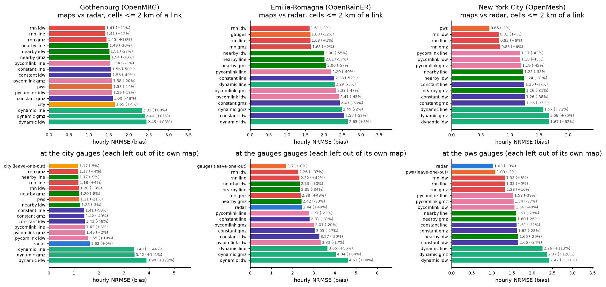
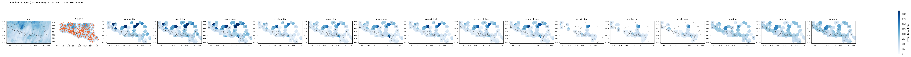

# Links, gauges and radar on three networks

_Generated by `python src/run.py study`; every number below is computed._

Per network, the 25 largest events of its study period (by radar domain-mean total), each mapped from every sensor on the same grid: the radar; the point gauges and every link method with the same IDW (power 2, 10 km). Hour-ending accumulations; scores only where both sides have a value; pooled over all cell-hours (maps) or station-hours (gauges) of a network's events. A map with gaps is scored on its share of the common sample, and its coverage is shown.

## Findings

- **Gothenburg (OpenMRG).** Near the links, the pws map differs from the radar by NRMSE 1.58 (bias -14%); the best link map (`rnn idw`) by 1.41 (+11%), the worst (`dynamic idw`) by 2.45. At the municipal gauges within 5 km of a link: radar 1.63, the other gauges 1.17, the best link map `rnn gmz` 1.17.
- **Emilia-Romagna (OpenRainER).** Near the links, the gauges map differs from the radar by NRMSE 1.63 (bias -32%); the best link map (`rnn idw`) by 1.61 (-3%), the worst (`dynamic idw`) by 2.65. At the ARPAE gauges within 5 km of a link: radar 2.32, the other gauges 1.62, the best link map `rnn idw` 2.14.
- **New York City (OpenMesh).** Near the links, the pws map differs from the radar by NRMSE 0.65 (bias -2%); the best link map (`rnn idw`) by 0.81 (+4%), the worst (`dynamic idw`) by 1.67. At the PWS gauges within 5 km of a link: radar 1.04, the other gauges 1.10, the best link map `rnn idw` 1.34.

## Retrieval x interpolation

Every link retrieval (four power-law methods, and the RNN of `projects/retrieval/rnn_three_networks` where a model is trained) mapped three ways: `idw` from each link's midpoint, `line` from virtual gauges along the path, `gmz` the same gauges corrected so each link keeps its own average (Goldshtein, Messer & Zinevich). Bold: the best interpolation per retrieval.

**Gothenburg (OpenMRG), hourly NRMSE against the radar, cells <= 2 km of a link:**

| retrieval | idw | line | gmz |
|---|---|---|---|
| rnn | **1.41** | 1.41 | 1.45 |
| nearby | 1.51 | **1.49** | 1.54 |
| pycomlink | 1.59 | **1.54** | 1.58 |
| constant | 1.56 | **1.56** | 1.60 |
| dynamic | 2.45 | **2.33** | 2.40 |

**Gothenburg (OpenMRG), hourly NRMSE at the municipal gauges <= 5 km of a link:**

| retrieval | idw | line | gmz |
|---|---|---|---|
| rnn | 1.20 | 1.18 | **1.17** |
| nearby | 1.25 | **1.17** | 1.20 |
| constant | 1.43 | **1.41** | 1.42 |
| pycomlink | 1.55 | **1.43** | 1.45 |
| dynamic | 3.90 | **3.40** | 3.42 |

**Emilia-Romagna (OpenRainER), hourly NRMSE against the radar, cells <= 2 km of a link:**

| retrieval | idw | line | gmz |
|---|---|---|---|
| rnn | **1.61** | 1.63 | 1.65 |
| nearby | **2.00** | 2.01 | 2.06 |
| pycomlink | 2.41 | **2.20** | 2.33 |
| constant | 2.55 | **2.28** | 2.43 |
| dynamic | 2.65 | **2.29** | 2.49 |

**Emilia-Romagna (OpenRainER), hourly NRMSE at the ARPAE gauges <= 5 km of a link:**

| retrieval | idw | line | gmz |
|---|---|---|---|
| nearby | 2.26 | **2.22** | 2.24 |
| rnn | **2.14** | 2.21 | 2.27 |
| constant | 2.98 | **2.57** | 2.78 |
| pycomlink | 3.09 | **2.64** | 2.87 |
| dynamic | 4.09 | **3.38** | 3.74 |

**New York City (OpenMesh), hourly NRMSE against the radar, cells <= 2 km of a link:**

| retrieval | idw | line | gmz |
|---|---|---|---|
| rnn | **0.81** | 0.82 | 0.83 |
| pycomlink | 1.18 | **1.17** | 1.19 |
| nearby | 1.24 | **1.23** | 1.26 |
| constant | 1.26 | **1.25** | 1.26 |
| dynamic | 1.67 | **1.57** | 1.66 |

**New York City (OpenMesh), hourly NRMSE at the PWS gauges <= 5 km of a link:**

| retrieval | idw | line | gmz |
|---|---|---|---|
| rnn | **1.34** | 1.34 | 1.35 |
| pycomlink | 1.59 | **1.55** | 1.56 |
| nearby | 1.68 | **1.61** | 1.62 |
| constant | 1.69 | **1.64** | 1.65 |
| dynamic | 2.46 | **2.29** | 2.40 |

## Gothenburg (OpenMRG)

25 events, 2015-06-02 to 2015-09-01, 212 mm domain-mean in all.

**Maps against the radar map** (cells <= 2 km of a link):

| estimate | events | coverage | n | rel_bias | nrmse | corr | csi |
|---|---|---|---|---|---|---|---|
| rnn idw | 25 | 100% | 280915 | +11% | 1.41 | 0.75 | 0.72 |
| rnn line | 25 | 100% | 280915 | +12% | 1.41 | 0.75 | 0.72 |
| rnn gmz | 25 | 100% | 280915 | +13% | 1.45 | 0.75 | 0.71 |
| nearby line | 25 | 100% | 280915 | -30% | 1.49 | 0.72 | 0.50 |
| nearby idw | 25 | 100% | 280915 | -27% | 1.51 | 0.72 | 0.50 |
| nearby gmz | 25 | 100% | 280915 | -30% | 1.54 | 0.71 | 0.49 |
| pycomlink line | 25 | 100% | 280915 | -21% | 1.54 | 0.73 | 0.53 |
| constant line | 25 | 100% | 280915 | -50% | 1.56 | 0.70 | 0.35 |
| constant idw | 25 | 100% | 280915 | -49% | 1.56 | 0.70 | 0.35 |
| pycomlink gmz | 25 | 100% | 280915 | -20% | 1.58 | 0.72 | 0.53 |
| pws | 25 | 83% | 232086 | -14% | 1.58 | 0.67 | 0.67 |
| pycomlink idw | 25 | 100% | 280915 | -18% | 1.59 | 0.72 | 0.54 |
| constant gmz | 25 | 100% | 280915 | -48% | 1.60 | 0.68 | 0.35 |
| city | 25 | 32% | 91080 | +4% | 1.65 | 0.68 | 0.69 |
| dynamic line | 25 | 100% | 280915 | +80% | 2.33 | 0.75 | 0.67 |
| dynamic gmz | 25 | 100% | 280915 | +81% | 2.40 | 0.74 | 0.67 |
| dynamic idw | 25 | 100% | 280915 | +83% | 2.45 | 0.75 | 0.68 |

**Maps against the city map** (cells <= 2 km of a link):

| estimate | events | coverage | n | rel_bias | nrmse | corr | csi |
|---|---|---|---|---|---|---|---|
| rnn idw | 25 | 32% | 91080 | +4% | 1.16 | 0.83 | 0.76 |
| rnn line | 25 | 32% | 91080 | +4% | 1.17 | 0.83 | 0.76 |
| rnn gmz | 25 | 32% | 91080 | +5% | 1.19 | 0.82 | 0.75 |
| nearby idw | 25 | 32% | 91080 | -18% | 1.29 | 0.81 | 0.64 |
| nearby line | 25 | 32% | 91080 | -22% | 1.29 | 0.80 | 0.64 |
| nearby gmz | 25 | 32% | 91080 | -21% | 1.39 | 0.78 | 0.64 |
| pycomlink line | 25 | 32% | 91080 | -13% | 1.47 | 0.77 | 0.63 |
| pycomlink idw | 25 | 32% | 91080 | -8% | 1.50 | 0.78 | 0.64 |
| pycomlink gmz | 25 | 32% | 91080 | -12% | 1.52 | 0.76 | 0.63 |
| constant idw | 25 | 32% | 91080 | -47% | 1.53 | 0.72 | 0.43 |
| constant line | 25 | 32% | 91080 | -48% | 1.54 | 0.71 | 0.43 |
| constant gmz | 25 | 32% | 91080 | -47% | 1.58 | 0.70 | 0.43 |
| dynamic line | 25 | 32% | 91080 | +100% | 2.51 | 0.80 | 0.63 |
| dynamic gmz | 25 | 32% | 91080 | +100% | 2.57 | 0.78 | 0.62 |
| dynamic idw | 25 | 32% | 91080 | +113% | 2.75 | 0.80 | 0.63 |

**Maps against the pws map** (cells <= 2 km of a link):

| estimate | events | coverage | n | rel_bias | nrmse | corr | csi |
|---|---|---|---|---|---|---|---|
| nearby line | 25 | 83% | 232086 | -19% | 1.48 | 0.77 | 0.55 |
| rnn idw | 25 | 83% | 232086 | +26% | 1.49 | 0.78 | 0.71 |
| nearby idw | 25 | 83% | 232086 | -15% | 1.50 | 0.77 | 0.56 |
| rnn line | 25 | 83% | 232086 | +27% | 1.50 | 0.78 | 0.71 |
| rnn gmz | 25 | 83% | 232086 | +27% | 1.53 | 0.77 | 0.71 |
| nearby gmz | 25 | 83% | 232086 | -18% | 1.56 | 0.75 | 0.55 |
| city | 25 | 29% | 81180 | +25% | 1.60 | 0.78 | 0.77 |
| constant idw | 25 | 83% | 232086 | -42% | 1.62 | 0.71 | 0.39 |
| constant line | 25 | 83% | 232086 | -42% | 1.63 | 0.71 | 0.38 |
| pycomlink line | 25 | 83% | 232086 | -9% | 1.66 | 0.74 | 0.58 |
| constant gmz | 25 | 83% | 232086 | -40% | 1.69 | 0.69 | 0.39 |
| pycomlink idw | 25 | 83% | 232086 | -5% | 1.70 | 0.74 | 0.58 |
| pycomlink gmz | 25 | 83% | 232086 | -8% | 1.71 | 0.73 | 0.58 |
| dynamic line | 25 | 83% | 232086 | +111% | 2.81 | 0.75 | 0.64 |
| dynamic gmz | 25 | 83% | 232086 | +112% | 2.90 | 0.73 | 0.64 |
| dynamic idw | 25 | 83% | 232086 | +115% | 2.95 | 0.75 | 0.65 |

**At the municipal gauges, <= 5 km of a link** (hourly; the gauge map is rebuilt without the gauge being scored):

| estimate | coverage | n | rel_bias | nrmse | corr |
|---|---|---|---|---|---|
| city (leave-one-out) | 100% | 3270 | -5% | 1.17 | 0.84 |
| rnn gmz | 100% | 3270 | +4% | 1.17 | 0.85 |
| nearby line | 100% | 3270 | -9% | 1.17 | 0.87 |
| rnn line | 100% | 3270 | +4% | 1.18 | 0.84 |
| rnn idw | 100% | 3270 | +3% | 1.20 | 0.84 |
| nearby gmz | 100% | 3270 | -8% | 1.20 | 0.86 |
| pws | 100% | 3270 | -21% | 1.21 | 0.85 |
| nearby idw | 100% | 3270 | -3% | 1.25 | 0.86 |
| constant line | 100% | 3270 | -50% | 1.41 | 0.80 |
| constant gmz | 100% | 3270 | -49% | 1.42 | 0.79 |
| constant idw | 100% | 3270 | -48% | 1.43 | 0.79 |
| pycomlink line | 100% | 3270 | +3% | 1.43 | 0.84 |
| pycomlink gmz | 100% | 3270 | +2% | 1.45 | 0.84 |
| pycomlink idw | 100% | 3270 | +10% | 1.55 | 0.84 |
| radar | 100% | 3270 | +0% | 1.63 | 0.69 |
| dynamic line | 100% | 3270 | +144% | 3.40 | 0.84 |
| dynamic gmz | 100% | 3270 | +141% | 3.42 | 0.83 |
| dynamic idw | 100% | 3270 | +171% | 3.90 | 0.83 |

**At the municipal gauges, all gauges** (hourly; the gauge map is rebuilt without the gauge being scored):

| estimate | coverage | n | rel_bias | nrmse | corr |
|---|---|---|---|---|---|
| city (leave-one-out) | 100% | 3270 | -5% | 1.17 | 0.84 |
| rnn gmz | 100% | 3270 | +4% | 1.17 | 0.85 |
| nearby line | 100% | 3270 | -9% | 1.17 | 0.87 |
| rnn line | 100% | 3270 | +4% | 1.18 | 0.84 |
| rnn idw | 100% | 3270 | +3% | 1.20 | 0.84 |
| nearby gmz | 100% | 3270 | -8% | 1.20 | 0.86 |
| pws | 100% | 3270 | -21% | 1.21 | 0.85 |
| nearby idw | 100% | 3270 | -3% | 1.25 | 0.86 |
| constant line | 100% | 3270 | -50% | 1.41 | 0.80 |
| constant gmz | 100% | 3270 | -49% | 1.42 | 0.79 |
| constant idw | 100% | 3270 | -48% | 1.43 | 0.79 |
| pycomlink line | 100% | 3270 | +3% | 1.43 | 0.84 |
| pycomlink gmz | 100% | 3270 | +2% | 1.45 | 0.84 |
| pycomlink idw | 100% | 3270 | +10% | 1.55 | 0.84 |
| radar | 100% | 3270 | +0% | 1.63 | 0.69 |
| dynamic line | 100% | 3270 | +144% | 3.40 | 0.84 |
| dynamic gmz | 100% | 3270 | +141% | 3.42 | 0.83 |
| dynamic idw | 100% | 3270 | +171% | 3.90 | 0.83 |

## Emilia-Romagna (OpenRainER)

25 events, 2021-05-11 to 2022-11-23, 674 mm domain-mean in all.

**Maps against the radar map** (cells <= 2 km of a link):

| estimate | events | coverage | n | rel_bias | nrmse | corr | csi |
|---|---|---|---|---|---|---|---|
| rnn idw | 25 | 100% | 740230 | -3% | 1.61 | 0.75 | 0.64 |
| gauges | 25 | 100% | 740230 | -32% | 1.63 | 0.74 | 0.70 |
| rnn line | 25 | 100% | 740230 | +1% | 1.63 | 0.75 | 0.64 |
| rnn gmz | 25 | 100% | 740230 | +2% | 1.65 | 0.75 | 0.63 |
| nearby idw | 25 | 69% | 508925 | -55% | 2.00 | 0.58 | 0.45 |
| nearby line | 25 | 72% | 536067 | -57% | 2.01 | 0.57 | 0.46 |
| nearby gmz | 25 | 72% | 536067 | -57% | 2.06 | 0.56 | 0.45 |
| pycomlink line | 25 | 100% | 740230 | -49% | 2.20 | 0.54 | 0.51 |
| constant line | 25 | 100% | 740230 | -52% | 2.28 | 0.51 | 0.43 |
| dynamic line | 25 | 100% | 740230 | -5% | 2.29 | 0.58 | 0.59 |
| pycomlink gmz | 25 | 100% | 740230 | -47% | 2.33 | 0.52 | 0.50 |
| pycomlink idw | 25 | 100% | 740230 | -45% | 2.41 | 0.51 | 0.51 |
| constant gmz | 25 | 100% | 740230 | -50% | 2.43 | 0.49 | 0.42 |
| dynamic gmz | 25 | 100% | 740230 | -2% | 2.49 | 0.55 | 0.58 |
| constant idw | 25 | 100% | 740230 | -52% | 2.55 | 0.46 | 0.41 |
| dynamic idw | 25 | 100% | 740230 | +5% | 2.65 | 0.55 | 0.59 |

**Maps against the gauges map** (cells <= 2 km of a link):

| estimate | events | coverage | n | rel_bias | nrmse | corr | csi |
|---|---|---|---|---|---|---|---|
| rnn idw | 25 | 100% | 740230 | +43% | 1.93 | 0.81 | 0.69 |
| nearby line | 25 | 72% | 536067 | -37% | 1.98 | 0.70 | 0.48 |
| nearby idw | 25 | 69% | 508925 | -34% | 1.99 | 0.72 | 0.48 |
| rnn line | 25 | 100% | 740230 | +49% | 2.01 | 0.80 | 0.69 |
| nearby gmz | 25 | 72% | 536067 | -36% | 2.09 | 0.68 | 0.47 |
| rnn gmz | 25 | 100% | 740230 | +50% | 2.10 | 0.80 | 0.69 |
| pycomlink line | 25 | 100% | 740230 | -25% | 2.47 | 0.65 | 0.53 |
| constant line | 25 | 100% | 740230 | -30% | 2.58 | 0.62 | 0.46 |
| pycomlink gmz | 25 | 100% | 740230 | -22% | 2.76 | 0.61 | 0.52 |
| constant gmz | 25 | 100% | 740230 | -27% | 2.89 | 0.58 | 0.44 |
| pycomlink idw | 25 | 100% | 740230 | -19% | 2.89 | 0.61 | 0.53 |
| dynamic line | 25 | 100% | 740230 | +40% | 2.91 | 0.66 | 0.62 |
| constant idw | 25 | 100% | 740230 | -29% | 3.08 | 0.56 | 0.43 |
| dynamic gmz | 25 | 100% | 740230 | +44% | 3.28 | 0.62 | 0.60 |
| dynamic idw | 25 | 100% | 740230 | +54% | 3.56 | 0.63 | 0.61 |

**At the ARPAE gauges, <= 5 km of a link** (hourly; the gauge map is rebuilt without the gauge being scored):

| estimate | coverage | n | rel_bias | nrmse | corr |
|---|---|---|---|---|---|
| gauges (leave-one-out) | 100% | 85959 | +2% | 1.62 | 0.84 |
| rnn idw | 98% | 84407 | +41% | 2.14 | 0.77 |
| rnn line | 100% | 85959 | +46% | 2.21 | 0.76 |
| nearby line | 76% | 65194 | -36% | 2.22 | 0.67 |
| nearby gmz | 76% | 65194 | -35% | 2.24 | 0.67 |
| nearby idw | 70% | 60347 | -32% | 2.26 | 0.68 |
| rnn gmz | 100% | 85959 | +48% | 2.27 | 0.76 |
| radar | 100% | 85959 | +49% | 2.32 | 0.77 |
| constant line | 100% | 85605 | -31% | 2.57 | 0.63 |
| pycomlink line | 100% | 85605 | -22% | 2.64 | 0.63 |
| constant gmz | 100% | 85605 | -27% | 2.78 | 0.61 |
| pycomlink gmz | 100% | 85605 | -19% | 2.87 | 0.61 |
| constant idw | 98% | 84047 | -30% | 2.98 | 0.58 |
| pycomlink idw | 98% | 84047 | -16% | 3.09 | 0.59 |
| dynamic line | 100% | 85605 | +51% | 3.38 | 0.60 |
| dynamic gmz | 100% | 85605 | +59% | 3.74 | 0.58 |
| dynamic idw | 98% | 84047 | +69% | 4.09 | 0.58 |

**At the ARPAE gauges, all gauges** (hourly; the gauge map is rebuilt without the gauge being scored):

| estimate | coverage | n | rel_bias | nrmse | corr |
|---|---|---|---|---|---|
| gauges (leave-one-out) | 100% | 206172 | -0% | 1.71 | 0.84 |
| rnn idw | 64% | 132438 | +37% | 2.26 | 0.73 |
| rnn line | 69% | 143266 | +42% | 2.32 | 0.72 |
| nearby idw | 41% | 83635 | -30% | 2.33 | 0.66 |
| nearby line | 46% | 95541 | -34% | 2.35 | 0.64 |
| rnn gmz | 69% | 143266 | +43% | 2.38 | 0.72 |
| nearby gmz | 46% | 95541 | -33% | 2.42 | 0.63 |
| radar | 100% | 206172 | +49% | 2.44 | 0.75 |
| pycomlink line | 69% | 142640 | -23% | 2.77 | 0.59 |
| constant line | 69% | 142640 | -31% | 2.81 | 0.57 |
| pycomlink gmz | 69% | 142640 | -20% | 3.01 | 0.56 |
| constant gmz | 69% | 142640 | -27% | 3.05 | 0.54 |
| constant idw | 64% | 131839 | -29% | 3.27 | 0.52 |
| pycomlink idw | 64% | 131839 | -17% | 3.33 | 0.54 |
| dynamic line | 69% | 142640 | +56% | 3.65 | 0.55 |
| dynamic gmz | 69% | 142640 | +64% | 4.04 | 0.52 |
| dynamic idw | 64% | 131839 | +80% | 4.61 | 0.51 |

## New York City (OpenMesh)

25 events, 2023-11-21 to 2024-06-27, 746 mm domain-mean in all.

**Maps against the radar map** (cells <= 2 km of a link):

| estimate | events | coverage | n | rel_bias | nrmse | corr | csi |
|---|---|---|---|---|---|---|---|
| pws | 25 | 100% | 51826 | -2% | 0.65 | 0.90 | 0.82 |
| rnn idw | 24 | 100% | 51484 | +4% | 0.81 | 0.79 | 0.82 |
| rnn line | 24 | 100% | 51484 | +6% | 0.82 | 0.78 | 0.82 |
| rnn gmz | 24 | 100% | 51484 | +6% | 0.83 | 0.77 | 0.82 |
| pycomlink line | 24 | 100% | 51484 | -43% | 1.17 | 0.59 | 0.66 |
| pycomlink idw | 24 | 100% | 51484 | -43% | 1.18 | 0.59 | 0.66 |
| pycomlink gmz | 24 | 100% | 51484 | -42% | 1.19 | 0.58 | 0.66 |
| nearby line | 24 | 96% | 49398 | -33% | 1.23 | 0.54 | 0.77 |
| nearby idw | 24 | 96% | 49377 | -31% | 1.24 | 0.54 | 0.76 |
| constant line | 24 | 100% | 51484 | -37% | 1.25 | 0.57 | 0.66 |
| nearby gmz | 24 | 96% | 49398 | -31% | 1.26 | 0.53 | 0.77 |
| constant idw | 24 | 100% | 51484 | -38% | 1.26 | 0.57 | 0.64 |
| constant gmz | 24 | 100% | 51484 | -35% | 1.26 | 0.56 | 0.67 |
| dynamic line | 24 | 100% | 51484 | +71% | 1.57 | 0.58 | 0.78 |
| dynamic gmz | 24 | 100% | 51484 | +75% | 1.66 | 0.56 | 0.78 |
| dynamic idw | 24 | 100% | 51484 | +82% | 1.67 | 0.58 | 0.78 |

**Maps against the pws map** (cells <= 2 km of a link):

| estimate | events | coverage | n | rel_bias | nrmse | corr | csi |
|---|---|---|---|---|---|---|---|
| rnn idw | 24 | 100% | 51484 | +6% | 1.06 | 0.71 | 0.84 |
| rnn line | 24 | 100% | 51484 | +8% | 1.07 | 0.70 | 0.85 |
| rnn gmz | 24 | 100% | 51484 | +8% | 1.09 | 0.69 | 0.84 |
| pycomlink line | 24 | 100% | 51484 | -42% | 1.34 | 0.56 | 0.66 |
| pycomlink idw | 24 | 100% | 51484 | -41% | 1.34 | 0.56 | 0.65 |
| pycomlink gmz | 24 | 100% | 51484 | -41% | 1.35 | 0.55 | 0.66 |
| nearby line | 24 | 96% | 49398 | -32% | 1.40 | 0.51 | 0.77 |
| nearby idw | 24 | 96% | 49377 | -30% | 1.41 | 0.50 | 0.76 |
| nearby gmz | 24 | 96% | 49398 | -30% | 1.42 | 0.50 | 0.77 |
| constant line | 24 | 100% | 51484 | -36% | 1.45 | 0.49 | 0.65 |
| constant idw | 24 | 100% | 51484 | -36% | 1.46 | 0.49 | 0.63 |
| constant gmz | 24 | 100% | 51484 | -33% | 1.47 | 0.49 | 0.65 |
| dynamic line | 24 | 100% | 51484 | +74% | 1.71 | 0.54 | 0.77 |
| dynamic gmz | 24 | 100% | 51484 | +78% | 1.80 | 0.52 | 0.77 |
| dynamic idw | 24 | 100% | 51484 | +86% | 1.82 | 0.54 | 0.77 |

**At the PWS gauges, <= 5 km of a link** (hourly; the gauge map is rebuilt without the gauge being scored):

| estimate | coverage | n | rel_bias | nrmse | corr |
|---|---|---|---|---|---|
| radar | 100% | 10112 | +3% | 1.04 | 0.79 |
| pws (leave-one-out) | 100% | 10112 | -3% | 1.10 | 0.77 |
| rnn idw | 100% | 9922 | +5% | 1.34 | 0.62 |
| rnn line | 100% | 9922 | +9% | 1.34 | 0.62 |
| rnn gmz | 100% | 9922 | +9% | 1.35 | 0.61 |
| pycomlink line | 100% | 9922 | -39% | 1.55 | 0.50 |
| pycomlink gmz | 100% | 9922 | -37% | 1.56 | 0.50 |
| pycomlink idw | 100% | 9922 | -40% | 1.59 | 0.49 |
| nearby line | 96% | 9487 | -28% | 1.61 | 0.45 |
| nearby gmz | 96% | 9487 | -26% | 1.62 | 0.45 |
| constant line | 100% | 9922 | -31% | 1.64 | 0.46 |
| constant gmz | 100% | 9922 | -28% | 1.65 | 0.45 |
| nearby idw | 96% | 9482 | -29% | 1.68 | 0.41 |
| constant idw | 100% | 9922 | -34% | 1.69 | 0.43 |
| dynamic line | 100% | 9922 | +113% | 2.29 | 0.44 |
| dynamic gmz | 100% | 9922 | +121% | 2.40 | 0.43 |
| dynamic idw | 100% | 9922 | +122% | 2.46 | 0.42 |

**At the PWS gauges, all gauges** (hourly; the gauge map is rebuilt without the gauge being scored):

| estimate | coverage | n | rel_bias | nrmse | corr |
|---|---|---|---|---|---|
| radar | 100% | 11192 | +3% | 1.03 | 0.79 |
| pws (leave-one-out) | 100% | 11192 | -2% | 1.09 | 0.77 |
| rnn idw | 100% | 10591 | +6% | 1.33 | 0.62 |
| rnn line | 100% | 10591 | +9% | 1.33 | 0.62 |
| rnn gmz | 100% | 10591 | +10% | 1.33 | 0.62 |
| pycomlink line | 100% | 10591 | -39% | 1.53 | 0.51 |
| pycomlink gmz | 100% | 10591 | -37% | 1.54 | 0.51 |
| pycomlink idw | 100% | 10591 | -40% | 1.56 | 0.49 |
| nearby line | 96% | 10132 | -28% | 1.59 | 0.46 |
| nearby gmz | 96% | 10132 | -26% | 1.60 | 0.45 |
| constant line | 100% | 10591 | -31% | 1.61 | 0.47 |
| constant gmz | 100% | 10591 | -28% | 1.62 | 0.47 |
| nearby idw | 96% | 10127 | -29% | 1.66 | 0.42 |
| constant idw | 100% | 10591 | -34% | 1.66 | 0.44 |
| dynamic line | 100% | 10591 | +113% | 2.26 | 0.46 |
| dynamic gmz | 100% | 10591 | +120% | 2.37 | 0.44 |
| dynamic idw | 100% | 10591 | +121% | 2.42 | 0.43 |

## Not scored

- openmesh 2024-03-06 17 / links: 1 link(s) pass QC - no link maps

## Files

`events.csv`, `event_scores.csv` (per event, pair and cell set), `pooled_map_scores.csv`, `pooled_point_scores.csv`, `link_scores.csv` (each method's link totals against radar along the path and gauges near it).
