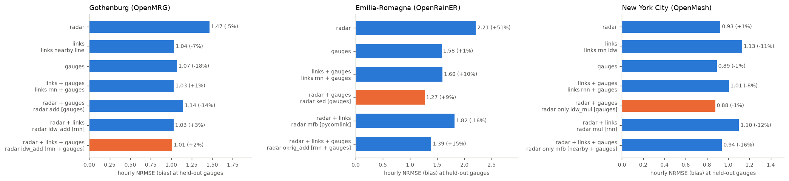
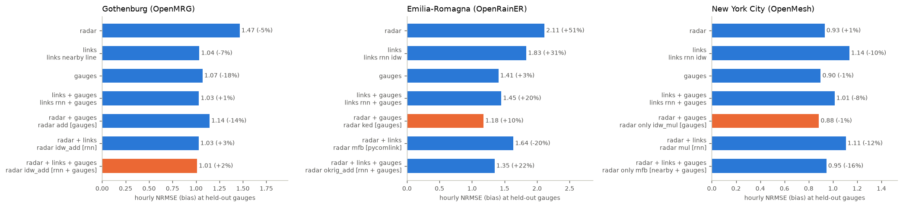
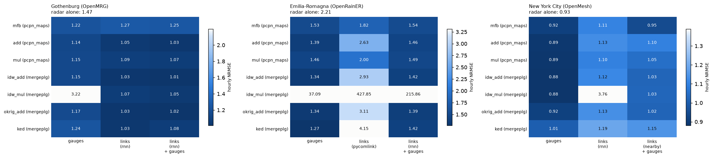
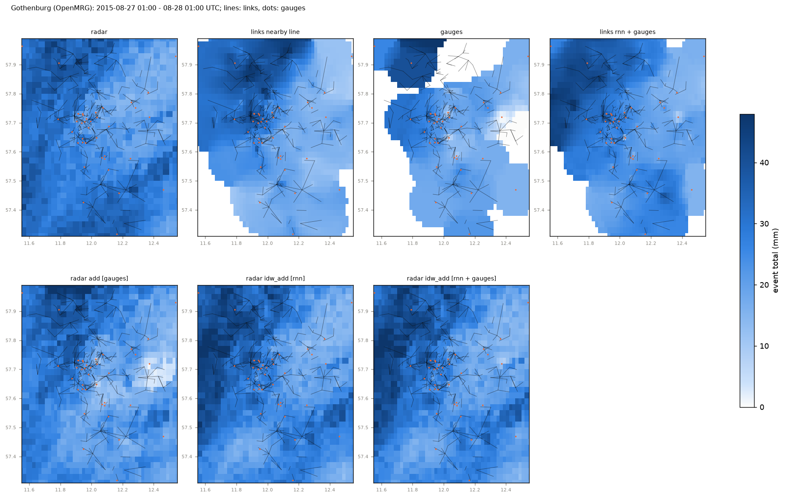
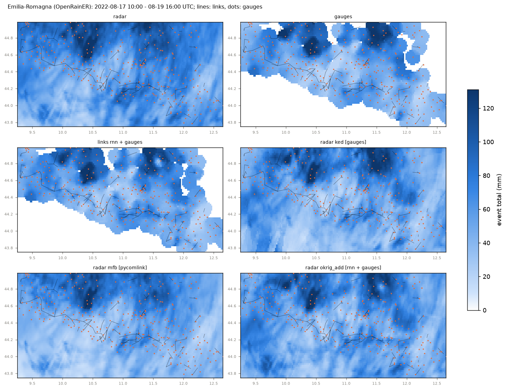
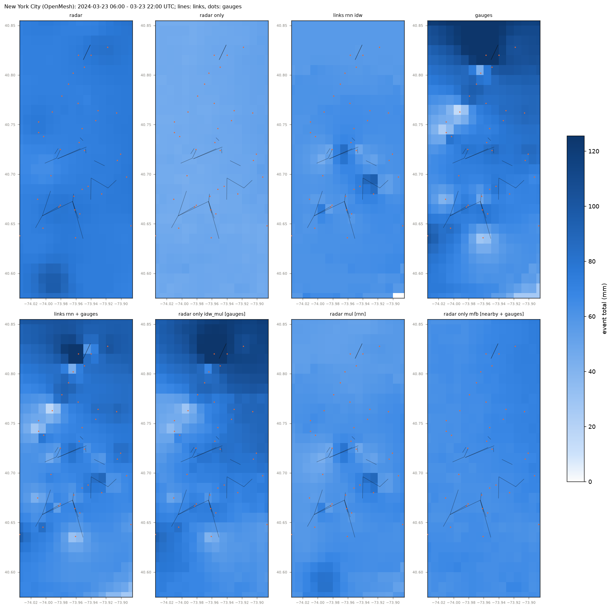

# Merging links, gauges and radar on three networks

_Generated by `python src/run.py merge`; every number below is computed._

The best hourly rain map from any combination of the three sensors, and what each sensor adds. Per network, the same 10 largest events as `results/report.md`. Products, on the network's grid:

- **radar** as it is (New York: MRMS Pass 2, which NOAA already corrects with gauges, and MRMS radar-only, which it does not);
- **links** alone - every retrieval (four power laws and the RNN of `projects/retrieval/rnn_three_networks`), IDW from midpoints and from virtual gauges along each path (`line`);
- **gauges** alone (IDW), and **links + gauges** (one IDW over both);
- **radar adjusted** with the gauges, the links, or both, by seven methods: mean-field bias, additive and multiplicative IDW of the residuals from `pcpn_maps` (`core.maps.merge`), and difference IDW (additive, multiplicative), difference block kriging and block kriging with external drift from the OpenSense package `mergeplg` 0.1.0 (`core.maps.mergeplg_methods`, identical to `mergeplg`'s own `adjust()` - `tests/test_merging.py`). The kriging variogram is fitted to each network's radar fields, never to a gauge.

**Scoring.** The check gauges are split into 5 groups by station; each group is held out in turn, every product that uses gauges is rebuilt without it and scored at it, hour by hour (links and radar do not change). All products are scored on the station-hours every full-coverage product has (a link-only map has no value beyond 10 km of a link, so away from the links it is shown with its coverage). NRMSE is the hourly RMSE over the mean gauge value. Independent gauges that no product uses give a second check where they exist.

## Findings

- **Gothenburg (OpenMRG)** (at held-out municipal gauges): best map `radar idw_add [rnn + gauges]`, NRMSE 1.01 (+2%). Radar alone 1.47, gauges alone 1.07; radar + gauges 1.14 (`radar add [gauges]`); radar + links 1.03 (`radar idw_add [rnn]`); all three 1.01 (`radar idw_add [rnn + gauges]`). Near the links (<= 5 km): radar + gauges 1.14, best with links `radar idw_add [rnn + gauges]` 1.01.
- **Emilia-Romagna (OpenRainER)** (at held-out ARPAE gauges): best map `radar ked [gauges]`, NRMSE 1.27 (+9%). Radar alone 2.21, gauges alone 1.58; radar + gauges 1.27 (`radar ked [gauges]`); radar + links 1.82 (`radar mfb [pycomlink]`); all three 1.39 (`radar okrig_add [rnn + gauges]`). Near the links (<= 5 km): radar + gauges 1.18, best with links `radar okrig_add [rnn + gauges]` 1.35.
- **New York City (OpenMesh)** (at held-out PWS): best map `radar only idw_mul [gauges]`, NRMSE 0.88 (-1%). Radar alone 0.93, gauges alone 0.89; radar + gauges 0.88 (`radar only idw_mul [gauges]`); radar + links 1.10 (`radar mul [rnn]`); all three 0.94 (`radar only mfb [nearby + gauges]`). Near the links (<= 5 km): radar + gauges 0.88, best with links `radar only mfb [nearby + gauges]` 0.95.

Near the links, where they can add something:

## Which merging method

Hourly NRMSE at held-out gauges of the radar adjusted by each method, with the gauges, the links of the best retrieval for that column, and both (method keys in the table below):

`idw_mul` is `mergeplg`'s multiplicative difference IDW: the ratio gauge / radar is interpolated with no bound, so one wet observation over a nearly dry radar cell gives a factor of hundreds; its blow-ups are the method's, reproduced exactly (the `pcpn_maps` `mul` clips the factor to [0.2, 5] and adds 0.5 mm to both sides). In Gothenburg every municipal gauge is within 5 km of a link, so the near-link scores equal the overall ones.

**Gothenburg (OpenMRG), `radar` (alone: 1.47)**

| method | package | gauges | links (rnn) | links (rnn) + gauges |
|---|---|---|---|---|
| mean-field bias (`mfb`) | pcpn_maps | 1.22 | 1.27 | 1.25 |
| additive IDW (`add`) | pcpn_maps | 1.14 | 1.05 | 1.03 |
| multiplicative IDW (`mul`) | pcpn_maps | 1.15 | 1.09 | 1.07 |
| difference IDW, additive (`idw_add`) | mergeplg | 1.15 | 1.03 | 1.01 |
| difference IDW, multiplicative (`idw_mul`) | mergeplg | 3.22 | 1.07 | 1.05 |
| difference block kriging (`okrig_add`) | mergeplg | 1.17 | 1.03 | 1.02 |
| KED block kriging (`ked`) | mergeplg | 1.24 | 1.03 | 1.08 |

**Emilia-Romagna (OpenRainER), `radar` (alone: 2.21)**

| method | package | gauges | links (pycomlink) | links (rnn) + gauges |
|---|---|---|---|---|
| mean-field bias (`mfb`) | pcpn_maps | 1.53 | 1.82 | 1.54 |
| additive IDW (`add`) | pcpn_maps | 1.39 | 2.63 | 1.46 |
| multiplicative IDW (`mul`) | pcpn_maps | 1.46 | 2.00 | 1.49 |
| difference IDW, additive (`idw_add`) | mergeplg | 1.34 | 2.93 | 1.42 |
| difference IDW, multiplicative (`idw_mul`) | mergeplg | 37.09 | 427.85 | 215.86 |
| difference block kriging (`okrig_add`) | mergeplg | 1.34 | 3.11 | 1.39 |
| KED block kriging (`ked`) | mergeplg | 1.27 | 4.15 | 1.42 |

**New York City (OpenMesh), `radar` (alone: 0.93)**

| method | package | gauges | links (rnn) | links (nearby) + gauges |
|---|---|---|---|---|
| mean-field bias (`mfb`) | pcpn_maps | 0.92 | 1.11 | 0.95 |
| additive IDW (`add`) | pcpn_maps | 0.89 | 1.13 | 1.10 |
| multiplicative IDW (`mul`) | pcpn_maps | 0.89 | 1.10 | 1.05 |
| difference IDW, additive (`idw_add`) | mergeplg | 0.88 | 1.12 | 1.03 |
| difference IDW, multiplicative (`idw_mul`) | mergeplg | 0.88 | 3.76 | 1.03 |
| difference block kriging (`okrig_add`) | mergeplg | 0.92 | 1.13 | 1.02 |
| KED block kriging (`ked`) | mergeplg | 1.01 | 1.19 | 1.15 |

**New York City (OpenMesh), `radar only` (alone: 1.15)**

| method | package | gauges | links (rnn) | links (nearby) + gauges |
|---|---|---|---|---|
| mean-field bias (`mfb`) | pcpn_maps | 0.90 | 1.10 | 0.94 |
| additive IDW (`add`) | pcpn_maps | 0.89 | 1.13 | 1.10 |
| multiplicative IDW (`mul`) | pcpn_maps | 0.88 | 1.11 | 1.05 |
| difference IDW, additive (`idw_add`) | mergeplg | 0.88 | 1.11 | 1.02 |
| difference IDW, multiplicative (`idw_mul`) | mergeplg | 0.88 | 1.13 | 1.02 |
| difference block kriging (`okrig_add`) | mergeplg | 0.92 | 1.13 | 1.03 |
| KED block kriging (`ked`) | mergeplg | 1.01 | 1.19 | 1.15 |

## Which link retrieval, once merged

Best NRMSE at held-out gauges over methods, per retrieval (radar + links; radar + links + gauges; links + gauges):

**Gothenburg (OpenMRG)**

| retrieval | radar + links | radar + links + gauges | links + gauges |
|---|---|---|---|
| rnn | 1.03 | 1.01 | 1.03 |
| nearby | 1.08 | 1.06 | 1.06 |
| constant | 1.20 | 1.17 | 1.19 |
| pycomlink | 1.35 | 1.30 | 1.33 |
| dynamic | 2.72 | 2.52 | 3.38 |

**Emilia-Romagna (OpenRainER)**

| retrieval | radar + links | radar + links + gauges | links + gauges |
|---|---|---|---|
| rnn | 1.83 | 1.39 | 1.60 |
| nearby | 1.83 | 1.40 | 1.62 |
| constant | 1.93 | 1.50 | 1.90 |
| pycomlink | 1.82 | 1.52 | 1.94 |
| dynamic | 2.80 | 1.69 | 2.30 |

**New York City (OpenMesh)**

| retrieval | radar + links | radar + links + gauges | links + gauges |
|---|---|---|---|
| nearby | 1.16 | 0.94 | 1.10 |
| rnn | 1.10 | 0.95 | 1.01 |
| constant | 1.17 | 0.95 | 1.18 |
| pycomlink | 1.20 | 0.96 | 1.13 |
| dynamic | 1.15 | 0.97 | 1.54 |

## The kriging variogram

The kriging products use a spherical variogram fitted to each network's radar (range and nugget below). Rebuilt with `mergeplg`'s default instead (sill 0.9, range 5 km, nugget 0.1) - NRMSE at held-out gauges, radar adjusted with the gauges and with the best retrieval's links + gauges:

| network | radar | product | radar fit | 5 km default |
|---|---|---|---|---|
| Gothenburg (OpenMRG) | radar | `radar okrig_add [rnn + gauges]` | 1.02 | 1.00 |
| Gothenburg (OpenMRG) | radar | `radar ked [rnn + gauges]` | 1.08 | 1.07 |
| Gothenburg (OpenMRG) | radar | `radar okrig_add [gauges]` | 1.17 | 1.17 |
| Gothenburg (OpenMRG) | radar | `radar ked [gauges]` | 1.24 | 1.27 |
| Emilia-Romagna (OpenRainER) | radar | `radar ked [gauges]` | 1.27 | 1.24 |
| Emilia-Romagna (OpenRainER) | radar | `radar okrig_add [gauges]` | 1.34 | 1.37 |
| Emilia-Romagna (OpenRainER) | radar | `radar okrig_add [rnn + gauges]` | 1.39 | 1.46 |
| Emilia-Romagna (OpenRainER) | radar | `radar ked [rnn + gauges]` | 1.42 | 1.44 |
| New York City (OpenMesh) | radar | `radar okrig_add [gauges]` | 0.92 | 0.91 |
| New York City (OpenMesh) | radar | `radar okrig_add [rnn + gauges]` | 0.98 | 0.98 |
| New York City (OpenMesh) | radar | `radar ked [gauges]` | 1.01 | 1.00 |
| New York City (OpenMesh) | radar | `radar ked [rnn + gauges]` | 1.07 | 1.07 |
| New York City (OpenMesh) | radar only | `radar only okrig_add [gauges]` | 0.92 | 0.91 |
| New York City (OpenMesh) | radar only | `radar only okrig_add [rnn + gauges]` | 0.99 | 0.98 |
| New York City (OpenMesh) | radar only | `radar only ked [gauges]` | 1.01 | 0.98 |
| New York City (OpenMesh) | radar only | `radar only ked [rnn + gauges]` | 1.05 | 1.04 |

## Gothenburg (OpenMRG)

10 of 10 events scored, 2015-06-02 to 2015-09-01; check gauges: municipal gauges. Kriging variogram from the radar: spherical, range 56 km, nugget 14% of the sill (155 wet hours).

**Best of each input combination, held-out gauges:**

| product | family | station-hours | bias | NRMSE | r | CSI |
|---|---|---|---|---|---|---|
| `radar` | radar | 1880 | -5% | 1.47 | 0.69 | 0.76 |
| `links nearby line` | links | 1880 | -7% | 1.04 | 0.87 | 0.64 |
| `gauges` | gauges | 1880 | -18% | 1.07 | 0.85 | 0.82 |
| `links rnn + gauges` | links + gauges | 1880 | +1% | 1.03 | 0.85 | 0.79 |
| `radar add [gauges]` | radar + gauges | 1880 | -14% | 1.14 | 0.81 | 0.77 |
| `radar idw_add [rnn]` | radar + links | 1880 | +3% | 1.03 | 0.85 | 0.77 |
| `radar idw_add [rnn + gauges]` | radar + links + gauges | 1880 | +2% | 1.01 | 0.86 | 0.77 |

**Top 15 products** (median per-event NRMSE and number of events on which each is the best product):

| product | family | station-hours | bias | NRMSE | r | CSI | median per event | events best |
|---|---|---|---|---|---|---|---|---|
| `radar idw_add [rnn + gauges]` | radar + links + gauges | 1880 | +2% | 1.01 | 0.86 | 0.77 | 0.87 | 0 |
| `radar okrig_add [rnn + gauges]` | radar + links + gauges | 1880 | +3% | 1.02 | 0.85 | 0.77 | 0.87 | 0 |
| `radar idw_add [rnn]` | radar + links | 1880 | +3% | 1.03 | 0.85 | 0.77 | 0.90 | 0 |
| `radar add [rnn + gauges]` | radar + links + gauges | 1880 | +2% | 1.03 | 0.85 | 0.77 | 0.88 | 0 |
| `radar okrig_add [rnn]` | radar + links | 1880 | +3% | 1.03 | 0.85 | 0.77 | 0.89 | 0 |
| `links rnn + gauges` | links + gauges | 1880 | +1% | 1.03 | 0.85 | 0.79 | 0.80 | 1 |
| `radar ked [rnn]` | radar + links | 1880 | +11% | 1.03 | 0.85 | 0.61 | 0.87 | 0 |
| `links nearby line` | links | 1880 | -7% | 1.04 | 0.87 | 0.64 | 0.87 | 1 |
| `links rnn line` | links | 1880 | +3% | 1.04 | 0.85 | 0.79 | 0.82 | 0 |
| `radar idw_mul [rnn + gauges]` | radar + links + gauges | 1880 | +3% | 1.05 | 0.85 | 0.77 | 0.82 | 0 |
| `radar add [rnn]` | radar + links | 1880 | +4% | 1.05 | 0.84 | 0.76 | 0.91 | 0 |
| `links rnn idw` | links | 1880 | +2% | 1.06 | 0.84 | 0.78 | 0.84 | 0 |
| `radar mul [nearby + gauges]` | radar + links + gauges | 1880 | -3% | 1.06 | 0.86 | 0.77 | 0.97 | 0 |
| `links nearby + gauges` | links + gauges | 1880 | -2% | 1.06 | 0.87 | 0.68 | 0.92 | 0 |
| `radar mul [rnn + gauges]` | radar + links + gauges | 1880 | -3% | 1.07 | 0.84 | 0.77 | 0.82 | 0 |

**Best of each input combination, held-out gauges <= 5 km of a link:**

| product | family | station-hours | bias | NRMSE | r | CSI |
|---|---|---|---|---|---|---|
| `radar` | radar | 1880 | -5% | 1.47 | 0.69 | 0.76 |
| `links nearby line` | links | 1880 | -7% | 1.04 | 0.87 | 0.64 |
| `gauges` | gauges | 1880 | -18% | 1.07 | 0.85 | 0.82 |
| `links rnn + gauges` | links + gauges | 1880 | +1% | 1.03 | 0.85 | 0.79 |
| `radar add [gauges]` | radar + gauges | 1880 | -14% | 1.14 | 0.81 | 0.77 |
| `radar idw_add [rnn]` | radar + links | 1880 | +3% | 1.03 | 0.85 | 0.77 |
| `radar idw_add [rnn + gauges]` | radar + links + gauges | 1880 | +2% | 1.01 | 0.86 | 0.77 |

**Best of each input combination, independent gauges:**

| product | family | station-hours | bias | NRMSE | r | CSI |
|---|---|---|---|---|---|---|
| `radar` | radar | 191 | -2% | 1.58 | 0.62 | 0.83 |
| `links nearby line` | links | 191 | +10% | 0.79 | 0.95 | 0.66 |
| `gauges` | gauges | 191 | -28% | 1.00 | 0.87 | 0.79 |
| `links rnn + gauges` | links + gauges | 191 | -1% | 0.83 | 0.90 | 0.81 |
| `radar ked [gauges]` | radar + gauges | 191 | -6% | 0.91 | 0.87 | 0.67 |
| `radar mul [nearby]` | radar + links | 191 | +9% | 0.83 | 0.92 | 0.84 |
| `radar mul [nearby + gauges]` | radar + links + gauges | 191 | +6% | 0.80 | 0.92 | 0.84 |

## Emilia-Romagna (OpenRainER)

10 of 10 events scored, 2021-05-23 to 2022-11-23; check gauges: ARPAE gauges. Kriging variogram from the radar: spherical, range 53 km, nugget 2% of the sill (286 wet hours).

**Best of each input combination, held-out gauges:**

| product | family | station-hours | bias | NRMSE | r | CSI |
|---|---|---|---|---|---|---|
| `radar` | radar | 97345 | +51% | 2.21 | 0.76 | 0.72 |
| `gauges` | gauges | 97345 | +1% | 1.58 | 0.84 | 0.79 |
| `links rnn + gauges` | links + gauges | 97345 | +10% | 1.60 | 0.84 | 0.76 |
| `radar ked [gauges]` | radar + gauges | 97345 | +9% | 1.27 | 0.90 | 0.68 |
| `radar mfb [pycomlink]` | radar + links | 97345 | -16% | 1.82 | 0.78 | 0.72 |
| `radar okrig_add [rnn + gauges]` | radar + links + gauges | 97345 | +15% | 1.39 | 0.88 | 0.70 |

**Top 15 products** (median per-event NRMSE and number of events on which each is the best product):

| product | family | station-hours | bias | NRMSE | r | CSI | median per event | events best |
|---|---|---|---|---|---|---|---|---|
| `radar ked [gauges]` | radar + gauges | 97345 | +9% | 1.27 | 0.90 | 0.68 | 0.94 | 4 |
| `radar okrig_add [gauges]` | radar + gauges | 97345 | +9% | 1.34 | 0.89 | 0.72 | 1.11 | 1 |
| `radar idw_add [gauges]` | radar + gauges | 97345 | +7% | 1.34 | 0.89 | 0.75 | 1.14 | 0 |
| `radar add [gauges]` | radar + gauges | 97345 | +8% | 1.39 | 0.89 | 0.75 | 1.19 | 0 |
| `radar okrig_add [rnn + gauges]` | radar + links + gauges | 97345 | +15% | 1.39 | 0.88 | 0.70 | 1.15 | 0 |
| `radar idw_add [nearby + gauges]` | radar + links + gauges | 97345 | +1% | 1.40 | 0.88 | 0.72 | 1.16 | 0 |
| `radar okrig_add [nearby + gauges]` | radar + links + gauges | 97345 | +4% | 1.41 | 0.88 | 0.71 | 1.12 | 0 |
| `radar idw_add [rnn + gauges]` | radar + links + gauges | 97345 | +16% | 1.42 | 0.88 | 0.72 | 1.21 | 0 |
| `radar ked [rnn + gauges]` | radar + links + gauges | 97345 | +18% | 1.42 | 0.88 | 0.65 | 1.10 | 0 |
| `radar ked [nearby + gauges]` | radar + links + gauges | 97345 | +8% | 1.45 | 0.87 | 0.67 | 1.03 | 0 |
| `radar add [rnn + gauges]` | radar + links + gauges | 97345 | +16% | 1.46 | 0.87 | 0.73 | 1.27 | 0 |
| `radar mul [nearby + gauges]` | radar + links + gauges | 97345 | +5% | 1.46 | 0.87 | 0.73 | 1.13 | 1 |
| `radar add [nearby + gauges]` | radar + links + gauges | 97345 | +2% | 1.46 | 0.87 | 0.72 | 1.22 | 0 |
| `radar mul [gauges]` | radar + gauges | 97345 | +10% | 1.46 | 0.87 | 0.74 | 1.18 | 0 |
| `radar mul [rnn + gauges]` | radar + links + gauges | 97345 | +17% | 1.49 | 0.87 | 0.73 | 1.24 | 0 |

**Best of each input combination, held-out gauges <= 5 km of a link:**

| product | family | station-hours | bias | NRMSE | r | CSI |
|---|---|---|---|---|---|---|
| `radar` | radar | 40708 | +51% | 2.11 | 0.76 | 0.72 |
| `links rnn idw` | links | 40708 | +31% | 1.83 | 0.77 | 0.70 |
| `gauges` | gauges | 40708 | +3% | 1.41 | 0.85 | 0.80 |
| `links rnn + gauges` | links + gauges | 40708 | +20% | 1.45 | 0.85 | 0.75 |
| `radar ked [gauges]` | radar + gauges | 40708 | +10% | 1.18 | 0.90 | 0.69 |
| `radar mfb [pycomlink]` | radar + links | 40708 | -20% | 1.64 | 0.79 | 0.72 |
| `radar okrig_add [rnn + gauges]` | radar + links + gauges | 40708 | +22% | 1.35 | 0.88 | 0.72 |

## New York City (OpenMesh)

9 of 10 events scored, 2023-11-21 to 2024-04-04; check gauges: PWS. Kriging variogram from the radar: spherical, range 55 km, nugget 1% of the sill (175 wet hours).

**Best of each input combination, held-out gauges:**

| product | family | station-hours | bias | NRMSE | r | CSI |
|---|---|---|---|---|---|---|
| `radar` | radar | 4618 | +1% | 0.93 | 0.77 | 0.82 |
| `links rnn idw` | links | 4618 | -11% | 1.13 | 0.64 | 0.79 |
| `gauges` | gauges | 4618 | -1% | 0.89 | 0.79 | 0.83 |
| `links rnn + gauges` | links + gauges | 4618 | -8% | 1.01 | 0.73 | 0.81 |
| `radar only idw_mul [gauges]` | radar + gauges | 4618 | -1% | 0.88 | 0.80 | 0.82 |
| `radar mul [rnn]` | radar + links | 4618 | -12% | 1.10 | 0.67 | 0.82 |
| `radar only mfb [nearby + gauges]` | radar + links + gauges | 4618 | -16% | 0.94 | 0.79 | 0.81 |

**Top 15 products** (median per-event NRMSE and number of events on which each is the best product):

| product | family | station-hours | bias | NRMSE | r | CSI | median per event | events best |
|---|---|---|---|---|---|---|---|---|
| `radar only idw_mul [gauges]` | radar + gauges | 4618 | -1% | 0.88 | 0.80 | 0.82 | 0.88 | 0 |
| `radar only idw_add [gauges]` | radar + gauges | 4618 | -1% | 0.88 | 0.80 | 0.82 | 0.90 | 2 |
| `radar idw_add [gauges]` | radar + gauges | 4618 | -1% | 0.88 | 0.80 | 0.82 | 0.89 | 0 |
| `radar idw_mul [gauges]` | radar + gauges | 4618 | -1% | 0.88 | 0.80 | 0.82 | 0.88 | 0 |
| `radar only mul [gauges]` | radar + gauges | 4618 | -5% | 0.88 | 0.80 | 0.80 | 0.88 | 1 |
| `radar mul [gauges]` | radar + gauges | 4618 | -1% | 0.89 | 0.80 | 0.82 | 0.88 | 1 |
| `radar only add [gauges]` | radar + gauges | 4618 | -1% | 0.89 | 0.80 | 0.82 | 0.90 | 0 |
| `radar add [gauges]` | radar + gauges | 4618 | -1% | 0.89 | 0.79 | 0.83 | 0.89 | 0 |
| `gauges` | gauges | 4618 | -1% | 0.89 | 0.79 | 0.83 | 0.93 | 0 |
| `radar only mfb [gauges]` | radar + gauges | 4618 | -0% | 0.90 | 0.79 | 0.82 | 0.88 | 2 |
| `radar mfb [gauges]` | radar + gauges | 4618 | +1% | 0.92 | 0.78 | 0.82 | 0.94 | 0 |
| `radar okrig_add [gauges]` | radar + gauges | 4618 | -4% | 0.92 | 0.78 | 0.82 | 0.92 | 1 |
| `radar only okrig_add [gauges]` | radar + gauges | 4618 | -3% | 0.92 | 0.78 | 0.81 | 0.90 | 0 |
| `radar` | radar | 4618 | +1% | 0.93 | 0.77 | 0.82 | 0.95 | 1 |
| `radar only mfb [nearby + gauges]` | radar + links + gauges | 4618 | -16% | 0.94 | 0.79 | 0.81 | 0.92 | 0 |

**Best of each input combination, held-out gauges <= 5 km of a link:**

| product | family | station-hours | bias | NRMSE | r | CSI |
|---|---|---|---|---|---|---|
| `radar` | radar | 4557 | +1% | 0.93 | 0.77 | 0.82 |
| `links rnn idw` | links | 4557 | -10% | 1.14 | 0.64 | 0.79 |
| `gauges` | gauges | 4557 | -1% | 0.90 | 0.79 | 0.83 |
| `links rnn + gauges` | links + gauges | 4557 | -8% | 1.01 | 0.73 | 0.81 |
| `radar only idw_mul [gauges]` | radar + gauges | 4557 | -1% | 0.88 | 0.80 | 0.82 |
| `radar mul [rnn]` | radar + links | 4557 | -12% | 1.11 | 0.67 | 0.82 |
| `radar only mfb [nearby + gauges]` | radar + links + gauges | 4557 | -16% | 0.95 | 0.78 | 0.81 |

**Best of each input combination, independent gauges:**

| product | family | station-hours | bias | NRMSE | r | CSI |
|---|---|---|---|---|---|---|
| `radar` | radar | 162 | +0% | 0.57 | 0.90 | 0.89 |
| `links pycomlink idw` | links | 162 | -42% | 0.88 | 0.85 | 0.73 |
| `gauges` | gauges | 162 | -3% | 0.38 | 0.96 | 0.95 |
| `links constant + gauges` | links + gauges | 162 | -5% | 0.40 | 0.96 | 0.91 |
| `radar add [gauges]` | radar + gauges | 162 | -1% | 0.34 | 0.97 | 0.95 |
| `radar okrig_add [pycomlink]` | radar + links | 162 | -14% | 0.73 | 0.84 | 0.76 |
| `radar add [pycomlink + gauges]` | radar + links + gauges | 162 | -6% | 0.36 | 0.97 | 0.96 |

## Not scored

- openmesh 2024-03-06 17 / links: 1 link(s) pass QC - no link maps
- openmesh 2024-03-06 17 / merging: fewer than 2 links - left out of the merging study

## Files

`ranking_<network>_<subset>.csv` (every product, pooled), `scores_per_event.csv`, `events.csv`, `variograms.json`. Per-event inputs and station-hour tables are cached under `dataset/open_datasets/_multisensor_maps/merging/`.
