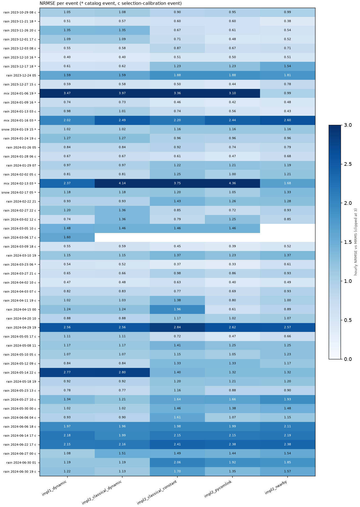
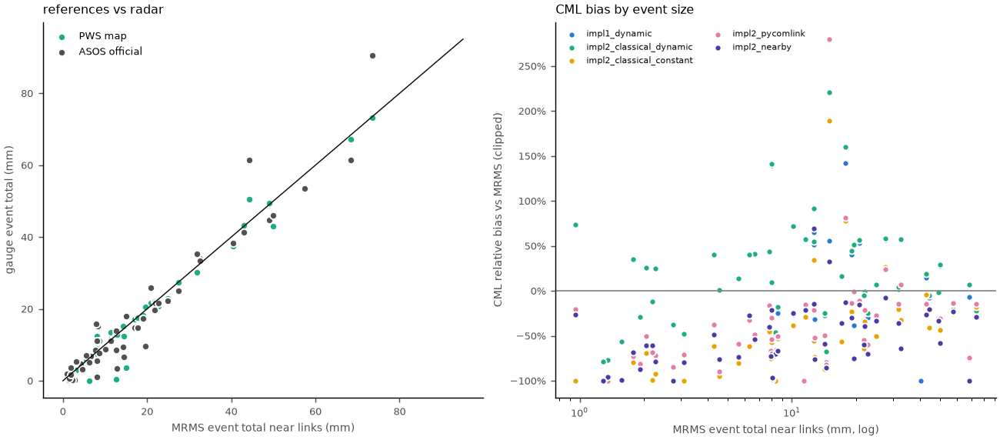
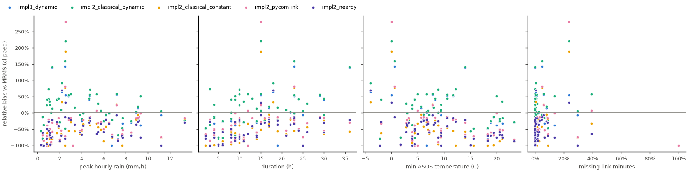

# All events of the OpenMesh record — methods, sensors and official gauges

Generated by `python src/run.py all-events` (`nyc_rain_maps.all_events`). 52 events with a domain-mean radar total >= 1 mm (47 rain, 3 mix, 2 snow), each run through every method on the gauge-selected links (`selected`) and the authors' links (`shared8`), scored hourly against MRMS on the 0.01 deg grid, with the PWS map and the official ASOS gauges alongside. Totals below are means over the cells within 2 km of a link (radar, PWS, CML) and over the ASOS stations in reach (Central Park, LaGuardia).

**Samples.** The link selection was calibrated on PWS gauges over the rain events >= 5 mm that are not in the catalog (*selection calibration*); those are in-sample for the *selection* (never for the radar). The catalog events and the smaller rain events were not used by it.

| sample | events |
|---|---|
| catalog (held out) | 10 |
| other (not used by selection) | 11 |
| selection calibration | 31 |

**Excluded from rankings:** 2 event(s) with more than 50% of link minutes missing (network outage - nothing to score): rain 2024-03-05 10 (100% missing), rain 2024-03-06 17 (100% missing).

## Ranking across 45 rain events (`selected` links)

| method | wins | median rank | median NRMSE | median bias | events under-estimated |
|---|---|---|---|---|---|
| `impl1_dynamic` | 16 | 2.0 | 0.98 | +1% | 49% |
| `impl2_classical_dynamic` | 9 | 2.0 | 1.02 | +7% | 44% |
| `impl2_pycomlink` | 15 | 3.0 | 1.00 | -49% | 96% |
| `impl2_classical_constant` | 1 | 4.0 | 1.17 | -61% | 98% |
| `impl2_nearby` | 4 | 4.0 | 1.00 | -60% | 100% |

| rain sample | events | `impl1_dynamic` median NRMSE / bias | `impl2_classical_dynamic` median NRMSE / bias | `impl2_classical_constant` median NRMSE / bias | `impl2_pycomlink` median NRMSE / bias | `impl2_nearby` median NRMSE / bias |
|---|---|---|---|---|---|---|
| catalog (held out) | 5 | 0.54 / -8% | 0.57 / -5% | 0.51 / -32% | 0.50 / -19% | 0.51 / -29% |
| other (not used by selection) | 11 | 1.15 / -12% | 1.15 / -12% | 1.41 / -100% | 1.23 / -71% | 1.25 / -78% |
| selection calibration | 29 | 1.02 / +7% | 1.07 / +13% | 0.98 / -55% | 0.95 / -31% | 0.96 / -58% |

| rain events | events | `impl1_dynamic` median NRMSE / bias | `impl2_classical_dynamic` median NRMSE / bias | `impl2_classical_constant` median NRMSE / bias | `impl2_pycomlink` median NRMSE / bias | `impl2_nearby` median NRMSE / bias |
|---|---|---|---|---|---|---|
| < 10 mm near links | 21 | 1.11 / +1% | 1.11 / +1% | 1.37 / -88% | 1.23 / -66% | 1.23 / -70% |
| >= 10 mm near links | 24 | 0.78 / +0% | 0.86 / +7% | 0.78 / -36% | 0.68 / -21% | 0.81 / -34% |

## What drives the errors (rain events, Spearman correlation with the event property)

| method | metric | total_mm | peak_hourly_mm | duration_h | min_temp_c | link_outage |
|---|---|---|---|---|---|---|
| `impl1_dynamic` | NRMSE | -0.60 | -0.39 | -0.32 | 0.54 | -0.29 |
| `impl1_dynamic` | |bias| | -0.45 | -0.28 | -0.30 | 0.25 | -0.21 |
| `impl2_classical_dynamic` | NRMSE | -0.52 | -0.35 | -0.29 | 0.50 | -0.18 |
| `impl2_classical_dynamic` | |bias| | -0.37 | -0.26 | -0.26 | 0.13 | -0.13 |
| `impl2_classical_constant` | NRMSE | -0.63 | -0.38 | -0.51 | 0.65 | -0.26 |
| `impl2_classical_constant` | |bias| | -0.74 | -0.58 | -0.64 | 0.26 | -0.48 |
| `impl2_pycomlink` | NRMSE | -0.52 | -0.30 | -0.41 | 0.56 | -0.17 |
| `impl2_pycomlink` | |bias| | -0.60 | -0.46 | -0.46 | 0.19 | -0.45 |
| `impl2_nearby` | NRMSE | -0.53 | -0.29 | -0.35 | 0.55 | -0.21 |
| `impl2_nearby` | |bias| | -0.46 | -0.26 | -0.51 | 0.19 | -0.22 |

- NRMSE falls with **total_mm** for most methods (median Spearman -0.53).
- NRMSE falls with **peak_hourly_mm** for most methods (median Spearman -0.35).
- NRMSE falls with **duration_h** for most methods (median Spearman -0.35).
- NRMSE rises with **min_temp_c** for most methods (median Spearman +0.55).
- |bias| falls with **total_mm** for most methods (median Spearman -0.46).
- |bias| falls with **duration_h** for most methods (median Spearman -0.46).

## Every event (`selected` links)

| event | type | sample | radar mm | PWS mm | ASOS mm | outage | impl1_dynamic NRMSE / bias | impl2_classical_dynamic NRMSE / bias | impl2_classical_constant NRMSE / bias | impl2_pycomlink NRMSE / bias | impl2_nearby NRMSE / bias | best |
|---|---|---|---|---|---|---|---|---|---|---|---|---|
| rain 2023-10-29 08 | rain | calib. | 20.8 | 21.6 | 25.9 | 1.0% | 1.05 / +54% | 1.08 / +56% | 0.90 / -13% | 0.95 / -11% | 0.99 / -15% | impl2_classical_constant |
| rain 2023-11-21 18 | rain | catalog | 44.3 | 50.6 | 61.3 | 4.6% | 0.51 / -8% | 0.57 / -5% | 0.60 / -41% | 0.60 / -19% | 0.38 / -21% | impl2_nearby |
| rain 2023-11-26 20 | rain | calib. | 10.1 | 8.8 | 8.8 | 0.3% | 1.35 / +72% | 1.35 / +72% | 0.67 / -38% | 0.61 / -26% | 0.54 / -24% | impl2_nearby |
| rain 2023-12-01 17 | rain | calib. | 11.6 | 12.4 | 11.0 | 0.0% | 1.09 / +57% | 1.09 / +57% | 0.71 / -29% | 0.48 / -16% | 0.52 / -21% | impl2_pycomlink |
| rain 2023-12-03 08 | rain | calib. | 17.1 | 17.2 | 14.8 | 0.3% | 0.55 / +16% | 0.58 / +17% | 0.87 / -56% | 0.67 / -37% | 0.71 / -36% | impl1_dynamic |
| rain 2023-12-10 16 | rain | catalog | 49.0 | 49.4 | 44.7 | 1.6% | 0.40 / -2% | 0.40 / -1% | 0.51 / -32% | 0.50 / -30% | 0.51 / -33% | impl2_classical_dynamic |
| rain 2023-12-17 18 | rain | catalog | 68.5 | 67.3 | 61.3 | 29.6% | 0.61 / -7% | 0.62 / +7% | 1.23 / -76% | 1.23 / -74% | 1.54 / -100% | impl1_dynamic |
| rain 2023-12-24 05 | rain |  | 1.4 | 0.3 | 0.1 | 0.0% | 1.59 / -77% | 1.59 / -77% | 1.88 / -100% | 1.88 / -100% | 1.81 / -96% | impl1_dynamic |
| rain 2023-12-27 15 | rain | calib. | 31.8 | 30.1 | 35.3 | 2.5% | 0.59 / +2% | 0.58 / +4% | 0.50 / -21% | 0.44 / -15% | 0.78 / -35% | impl2_pycomlink |
| mix 2024-01-06 19 | mix | catalog | 17.8 | 17.5 | 14.7 | 4.8% | 3.47 / +142% | 3.97 / +160% | 3.36 / +78% | 3.10 / +82% | 0.99 / -13% | impl2_nearby |
| rain 2024-01-09 16 | rain | catalog | 57.5 | 53.4 | 53.6 | 3.0% | 0.74 / -21% | 0.73 / -21% | 0.46 / -14% | 0.42 / -13% | 0.48 / -23% | impl2_pycomlink |
| rain 2024-01-13 03 | rain | calib. | 27.5 | 27.4 | 25.1 | 5.9% | 0.98 / +56% | 1.01 / +58% | 0.74 / +27% | 0.56 / +24% | 0.43 / -7% | impl2_nearby |
| mix 2024-01-16 03 | mix | catalog | 12.7 | 0.5 | 8.6 | 0.5% | 2.02 / +65% | 2.49 / +92% | 2.20 / +34% | 2.44 / +70% | 2.60 / +69% | impl1_dynamic |
| snow 2024-01-19 15 | snow | catalog | 1.3 | 0.0 | 0.9 | 0.0% | 1.02 / -78% | 1.02 / -78% | 1.16 / -100% | 1.16 / -100% | 1.16 / -100% | impl1_dynamic |
| rain 2024-01-24 19 | rain | calib. | 6.7 | 6.6 | 7.0 | 0.0% | 1.27 / +42% | 1.27 / +42% | 0.96 / -55% | 0.96 / -49% | 0.96 / -54% | impl2_pycomlink |
| rain 2024-01-26 05 | rain |  | 4.3 | 3.6 | 4.7 | 0.0% | 0.84 / +40% | 0.84 / +40% | 0.92 / -62% | 0.74 / -38% | 0.79 / -49% | impl2_pycomlink |
| rain 2024-01-28 06 | rain | calib. | 21.9 | 20.2 | 21.7 | 0.0% | 0.67 / -1% | 0.67 / -1% | 0.61 / -34% | 0.47 / -21% | 0.68 / -39% | impl2_pycomlink |
| rain 2024-01-29 07 | rain |  | 8.1 | 1.6 | 1.1 | 0.0% | 0.97 / -75% | 0.97 / -75% | 1.22 / -100% | 1.21 / -99% | 1.19 / -97% | impl1_dynamic |
| rain 2024-02-02 05 | rain | calib. | 5.6 | 5.7 | 7.0 | 0.0% | 0.81 / +13% | 0.81 / +13% | 1.25 / -80% | 1.00 / -59% | 1.21 / -74% | impl1_dynamic |
| mix 2024-02-13 03 | mix | catalog | 15.0 | 3.7 | 17.9 | 23.7% | 2.37 / +56% | 4.14 / +221% | 3.75 / +189% | 4.36 / +280% | 1.68 / +33% | impl2_nearby |
| snow 2024-02-17 05 | snow | catalog | 6.3 | 0.0 | 5.1 | 0.0% | 1.18 / +41% | 1.18 / +41% | 1.20 / -62% | 1.05 / -32% | 1.33 / -27% | impl2_pycomlink |
| rain 2024-02-22 21 | rain |  | 2.3 | 2.1 | 1.9 | 0.0% | 0.93 / +25% | 0.93 / +25% | 1.43 / -92% | 1.26 / -71% | 1.28 / -78% | impl1_dynamic |
| rain 2024-02-27 22 | rain | calib. | 19.1 | 18.1 | 17.4 | 0.8% | 1.20 / +40% | 1.36 / +45% | 0.85 / -23% | 0.72 / -14% | 0.93 / -30% | impl2_pycomlink |
| rain 2024-03-02 12 | rain | calib. | 32.6 | 34.1 | 33.4 | 39.4% | 0.74 / +5% | 1.36 / +57% | 0.79 / -32% | 1.25 / +7% | 0.85 / -64% | impl1_dynamic |
| rain 2024-03-05 10 | rain | calib. | 11.4 | 13.4 | 11.2 | 99.9% | 1.48 / -100% | 1.46 / -100% | 1.46 / -100% | 1.46 / -100% | - / - | impl2_classical_dynamic |
| rain 2024-03-06 17 | rain | calib. | 40.5 | 37.5 | 38.3 | 100.0% | 1.60 / -100% | - / - | - / - | - / - | - / - | impl1_dynamic |
| rain 2024-03-09 18 | rain | calib. | 42.9 | 43.2 | 41.3 | 7.7% | 0.55 / +15% | 0.59 / +19% | 0.45 / -4% | 0.39 / -15% | 0.52 / -26% | impl2_pycomlink |
| rain 2024-03-10 19 | rain |  | 2.7 | 0.1 | 0.1 | 0.0% | 1.15 / -37% | 1.15 / -37% | 1.37 / -100% | 1.23 / -85% | 1.37 / -100% | impl1_dynamic |
| rain 2024-03-23 06 | rain | catalog | 73.5 | 73.2 | 90.5 | 8.7% | 0.54 / -24% | 0.52 / -22% | 0.37 / -18% | 0.33 / -15% | 0.61 / -29% | impl2_pycomlink |
| rain 2024-03-27 21 | rain | calib. | 21.8 | 22.0 | 19.8 | 0.2% | 0.65 / -6% | 0.66 / -5% | 0.98 / -64% | 0.86 / -55% | 0.93 / -60% | impl1_dynamic |
| rain 2024-04-02 10 | rain | calib. | 25.0 | 22.8 | 22.4 | 0.4% | 0.47 / +7% | 0.48 / +7% | 0.63 / -51% | 0.40 / -27% | 0.49 / -34% | impl2_pycomlink |
| rain 2024-04-03 07 | rain | calib. | 50.0 | 43.1 | 46.0 | 1.4% | 0.82 / +27% | 0.83 / +29% | 0.77 / -44% | 0.69 / -31% | 0.93 / -58% | impl2_pycomlink |
| rain 2024-04-11 19 | rain | calib. | 12.7 | 12.9 | 14.0 | 0.4% | 1.02 / +52% | 1.03 / +55% | 1.38 / -55% | 0.80 / -21% | 1.00 / -15% | impl2_pycomlink |
| rain 2024-04-15 00 | rain |  | 1.0 | 1.2 | 1.9 | 0.0% | 1.24 / +73% | 1.24 / +73% | 1.96 / -100% | 0.61 / -21% | 0.89 / -26% | impl2_pycomlink |
| rain 2024-04-20 10 | rain |  | 2.1 | 1.8 | 1.5 | 0.0% | 0.88 / +26% | 0.88 / +26% | 1.17 / -70% | 1.02 / -51% | 1.07 / -60% | impl1_dynamic |
| rain 2024-04-29 19 | rain |  | 2.2 | 2.0 | 0.3 | 0.1% | 2.56 / -12% | 2.56 / -12% | 2.84 / -100% | 2.62 / -68% | 2.57 / -61% | impl2_classical_dynamic |
| rain 2024-05-05 17 | rain | calib. | 7.8 | 7.4 | 8.6 | 0.0% | 1.11 / +44% | 1.11 / +44% | 0.72 / -46% | 0.47 / -16% | 0.66 / -40% | impl2_pycomlink |
| rain 2024-05-08 11 | rain |  | 3.1 | 3.0 | 5.3 | 1.1% | 1.17 / -49% | 1.17 / -48% | 1.41 / -100% | 1.25 / -71% | 1.25 / -79% | impl2_classical_dynamic |
| rain 2024-05-10 05 | rain | calib. | 8.0 | 7.4 | 5.6 | 0.0% | 1.07 / +9% | 1.07 / +9% | 1.15 / -66% | 1.05 / -54% | 1.23 / -70% | impl2_pycomlink |
| rain 2024-05-12 09 | rain | calib. | 4.5 | 4.2 | 3.2 | 0.0% | 0.84 / +1% | 0.84 / +1% | 1.33 / -95% | 1.33 / -90% | 1.17 / -76% | impl1_dynamic |
| rain 2024-05-14 22 | rain | calib. | 8.0 | 12.4 | 11.0 | 0.1% | 2.77 / +139% | 2.80 / +141% | 1.40 / -57% | 1.32 / -30% | 1.32 / -21% | impl2_nearby |
| rain 2024-05-18 19 | rain |  | 1.6 | 0.8 | 0.6 | 0.0% | 0.92 / -56% | 0.92 / -56% | 1.20 / -99% | 1.21 / -100% | 1.20 / -99% | impl1_dynamic |
| rain 2024-05-23 13 | rain | calib. | 8.4 | 10.4 | 15.1 | 9.0% | 0.78 / -49% | 0.77 / -46% | 1.16 / -100% | 0.88 / -66% | 0.90 / -70% | impl2_classical_dynamic |
| rain 2024-05-27 10 | rain | calib. | 22.7 | 20.7 | 21.6 | 2.0% | 1.34 / -30% | 1.21 / -25% | 1.64 / -61% | 1.66 / -60% | 1.93 / -70% | impl2_classical_dynamic |
| rain 2024-05-30 00 | rain | calib. | 8.0 | 9.0 | 15.8 | 0.0% | 1.02 / -21% | 1.02 / -21% | 1.46 / -75% | 1.38 / -66% | 1.48 / -72% | impl1_dynamic |
| rain 2024-06-06 04 | rain | calib. | 14.3 | 15.1 | 9.4 | 2.8% | 0.93 / -27% | 0.90 / -24% | 1.61 / -87% | 1.07 / -50% | 1.15 / -59% | impl2_classical_dynamic |
| rain 2024-06-06 18 | rain | calib. | 8.6 | 11.2 | 7.6 | 2.1% | 1.97 / -25% | 1.96 / -18% | 1.98 / -53% | 1.99 / -51% | 2.11 / -67% | impl2_classical_dynamic |
| rain 2024-06-14 17 | rain | calib. | 14.5 | 12.4 | 6.7 | 2.0% | 2.18 / -79% | 1.99 / -67% | 2.15 / -82% | 2.15 / -82% | 2.19 / -86% | impl2_classical_dynamic |
| rain 2024-06-22 17 | rain | calib. | 1.9 | 1.8 | 3.7 | 0.0% | 2.15 / -30% | 2.16 / -29% | 2.41 / -88% | 2.38 / -81% | 2.38 / -87% | impl1_dynamic |
| rain 2024-06-27 00 | rain | calib. | 19.6 | 20.6 | 9.6 | 13.6% | 1.08 / -38% | 1.51 / +51% | 1.49 / -1% | 1.44 / -0% | 1.54 / -75% | impl1_dynamic |
| rain 2024-06-30 01 | rain |  | 1.8 | 1.8 | 1.8 | 0.0% | 1.19 / +35% | 1.19 / +35% | 2.06 / -79% | 1.92 / -72% | 1.85 / -68% | impl1_dynamic |
| rain 2024-06-30 19 | rain | calib. | 12.8 | 12.9 | 3.4 | 6.6% | 1.22 / -32% | 1.13 / -15% | 1.70 / -74% | 1.35 / -52% | 1.57 / -76% | impl2_classical_dynamic |

`event_table_selected.csv` / `event_table_shared8.csv` hold every number; `pooled_scores.csv` the pooled scores per type and link set.
