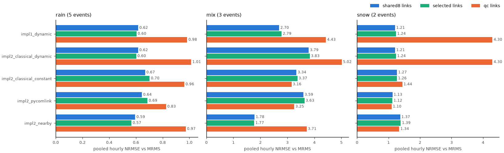
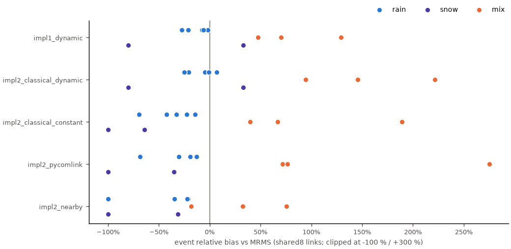
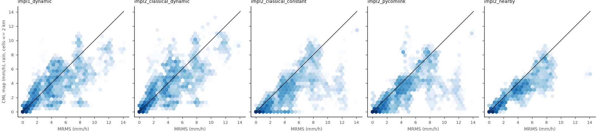
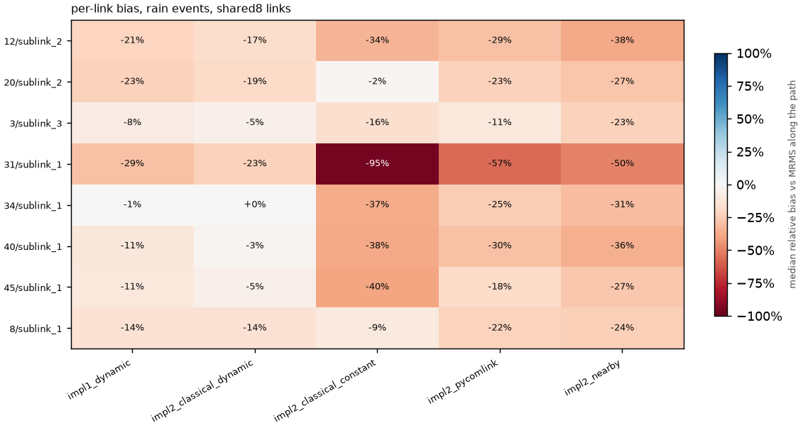

# CML rainfall maps vs MRMS radar - study `study`

_Generated 2026-09-28T17:11:35+00:00 by `nyc_rain_maps` 1.0 (Python 3.11.5). Regenerate: `python src/run.py study`._

## Design

- **Events:** 10 precipitation events inside the OpenMesh record (5 rain, 3 mix, 2 snow), from the MRMS/ASOS event catalog (`events/`).
- **Methods:** `impl1_dynamic`, `impl2_classical_dynamic`, `impl2_classical_constant`, `impl2_pycomlink`, `impl2_nearby` (definitions: `docs/METHODS.md`).
- **Link sets:** `shared8`, `selected`, `qc` - `shared8` = the 8 sublinks both implementations picked by eye; `selected` = the cherry-picking pipeline (`nyc_rain_maps.link_selection`: implementation_1's contact-loss, rain-response and accumulation checks + one sublink per path, calibrated on PWS gauges over rain events *not* in this study - see `results/link_selection/`); `qc` = the README's automatic metadata/time-series QC over all 103 sublinks, re-run per event.
- **Common footing:** 6h spin-up; 1-min link rain -> hourly accumulations (hour-ending, >= 80 % coverage); IDW power 2, 10 km radius, on the MRMS 0.01 deg grid; reference MRMS `MultiSensor_QPE_01H_Pass2`; only cells/hours where both are valid.
- **Scores:** pooled over all cell-hours of a type (every hour weighs the same) and per event. The sample is the cell-hours every full-coverage method has (>= 90% of the best-covered method in that event); a method with gaps is scored on its share of that sample and its **coverage** is reported, so it can neither remove its failed hours from everyone's score nor look better by staying silent; NRMSE = RMSE / mean(radar); wet = >= 0.1 mm/h for POD/FAR/CSI. 'near' = cells within 2.0 km of a link.

## Findings

- **rain, shared8 links** (5 events, 35,693 cell-hours): lowest hourly NRMSE 0.62 with `impl2_classical_dynamic`; smallest total bias -9% with `impl2_classical_dynamic`; the methods typically under-estimate (median bias -29%); incomplete output (not ranked): `impl2_nearby` 76% coverage, NRMSE 0.59 on it.
- **mix, shared8 links** (3 events, 20,369 cell-hours): lowest hourly NRMSE 1.78 with `impl2_nearby`; smallest total bias +25% with `impl2_nearby`; the methods typically over-estimate (median bias +102%).
- **snow, shared8 links** (2 events, 5,110 cell-hours): lowest hourly NRMSE 1.13 with `impl2_pycomlink`; smallest total bias +11% with `impl1_dynamic`; the methods typically under-estimate (median bias -44%).
- **rain, selected links** (5 events, 36,500 cell-hours): lowest hourly NRMSE 0.60 with `impl2_classical_dynamic`; smallest total bias -9% with `impl2_classical_dynamic`; the methods typically under-estimate (median bias -27%); incomplete output (not ranked): `impl2_nearby` 74% coverage, NRMSE 0.57 on it.
- **mix, selected links** (3 events, 20,075 cell-hours): lowest hourly NRMSE 1.77 with `impl2_nearby`; smallest total bias +25% with `impl2_nearby`; the methods typically over-estimate (median bias +106%).
- **snow, selected links** (2 events, 5,110 cell-hours): lowest hourly NRMSE 1.12 with `impl2_pycomlink`; smallest total bias +18% with `impl1_dynamic`; the methods typically under-estimate (median bias -41%).
- **rain, qc links** (5 events, 44,638 cell-hours): lowest hourly NRMSE 0.83 with `impl2_pycomlink`; smallest total bias -13% with `impl2_pycomlink`; the methods typically under-estimate (median bias -13%).
- **mix, qc links** (3 events, 25,320 cell-hours): lowest hourly NRMSE 3.16 with `impl2_classical_constant`; smallest total bias +63% with `impl2_classical_constant`; the methods typically over-estimate (median bias +125%).
- **snow, qc links** (2 events, 6,468 cell-hours): lowest hourly NRMSE 1.10 with `impl2_pycomlink`; smallest total bias -37% with `impl2_nearby`; the methods typically under-estimate (median bias -37%).
- **Sensors, rain** (cells <= 2 km of links): the PWS gauge map differs from MRMS by NRMSE 0.33 (bias +0%); the best CML map (`impl2_classical_dynamic`) by 0.57 (-9%) - the gauge-radar disagreement is the floor any CML score should be read against.
- **Sensors, mix** (cells <= 2 km of links): the PWS gauge map differs from MRMS by NRMSE 1.08 (bias -52%); the best CML map (`impl2_nearby`) by 1.89 (+36%) - the gauge-radar disagreement is the floor any CML score should be read against.
- **Sensors, snow** (cells <= 2 km of links): the PWS gauge map differs from MRMS by NRMSE 1.40 (bias -100%); the best CML map (`impl2_pycomlink`) by 1.11 (-45%) - the gauge-radar disagreement is the floor any CML score should be read against.
- **Cherry-picked links** (gauge-calibrated selection, 10 held-out events): NRMSE within 0.05 of the hand-picked 8 in 14 of 15 cases, better in 0, worse in 1.
- **Link set:** the automatic-QC link set beats the 8 hand-picked links in 4 of 15 (type, method) cases by pooled NRMSE.

## Pooled scores - `shared8` links, all cells

| type | method | events | coverage | cell-hours | radar mean mm/h | CML mean mm/h | rel. bias | NRMSE | corr | POD | FAR | CSI |
|---|---|---|---|---|---|---|---|---|---|---|---|---|
| rain | `impl2_nearby` | 5 | 76% | 27,663 | 3.01 | 2.14 | -29% | 0.59 | 0.85 | 0.88 | 0.03 | 0.86 |
| rain | `impl2_classical_dynamic` | 5 | 100% | 35,693 | 3.01 | 2.73 | -9% | 0.62 | 0.80 | 0.97 | 0.06 | 0.92 |
| rain | `impl1_dynamic` | 5 | 100% | 35,693 | 3.01 | 2.60 | -14% | 0.62 | 0.80 | 0.97 | 0.05 | 0.92 |
| rain | `impl2_pycomlink` | 5 | 100% | 35,693 | 3.01 | 2.14 | -29% | 0.64 | 0.82 | 0.89 | 0.04 | 0.86 |
| rain | `impl2_classical_constant` | 5 | 100% | 35,693 | 3.01 | 1.93 | -36% | 0.67 | 0.83 | 0.76 | 0.02 | 0.75 |
| mix | `impl2_nearby` | 3 | 100% | 20,369 | 0.85 | 1.07 | +25% | 1.78 | 0.38 | 0.62 | 0.15 | 0.56 |
| mix | `impl1_dynamic` | 3 | 100% | 20,369 | 0.85 | 1.58 | +85% | 2.70 | 0.48 | 0.74 | 0.22 | 0.61 |
| mix | `impl2_classical_constant` | 3 | 100% | 20,369 | 0.85 | 1.73 | +102% | 3.34 | 0.53 | 0.54 | 0.03 | 0.53 |
| mix | `impl2_pycomlink` | 3 | 100% | 20,369 | 0.85 | 2.08 | +143% | 3.59 | 0.51 | 0.69 | 0.06 | 0.66 |
| mix | `impl2_classical_dynamic` | 3 | 100% | 20,369 | 0.85 | 2.21 | +158% | 3.79 | 0.58 | 0.79 | 0.21 | 0.66 |
| snow | `impl2_pycomlink` | 2 | 100% | 5,110 | 0.58 | 0.30 | -48% | 1.13 | 0.39 | 0.50 | 0.02 | 0.49 |
| snow | `impl1_dynamic` | 2 | 100% | 5,110 | 0.58 | 0.64 | +11% | 1.21 | 0.52 | 0.71 | 0.06 | 0.68 |
| snow | `impl2_classical_dynamic` | 2 | 100% | 5,110 | 0.58 | 0.64 | +11% | 1.21 | 0.52 | 0.71 | 0.06 | 0.68 |
| snow | `impl2_classical_constant` | 2 | 100% | 5,110 | 0.58 | 0.17 | -71% | 1.27 | 0.22 | 0.33 | 0.03 | 0.33 |
| snow | `impl2_nearby` | 2 | 100% | 5,110 | 0.58 | 0.32 | -44% | 1.37 | 0.07 | 0.50 | 0.07 | 0.48 |

## Pooled scores - `shared8` links, cells near links

| type | method | events | coverage | cell-hours | radar mean mm/h | CML mean mm/h | rel. bias | NRMSE | corr | POD | FAR | CSI |
|---|---|---|---|---|---|---|---|---|---|---|---|---|
| rain | `impl2_nearby` | 5 | 76% | 6,308 | 2.94 | 2.09 | -29% | 0.59 | 0.86 | 0.88 | 0.02 | 0.86 |
| rain | `impl2_classical_dynamic` | 5 | 100% | 8,134 | 2.97 | 2.70 | -9% | 0.59 | 0.82 | 0.97 | 0.05 | 0.93 |
| rain | `impl1_dynamic` | 5 | 100% | 8,134 | 2.97 | 2.58 | -13% | 0.60 | 0.82 | 0.96 | 0.05 | 0.92 |
| rain | `impl2_pycomlink` | 5 | 100% | 8,134 | 2.97 | 2.12 | -29% | 0.64 | 0.82 | 0.88 | 0.04 | 0.85 |
| rain | `impl2_classical_constant` | 5 | 100% | 8,134 | 2.97 | 1.89 | -36% | 0.68 | 0.83 | 0.76 | 0.02 | 0.75 |
| mix | `impl2_nearby` | 3 | 100% | 4,648 | 0.81 | 1.09 | +34% | 1.90 | 0.39 | 0.64 | 0.17 | 0.57 |
| mix | `impl1_dynamic` | 3 | 100% | 4,648 | 0.81 | 1.52 | +87% | 2.60 | 0.51 | 0.74 | 0.23 | 0.61 |
| mix | `impl2_classical_constant` | 3 | 100% | 4,648 | 0.81 | 1.67 | +105% | 3.35 | 0.55 | 0.56 | 0.04 | 0.55 |
| mix | `impl2_pycomlink` | 3 | 100% | 4,648 | 0.81 | 2.03 | +150% | 3.68 | 0.52 | 0.69 | 0.08 | 0.65 |
| mix | `impl2_classical_dynamic` | 3 | 100% | 4,648 | 0.81 | 2.13 | +162% | 3.79 | 0.59 | 0.78 | 0.22 | 0.64 |
| snow | `impl2_pycomlink` | 2 | 100% | 1,162 | 0.54 | 0.28 | -48% | 1.11 | 0.42 | 0.48 | 0.03 | 0.48 |
| snow | `impl1_dynamic` | 2 | 100% | 1,162 | 0.54 | 0.62 | +14% | 1.22 | 0.55 | 0.70 | 0.07 | 0.66 |
| snow | `impl2_classical_dynamic` | 2 | 100% | 1,162 | 0.54 | 0.62 | +14% | 1.22 | 0.55 | 0.70 | 0.07 | 0.66 |
| snow | `impl2_classical_constant` | 2 | 100% | 1,162 | 0.54 | 0.16 | -71% | 1.25 | 0.26 | 0.32 | 0.05 | 0.31 |
| snow | `impl2_nearby` | 2 | 100% | 1,162 | 0.54 | 0.32 | -42% | 1.40 | 0.10 | 0.54 | 0.07 | 0.52 |

## Pooled scores - `selected` links, all cells

| type | method | events | coverage | cell-hours | radar mean mm/h | CML mean mm/h | rel. bias | NRMSE | corr | POD | FAR | CSI |
|---|---|---|---|---|---|---|---|---|---|---|---|---|
| rain | `impl2_nearby` | 5 | 74% | 27,010 | 3.06 | 2.23 | -27% | 0.57 | 0.86 | 0.89 | 0.03 | 0.86 |
| rain | `impl2_classical_dynamic` | 5 | 100% | 36,500 | 2.96 | 2.69 | -9% | 0.60 | 0.81 | 0.97 | 0.06 | 0.91 |
| rain | `impl1_dynamic` | 5 | 100% | 36,500 | 2.96 | 2.57 | -13% | 0.60 | 0.82 | 0.96 | 0.06 | 0.91 |
| rain | `impl2_pycomlink` | 5 | 100% | 36,500 | 2.96 | 2.04 | -31% | 0.69 | 0.80 | 0.86 | 0.04 | 0.84 |
| rain | `impl2_classical_constant` | 5 | 100% | 36,500 | 2.96 | 1.89 | -36% | 0.70 | 0.81 | 0.74 | 0.02 | 0.72 |
| mix | `impl2_nearby` | 3 | 98% | 20,075 | 0.86 | 1.08 | +25% | 1.77 | 0.37 | 0.64 | 0.16 | 0.57 |
| mix | `impl1_dynamic` | 3 | 100% | 20,075 | 0.86 | 1.66 | +92% | 2.79 | 0.47 | 0.76 | 0.23 | 0.62 |
| mix | `impl2_classical_constant` | 3 | 100% | 20,075 | 0.86 | 1.78 | +106% | 3.37 | 0.52 | 0.55 | 0.04 | 0.54 |
| mix | `impl2_pycomlink` | 3 | 100% | 20,075 | 0.86 | 2.14 | +149% | 3.63 | 0.51 | 0.71 | 0.06 | 0.68 |
| mix | `impl2_classical_dynamic` | 3 | 100% | 20,075 | 0.86 | 2.27 | +164% | 3.83 | 0.57 | 0.81 | 0.21 | 0.67 |
| snow | `impl2_pycomlink` | 2 | 100% | 5,110 | 0.58 | 0.32 | -45% | 1.12 | 0.39 | 0.51 | 0.02 | 0.50 |
| snow | `impl1_dynamic` | 2 | 100% | 5,110 | 0.58 | 0.68 | +18% | 1.24 | 0.53 | 0.72 | 0.06 | 0.69 |
| snow | `impl2_classical_dynamic` | 2 | 100% | 5,110 | 0.58 | 0.68 | +18% | 1.24 | 0.53 | 0.72 | 0.06 | 0.69 |
| snow | `impl2_classical_constant` | 2 | 100% | 5,110 | 0.58 | 0.18 | -69% | 1.26 | 0.23 | 0.35 | 0.03 | 0.34 |
| snow | `impl2_nearby` | 2 | 100% | 5,110 | 0.58 | 0.34 | -41% | 1.39 | 0.06 | 0.50 | 0.07 | 0.48 |

## Pooled scores - `selected` links, cells near links

| type | method | events | coverage | cell-hours | radar mean mm/h | CML mean mm/h | rel. bias | NRMSE | corr | POD | FAR | CSI |
|---|---|---|---|---|---|---|---|---|---|---|---|---|
| rain | `impl2_nearby` | 5 | 74% | 6,142 | 2.99 | 2.19 | -27% | 0.55 | 0.88 | 0.89 | 0.03 | 0.87 |
| rain | `impl2_classical_dynamic` | 5 | 100% | 8,300 | 2.93 | 2.67 | -9% | 0.57 | 0.84 | 0.96 | 0.05 | 0.92 |
| rain | `impl1_dynamic` | 5 | 100% | 8,300 | 2.93 | 2.56 | -13% | 0.58 | 0.83 | 0.96 | 0.05 | 0.91 |
| rain | `impl2_pycomlink` | 5 | 100% | 8,300 | 2.93 | 2.00 | -32% | 0.70 | 0.79 | 0.85 | 0.03 | 0.82 |
| rain | `impl2_classical_constant` | 5 | 100% | 8,300 | 2.93 | 1.85 | -37% | 0.72 | 0.80 | 0.73 | 0.02 | 0.72 |
| mix | `impl2_nearby` | 3 | 98% | 4,565 | 0.82 | 1.12 | +36% | 1.89 | 0.38 | 0.66 | 0.18 | 0.58 |
| mix | `impl1_dynamic` | 3 | 100% | 4,565 | 0.82 | 1.61 | +97% | 2.73 | 0.50 | 0.76 | 0.24 | 0.62 |
| mix | `impl2_classical_constant` | 3 | 100% | 4,565 | 0.82 | 1.74 | +112% | 3.42 | 0.54 | 0.58 | 0.04 | 0.56 |
| mix | `impl2_pycomlink` | 3 | 100% | 4,565 | 0.82 | 2.12 | +158% | 3.77 | 0.51 | 0.72 | 0.08 | 0.68 |
| mix | `impl2_classical_dynamic` | 3 | 100% | 4,565 | 0.82 | 2.21 | +169% | 3.84 | 0.58 | 0.81 | 0.23 | 0.65 |
| snow | `impl2_pycomlink` | 2 | 100% | 1,162 | 0.54 | 0.30 | -45% | 1.11 | 0.43 | 0.49 | 0.03 | 0.49 |
| snow | `impl2_classical_constant` | 2 | 100% | 1,162 | 0.54 | 0.17 | -68% | 1.25 | 0.27 | 0.33 | 0.05 | 0.33 |
| snow | `impl1_dynamic` | 2 | 100% | 1,162 | 0.54 | 0.66 | +22% | 1.26 | 0.56 | 0.72 | 0.08 | 0.68 |
| snow | `impl2_classical_dynamic` | 2 | 100% | 1,162 | 0.54 | 0.66 | +22% | 1.26 | 0.56 | 0.72 | 0.08 | 0.68 |
| snow | `impl2_nearby` | 2 | 100% | 1,162 | 0.54 | 0.34 | -38% | 1.42 | 0.09 | 0.54 | 0.07 | 0.52 |

## Pooled scores - `qc` links, all cells

| type | method | events | coverage | cell-hours | radar mean mm/h | CML mean mm/h | rel. bias | NRMSE | corr | POD | FAR | CSI |
|---|---|---|---|---|---|---|---|---|---|---|---|---|
| rain | `impl2_pycomlink` | 5 | 100% | 44,638 | 3.01 | 2.61 | -13% | 0.83 | 0.71 | 0.89 | 0.07 | 0.83 |
| rain | `impl2_classical_constant` | 5 | 100% | 44,638 | 3.01 | 2.59 | -14% | 0.96 | 0.67 | 0.79 | 0.04 | 0.77 |
| rain | `impl2_nearby` | 5 | 98% | 44,638 | 3.01 | 1.91 | -37% | 0.97 | 0.52 | 0.89 | 0.05 | 0.85 |
| rain | `impl1_dynamic` | 5 | 100% | 44,638 | 3.01 | 4.26 | +42% | 0.98 | 0.65 | 0.99 | 0.11 | 0.89 |
| rain | `impl2_classical_dynamic` | 5 | 100% | 44,638 | 3.01 | 4.37 | +45% | 1.01 | 0.66 | 0.99 | 0.11 | 0.89 |
| mix | `impl2_classical_constant` | 3 | 100% | 25,320 | 0.84 | 1.37 | +63% | 3.16 | 0.46 | 0.58 | 0.13 | 0.53 |
| mix | `impl2_pycomlink` | 3 | 100% | 25,320 | 0.84 | 1.55 | +85% | 3.25 | 0.50 | 0.66 | 0.10 | 0.62 |
| mix | `impl2_nearby` | 3 | 98% | 25,320 | 0.84 | 1.88 | +125% | 3.71 | 0.41 | 0.73 | 0.22 | 0.61 |
| mix | `impl1_dynamic` | 3 | 100% | 25,320 | 0.84 | 3.31 | +295% | 4.43 | 0.46 | 0.97 | 0.27 | 0.72 |
| mix | `impl2_classical_dynamic` | 3 | 100% | 25,320 | 0.84 | 3.55 | +324% | 5.02 | 0.48 | 0.98 | 0.27 | 0.72 |
| snow | `impl2_pycomlink` | 2 | 100% | 6,468 | 0.55 | 0.31 | -43% | 1.10 | 0.51 | 0.44 | 0.09 | 0.42 |
| snow | `impl2_nearby` | 2 | 100% | 6,468 | 0.55 | 0.34 | -37% | 1.34 | 0.16 | 0.54 | 0.11 | 0.50 |
| snow | `impl2_classical_constant` | 2 | 100% | 6,468 | 0.55 | 0.33 | -40% | 1.44 | 0.44 | 0.32 | 0.03 | 0.31 |
| snow | `impl1_dynamic` | 2 | 100% | 6,468 | 0.55 | 2.10 | +285% | 4.30 | 0.26 | 0.95 | 0.20 | 0.77 |
| snow | `impl2_classical_dynamic` | 2 | 100% | 6,468 | 0.55 | 2.10 | +285% | 4.30 | 0.26 | 0.95 | 0.20 | 0.77 |

## Pooled scores - `qc` links, cells near links

| type | method | events | coverage | cell-hours | radar mean mm/h | CML mean mm/h | rel. bias | NRMSE | corr | POD | FAR | CSI |
|---|---|---|---|---|---|---|---|---|---|---|---|---|
| rain | `impl2_pycomlink` | 5 | 100% | 14,065 | 2.97 | 2.15 | -28% | 0.83 | 0.69 | 0.85 | 0.05 | 0.81 |
| rain | `impl2_nearby` | 5 | 98% | 14,065 | 2.97 | 1.79 | -40% | 0.91 | 0.60 | 0.88 | 0.04 | 0.85 |
| rain | `impl2_classical_constant` | 5 | 100% | 14,065 | 2.97 | 2.01 | -32% | 0.94 | 0.66 | 0.75 | 0.02 | 0.74 |
| rain | `impl1_dynamic` | 5 | 100% | 14,065 | 2.97 | 4.03 | +36% | 1.00 | 0.63 | 1.00 | 0.11 | 0.89 |
| rain | `impl2_classical_dynamic` | 5 | 100% | 14,065 | 2.97 | 4.15 | +40% | 1.04 | 0.64 | 1.00 | 0.11 | 0.89 |
| mix | `impl2_nearby` | 3 | 98% | 8,274 | 0.81 | 1.74 | +113% | 3.52 | 0.40 | 0.74 | 0.22 | 0.61 |
| mix | `impl2_classical_constant` | 3 | 100% | 8,274 | 0.81 | 1.38 | +69% | 3.86 | 0.44 | 0.58 | 0.11 | 0.54 |
| mix | `impl2_pycomlink` | 3 | 100% | 8,274 | 0.81 | 1.65 | +103% | 4.14 | 0.45 | 0.67 | 0.11 | 0.62 |
| mix | `impl1_dynamic` | 3 | 100% | 8,274 | 0.81 | 3.34 | +310% | 4.82 | 0.47 | 0.99 | 0.27 | 0.73 |
| mix | `impl2_classical_dynamic` | 3 | 100% | 8,274 | 0.81 | 3.63 | +346% | 5.75 | 0.46 | 0.99 | 0.27 | 0.73 |
| snow | `impl2_pycomlink` | 2 | 100% | 2,114 | 0.53 | 0.39 | -26% | 1.23 | 0.50 | 0.54 | 0.07 | 0.52 |
| snow | `impl2_nearby` | 2 | 100% | 2,114 | 0.53 | 0.41 | -24% | 1.49 | 0.19 | 0.59 | 0.08 | 0.56 |
| snow | `impl2_classical_constant` | 2 | 100% | 2,114 | 0.53 | 0.43 | -20% | 1.82 | 0.42 | 0.38 | 0.04 | 0.38 |
| snow | `impl1_dynamic` | 2 | 100% | 2,114 | 0.53 | 2.20 | +314% | 4.93 | 0.34 | 0.99 | 0.19 | 0.80 |
| snow | `impl2_classical_dynamic` | 2 | 100% | 2,114 | 0.53 | 2.20 | +314% | 4.93 | 0.34 | 0.99 | 0.19 | 0.80 |

## Multi-sensor agreement

CML maps (`selected` links), the PWS gauge map (implementation_1's 5th-95th-percentile gauge filter, same IDW) and MRMS, compared pairwise on the same cell-hours within 2 km of a link; ASOS (never used in a map) is the independent point check. Per-event snapshot grids, totals and time series: `events/<event>/` next to this report (not tracked; `python src/run.py compare` redraws any one).

| type | estimate | reference | coverage | cell-hours | rel. bias | NRMSE | corr | CSI |
|---|---|---|---|---|---|---|---|---|
| rain | PWS | MRMS | 100% | 8,300 | +0% | 0.33 | 0.95 | 0.93 |
| rain | CML impl2_nearby | MRMS | 74% | 6,142 | -27% | 0.55 | 0.88 | 0.87 |
| rain | CML impl2_classical_dynamic | MRMS | 100% | 8,300 | -9% | 0.57 | 0.84 | 0.92 |
| rain | CML impl1_dynamic | MRMS | 100% | 8,300 | -13% | 0.58 | 0.83 | 0.91 |
| rain | CML impl2_pycomlink | MRMS | 100% | 8,300 | -32% | 0.70 | 0.79 | 0.82 |
| rain | CML impl2_classical_constant | MRMS | 100% | 8,300 | -37% | 0.72 | 0.80 | 0.72 |
| rain | CML impl2_classical_dynamic | PWS | 100% | 8,300 | -9% | 0.59 | 0.84 | 0.91 |
| rain | CML impl1_dynamic | PWS | 100% | 8,300 | -13% | 0.62 | 0.83 | 0.91 |
| rain | CML impl2_nearby | PWS | 74% | 6,142 | -27% | 0.63 | 0.83 | 0.89 |
| rain | CML impl2_pycomlink | PWS | 100% | 8,300 | -32% | 0.72 | 0.81 | 0.85 |
| rain | CML impl2_classical_constant | PWS | 100% | 8,300 | -37% | 0.83 | 0.73 | 0.74 |
| mix | PWS | MRMS | 100% | 4,565 | -52% | 1.08 | 0.50 | 0.46 |
| mix | CML impl2_nearby | MRMS | 98% | 4,565 | +36% | 1.89 | 0.38 | 0.58 |
| mix | CML impl1_dynamic | MRMS | 100% | 4,565 | +97% | 2.73 | 0.50 | 0.62 |
| mix | CML impl2_classical_constant | MRMS | 100% | 4,565 | +112% | 3.42 | 0.54 | 0.56 |
| mix | CML impl2_pycomlink | MRMS | 100% | 4,565 | +158% | 3.77 | 0.51 | 0.68 |
| mix | CML impl2_classical_dynamic | MRMS | 100% | 4,565 | +169% | 3.84 | 0.58 | 0.65 |
| mix | CML impl2_nearby | PWS | 98% | 4,565 | +186% | 4.74 | 0.09 | 0.64 |
| mix | CML impl1_dynamic | PWS | 100% | 4,565 | +313% | 6.76 | 0.21 | 0.54 |
| mix | CML impl2_classical_constant | PWS | 100% | 4,565 | +345% | 8.48 | 0.09 | 0.43 |
| mix | CML impl2_pycomlink | PWS | 100% | 4,565 | +441% | 9.15 | 0.12 | 0.53 |
| mix | CML impl2_classical_dynamic | PWS | 100% | 4,565 | +465% | 9.50 | 0.09 | 0.58 |
| snow | CML impl2_pycomlink | MRMS | 100% | 1,162 | -45% | 1.11 | 0.43 | 0.49 |
| snow | CML impl2_classical_constant | MRMS | 100% | 1,162 | -68% | 1.25 | 0.27 | 0.33 |
| snow | CML impl1_dynamic | MRMS | 100% | 1,162 | +22% | 1.26 | 0.56 | 0.68 |
| snow | CML impl2_classical_dynamic | MRMS | 100% | 1,162 | +22% | 1.26 | 0.56 | 0.68 |
| snow | PWS | MRMS | 100% | 1,162 | -100% | 1.40 | -0.06 | 0.00 |
| snow | CML impl2_nearby | MRMS | 100% | 1,162 | -38% | 1.42 | 0.09 | 0.52 |
| snow | CML impl2_classical_constant | PWS | 100% | 1,162 | +9129% | 225.83 | -0.08 | 0.00 |
| snow | CML impl2_pycomlink | PWS | 100% | 1,162 | +15887% | 309.50 | -0.10 | 0.00 |
| snow | CML impl2_nearby | PWS | 100% | 1,162 | +17972% | 354.86 | -0.11 | 0.00 |
| snow | CML impl1_dynamic | PWS | 100% | 1,162 | +35227% | 557.83 | -0.12 | 0.00 |
| snow | CML impl2_classical_dynamic | PWS | 100% | 1,162 | +35227% | 557.83 | -0.12 | 0.00 |

**At the ASOS stations** (hourly, map value in the station's cell vs the gauge):

| type | map | station-hours | rel. bias | NRMSE | corr |
|---|---|---|---|---|---|
| rain | PWS | 200 | -0% | 0.39 | 0.95 |
| rain | MRMS | 200 | -3% | 0.58 | 0.89 |
| rain | CML impl2_pycomlink | 200 | -25% | 0.75 | 0.85 |
| rain | CML impl2_nearby | 148 | -28% | 0.83 | 0.78 |
| rain | CML impl2_classical_constant | 200 | -27% | 0.88 | 0.74 |
| rain | CML impl2_classical_dynamic | 200 | -9% | 0.89 | 0.71 |
| rain | CML impl1_dynamic | 200 | -15% | 0.90 | 0.71 |
| mix | MRMS | 112 | +7% | 0.73 | 0.74 |
| mix | PWS | 112 | -43% | 1.25 | 0.26 |
| mix | CML impl2_nearby | 110 | +37% | 2.10 | 0.45 |
| mix | CML impl1_dynamic | 112 | +181% | 4.93 | 0.36 |
| mix | CML impl2_pycomlink | 112 | +244% | 5.22 | 0.75 |
| mix | CML impl2_classical_constant | 112 | +236% | 5.48 | 0.72 |
| mix | CML impl2_classical_dynamic | 112 | +262% | 5.97 | 0.57 |
| snow | MRMS | 28 | -3% | 0.61 | 0.84 |
| snow | PWS | 28 | -99% | 1.49 | -0.09 |
| snow | CML impl2_nearby | 28 | -13% | 1.66 | 0.12 |
| snow | CML impl2_classical_constant | 28 | -41% | 1.66 | 0.09 |
| snow | CML impl2_pycomlink | 28 | +10% | 1.71 | 0.17 |
| snow | CML impl1_dynamic | 28 | +86% | 2.33 | 0.30 |
| snow | CML impl2_classical_dynamic | 28 | +86% | 2.33 | 0.30 |

## Per-event NRMSE (`shared8`)

| event | type | `impl1_dynamic` | `impl2_classical_dynamic` | `impl2_classical_constant` | `impl2_pycomlink` | `impl2_nearby` |
|---|---|---|---|---|---|---|
| rain#5 2023-11-21 | rain | 0.51 | 0.58 | 0.60 | 0.61 | 0.38 |
| rain#4 2023-12-10 | rain | 0.42 | 0.42 | 0.51 | 0.50 | 0.52 |
| rain#2 2023-12-17 | rain | 0.59 | 0.60 | 1.11 | 1.12 | 1.54 |
| mix#1 2024-01-06 | mix | 3.30 | 3.77 | 3.20 | 2.96 | 0.97 |
| rain#3 2024-01-09 | rain | 0.72 | 0.72 | 0.46 | 0.42 | 0.47 |
| mix#3 2024-01-16 | mix | 2.16 | 2.60 | 2.28 | 2.52 | 2.65 |
| snow#2 2024-01-19 | snow | 1.03 | 1.03 | 1.16 | 1.16 | 1.16 |
| mix#2 2024-02-13 | mix | 2.27 | 4.17 | 3.76 | 4.34 | 1.67 |
| snow#1 2024-02-17 | snow | 1.15 | 1.15 | 1.20 | 1.05 | 1.31 |
| rain#1 2024-03-23 | rain | 0.60 | 0.58 | 0.44 | 0.34 | 0.66 |

## Link QC (automatic link set)

| event | links in | links out | rejected by reason |
|---|---|---|---|
| rain#5 2023-11-21 | 103 | 25 | duplicate path (other direction/sublink kept): 14; frequency outside 10.0-100.0 GHz: 51; path shorter than 0.3 km: 13 |
| rain#4 2023-12-10 | 103 | 25 | duplicate path (other direction/sublink kept): 14; frequency outside 10.0-100.0 GHz: 51; path shorter than 0.3 km: 13 |
| rain#2 2023-12-17 | 103 | 12 | availability below 80%: 13; duplicate path (other direction/sublink kept): 14; frequency outside 10.0-100.0 GHz: 51; path shorter than 0.3 km: 13 |
| mix#1 2024-01-06 | 103 | 25 | duplicate path (other direction/sublink kept): 14; frequency outside 10.0-100.0 GHz: 51; path shorter than 0.3 km: 13 |
| rain#3 2024-01-09 | 103 | 25 | duplicate path (other direction/sublink kept): 14; frequency outside 10.0-100.0 GHz: 51; path shorter than 0.3 km: 13 |
| mix#3 2024-01-16 | 103 | 25 | duplicate path (other direction/sublink kept): 14; frequency outside 10.0-100.0 GHz: 51; path shorter than 0.3 km: 13 |
| snow#2 2024-01-19 | 103 | 25 | duplicate path (other direction/sublink kept): 14; frequency outside 10.0-100.0 GHz: 51; path shorter than 0.3 km: 13 |
| mix#2 2024-02-13 | 103 | 18 | availability below 80%: 7; duplicate path (other direction/sublink kept): 14; frequency outside 10.0-100.0 GHz: 51; path shorter than 0.3 km: 13 |
| snow#1 2024-02-17 | 103 | 24 | availability below 80%: 1; duplicate path (other direction/sublink kept): 14; frequency outside 10.0-100.0 GHz: 51; path shorter than 0.3 km: 13 |
| rain#1 2024-03-23 | 103 | 21 | availability below 80%: 4; duplicate path (other direction/sublink kept): 14; frequency outside 10.0-100.0 GHz: 51; path shorter than 0.3 km: 13 |

## Limitations

- MRMS is a radar estimate, not ground truth (beam height over NYC, urban clutter, empirical Z-R, uncertain snow QPE).
- Snow and mixed-event sample sizes are small (the 2023-24 winter was snow-poor); treat those rows as indicative.
- IDW from a few links cannot reproduce convective structure smaller than the link spacing; 'near' scores isolate cells the network actually constrains.
- Methods run with the parameters of the original implementations; nothing is tuned against this radar data.

## Files

`events.csv`, `event_scores.csv` (per event x link set x method), `pooled_scores.csv`, `link_scores.csv` (per link vs radar along the path), `study.json` (config, QC, errors).
