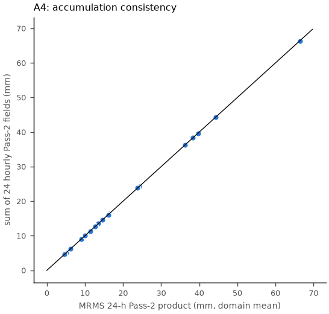
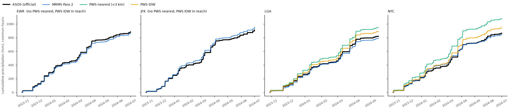
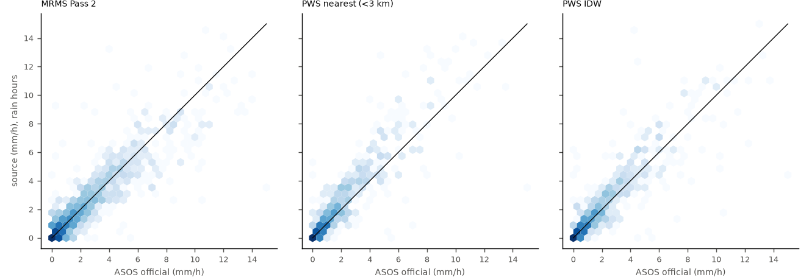

# Data validation: radar fetching and all sources vs the official gauges

Generated by `python src/run.py validate` (`nyc_rain_maps.validation`). Official reference: NWS ASOS hourly precipitation (routine METAR, report nearest :51) at Central Park (NYC), LaGuardia (LGA), JFK and Newark (EWR); hours typed by each station's own present-weather report.

## A. Is the radar data what NOAA published, where it belongs?

| check | what | result |
|---|---|---|
| A1 sources | 6 files fetched separately from NOAA AWS and IEM | 6/6 byte-identical GRIB after gunzip; max field difference 0 mm |
| A2 decoder | our ecCodes crop vs independent full cfgrib decode, 6 files x 2655 cells | max difference 0 mm; missing-data mask identical in 6/6; valid time correct in 6/6 |
| A3 georeferencing | cached value at each ASOS station vs ecCodes nearest grid point, 48 station-hours | 48/48 equal |
| A4 accumulation | 24 hourly Pass-2 fields vs the 24-h Pass-2 product, 20 wet days | domain-mean difference 0.0% median, 0.0% worst; cell correlation 1.000 median |
| A5 completeness | hourly Pass 2, 2023-10-29 to 2024-07-01 | 5899/5904 hours present (5 missing on every archive); 0.00% of cell-hours without radar coverage |

A4 matches to the last digit because MRMS builds its 24-h Pass-2 product from its hourly Pass-2 fields; the exact match also confirms our hour-ending time labels (a one-hour shift would break it).

## B. Every source against the official gauges

### Whole OpenMesh record (hourly, pooled over the four stations)

Every source is scored on the **same station-hours** (official gauge and all sources valid); *coverage* is the share of official station-hours a source has at all.

| hours | source | coverage | station-hours | official total mm | source total mm | rel. bias | NRMSE | corr | POD | FAR | CSI |
|---|---|---|---|---|---|---|---|---|---|---|---|
| all | PWS IDW | 50% | 10,492 | 1685 | 1835 | +9% | 1.94 | 0.94 | 0.87 | 0.22 | 0.70 |
| all | MRMS Pass 2 | 100% | 10,492 | 1685 | 1635 | -3% | 2.24 | 0.92 | 0.79 | 0.14 | 0.70 |
| all | PWS nearest (<3 km) | 44% | 10,492 | 1685 | 2024 | +20% | 2.35 | 0.94 | 0.85 | 0.19 | 0.71 |
| rain | PWS IDW | 48% | 1,124 | 1561 | 1722 | +10% | 0.63 | 0.94 | 0.96 | 0.14 | 0.83 |
| rain | PWS nearest (<3 km) | 44% | 1,124 | 1561 | 1915 | +23% | 0.78 | 0.93 | 0.95 | 0.12 | 0.84 |
| rain | MRMS Pass 2 | 100% | 1,124 | 1561 | 1506 | -4% | 0.78 | 0.90 | 0.84 | 0.12 | 0.76 |
| mix | PWS IDW | 41% | 25 | 22 | 17 | -22% | 0.74 | 0.94 | 0.59 | 0.00 | 0.59 |
| mix | MRMS Pass 2 | 100% | 25 | 22 | 32 | +46% | 0.84 | 0.91 | 0.82 | 0.00 | 0.82 |
| mix | PWS nearest (<3 km) | 41% | 25 | 22 | 24 | +8% | 1.35 | 0.95 | 0.59 | 0.00 | 0.59 |
| snow | MRMS Pass 2 | 100% | 129 | 67 | 63 | -7% | 0.65 | 0.89 | 0.88 | 0.09 | 0.81 |
| snow | PWS IDW | 51% | 129 | 67 | 17 | -75% | 1.55 | 0.32 | 0.32 | 0.12 | 0.31 |
| snow | PWS nearest (<3 km) | 51% | 129 | 67 | 16 | -77% | 1.62 | 0.23 | 0.19 | 0.22 | 0.18 |

### MRMS products on the catalog events (all 15, pooled over stations)

| hours | product | station-hours | rel. bias | NRMSE | corr |
|---|---|---|---|---|---|
| all | MRMS Pass 1 | 1,220 | +10% | 0.71 | 0.89 |
| all | MRMS Pass 2 | 1,220 | +11% | 0.72 | 0.89 |
| all | MRMS radar-only | 1,220 | -7% | 1.04 | 0.75 |
| rain | MRMS Pass 1 | 521 | -1% | 0.51 | 0.90 |
| rain | MRMS Pass 2 | 521 | +1% | 0.52 | 0.89 |
| rain | MRMS radar-only | 521 | -21% | 0.83 | 0.74 |
| mix | MRMS Pass 1 | 98 | +60% | 1.27 | 0.54 |
| mix | MRMS Pass 2 | 98 | +61% | 1.27 | 0.53 |
| mix | MRMS radar-only | 98 | +58% | 1.30 | 0.53 |
| snow | MRMS Pass 1 | 513 | +39% | 1.14 | 0.58 |
| snow | MRMS Pass 2 | 513 | +40% | 1.14 | 0.58 |
| snow | MRMS radar-only | 513 | +33% | 1.15 | 0.54 |

### CML maps at the official gauges (study events, stations inside the link network's reach)

| type | map | station-hours | rel. bias | NRMSE | corr |
|---|---|---|---|---|---|
| rain | PWS | 200 | -0% | 0.39 | 0.95 |
| rain | MRMS | 200 | -3% | 0.58 | 0.89 |
| rain | CML impl2_pycomlink | 200 | -25% | 0.75 | 0.85 |
| rain | CML impl2_nearby | 148 | -28% | 0.83 | 0.78 |
| rain | CML impl2_classical_constant | 200 | -27% | 0.88 | 0.74 |
| rain | CML impl2_classical_dynamic | 200 | -9% | 0.89 | 0.71 |
| rain | CML impl1_dynamic | 200 | -15% | 0.90 | 0.71 |
| mix | MRMS | 112 | +7% | 0.73 | 0.74 |
| mix | PWS | 112 | -43% | 1.25 | 0.26 |
| mix | CML impl2_nearby | 110 | +37% | 2.10 | 0.45 |
| mix | CML impl1_dynamic | 112 | +181% | 4.93 | 0.36 |
| mix | CML impl2_pycomlink | 112 | +244% | 5.22 | 0.75 |
| mix | CML impl2_classical_constant | 112 | +236% | 5.48 | 0.72 |
| mix | CML impl2_classical_dynamic | 112 | +262% | 5.97 | 0.57 |
| snow | MRMS | 28 | -3% | 0.61 | 0.84 |
| snow | PWS | 28 | -99% | 1.49 | -0.09 |
| snow | CML impl2_nearby | 28 | -13% | 1.66 | 0.12 |
| snow | CML impl2_classical_constant | 28 | -41% | 1.66 | 0.09 |
| snow | CML impl2_pycomlink | 28 | +10% | 1.71 | 0.17 |
| snow | CML impl1_dynamic | 28 | +86% | 2.33 | 0.30 |
| snow | CML impl2_classical_dynamic | 28 | +86% | 2.33 | 0.30 |

## Per station (whole record, all hours)

| station | source | station-hours | rel. bias | NRMSE | corr |
|---|---|---|---|---|---|
| EWR | MRMS Pass 2 | 5,897 | -1% | 1.86 | 0.94 |
| JFK | MRMS Pass 2 | 5,898 | +5% | 1.89 | 0.95 |
| LGA | PWS nearest (<3 km) | 4,745 | +15% | 1.91 | 0.95 |
| LGA | PWS IDW | 5,896 | +11% | 2.37 | 0.92 |
| LGA | MRMS Pass 2 | 5,895 | -1% | 2.56 | 0.90 |
| NYC | PWS IDW | 5,895 | +6% | 2.19 | 0.93 |
| NYC | MRMS Pass 2 | 5,894 | -0% | 2.39 | 0.91 |
| NYC | PWS nearest (<3 km) | 5,757 | +25% | 2.75 | 0.93 |

## Reading the numbers

- **rain hours:** closest to the official gauges is `PWS IDW` (NRMSE 0.63, bias +10%); `PWS nearest (<3 km)` 0.78 (+23%); `MRMS Pass 2` 0.78 (-4%).
- **snow hours:** closest to the official gauges is `MRMS Pass 2` (NRMSE 0.65, bias -7%); `PWS IDW` 1.55 (-75%); `PWS nearest (<3 km)` 1.62 (-77%).
- **mix hours:** closest to the official gauges is `PWS IDW` (NRMSE 0.74, bias -22%); `MRMS Pass 2` 0.84 (+46%); `PWS nearest (<3 km)` 1.35 (+8%).

## Caveats

- ASOS heated tipping buckets under-catch snow and wind-driven precipitation; in snow and mixed hours the "official" value is itself low.
- A point gauge against a 1 km radar cell or an interpolated map includes representativeness error even when both are perfect; that sets a floor on every NRMSE here.
- METAR hourly precipitation is the routine report's `p01m`; hours with a missing routine report are excluded, never zero-filled.
