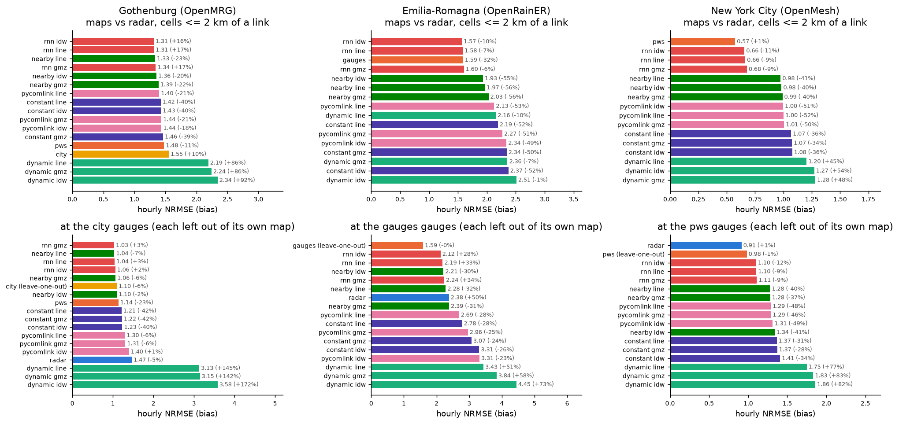
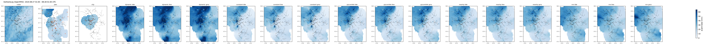
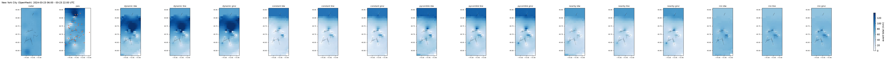

# Links, gauges and radar on three networks

_Generated by `python src/run.py study`; every number below is computed._

Per network, the 10 largest events of its study period (by radar domain-mean total), each mapped from every sensor on the same grid: the radar; the point gauges and every link method with the same IDW (power 2, 10 km). Hour-ending accumulations; scores only where both sides have a value; pooled over all cell-hours (maps) or station-hours (gauges) of a network's events. A map with gaps is scored on its share of the common sample, and its coverage is shown.

## Findings

- **Gothenburg (OpenMRG).** Near the links, the pws map differs from the radar by NRMSE 1.48 (bias -11%); the best link map (`rnn idw`) by 1.31 (+16%), the worst (`dynamic idw`) by 2.34. At the municipal gauges within 5 km of a link: radar 1.47, the other gauges 1.10, the best link map `rnn gmz` 1.03.
- **Emilia-Romagna (OpenRainER).** Near the links, the gauges map differs from the radar by NRMSE 1.59 (bias -32%); the best link map (`rnn idw`) by 1.57 (-10%), the worst (`dynamic idw`) by 2.51. At the ARPAE gauges within 5 km of a link: radar 2.26, the other gauges 1.46, the best link map `rnn idw` 2.01.
- **New York City (OpenMesh).** Near the links, the pws map differs from the radar by NRMSE 0.57 (bias +1%); the best link map (`rnn idw`) by 0.66 (-11%), the worst (`dynamic gmz`) by 1.28. At the PWS gauges within 5 km of a link: radar 0.91, the other gauges 0.98, the best link map `rnn idw` 1.11.

## Retrieval x interpolation

Every link retrieval (four power-law methods, and the RNN of `projects/cml_rnn` where a model is trained) mapped three ways: `idw` from each link's midpoint, `line` from virtual gauges along the path, `gmz` the same gauges corrected so each link keeps its own average (Goldshtein, Messer & Zinevich). Bold: the best interpolation per retrieval.

**Gothenburg (OpenMRG), hourly NRMSE against the radar, cells <= 2 km of a link:**

| retrieval | idw | line | gmz |
|---|---|---|---|
| rnn | **1.31** | 1.31 | 1.34 |
| nearby | 1.36 | **1.33** | 1.39 |
| pycomlink | 1.44 | **1.40** | 1.44 |
| constant | 1.43 | **1.42** | 1.46 |
| dynamic | 2.34 | **2.19** | 2.24 |

**Gothenburg (OpenMRG), hourly NRMSE at the municipal gauges <= 5 km of a link:**

| retrieval | idw | line | gmz |
|---|---|---|---|
| rnn | 1.06 | 1.04 | **1.03** |
| nearby | 1.10 | **1.04** | 1.06 |
| constant | 1.23 | **1.21** | 1.22 |
| pycomlink | 1.40 | **1.30** | 1.31 |
| dynamic | 3.58 | **3.13** | 3.15 |

**Emilia-Romagna (OpenRainER), hourly NRMSE against the radar, cells <= 2 km of a link:**

| retrieval | idw | line | gmz |
|---|---|---|---|
| rnn | **1.57** | 1.58 | 1.60 |
| nearby | **1.93** | 1.97 | 2.03 |
| pycomlink | 2.34 | **2.13** | 2.27 |
| constant | 2.37 | **2.19** | 2.34 |
| dynamic | 2.51 | **2.16** | 2.36 |

**Emilia-Romagna (OpenRainER), hourly NRMSE at the ARPAE gauges <= 5 km of a link:**

| retrieval | idw | line | gmz |
|---|---|---|---|
| nearby | 2.11 | **2.05** | 2.08 |
| rnn | **2.01** | 2.08 | 2.13 |
| constant | 2.96 | **2.47** | 2.71 |
| pycomlink | 3.04 | **2.52** | 2.75 |
| dynamic | 3.80 | **3.02** | 3.36 |

**New York City (OpenMesh), hourly NRMSE against the radar, cells <= 2 km of a link:**

| retrieval | idw | line | gmz |
|---|---|---|---|
| rnn | **0.66** | 0.66 | 0.68 |
| nearby | 0.98 | **0.98** | 0.99 |
| pycomlink | **1.00** | 1.00 | 1.01 |
| constant | 1.08 | **1.07** | 1.07 |
| dynamic | 1.27 | **1.20** | 1.28 |

**New York City (OpenMesh), hourly NRMSE at the PWS gauges <= 5 km of a link:**

| retrieval | idw | line | gmz |
|---|---|---|---|
| rnn | **1.11** | 1.12 | 1.12 |
| nearby | 1.35 | **1.29** | 1.30 |
| pycomlink | 1.33 | **1.31** | 1.31 |
| constant | 1.43 | **1.39** | 1.40 |
| dynamic | 1.89 | **1.78** | 1.87 |

## Gothenburg (OpenMRG)

10 events, 2015-06-02 to 2015-09-01, 152 mm domain-mean in all.

**Maps against the radar map** (cells <= 2 km of a link):

| estimate | events | coverage | n | rel_bias | nrmse | corr | csi |
|---|---|---|---|---|---|---|---|
| rnn idw | 10 | 100% | 162487 | +16% | 1.31 | 0.76 | 0.78 |
| rnn line | 10 | 100% | 162487 | +17% | 1.31 | 0.76 | 0.77 |
| nearby line | 10 | 100% | 162487 | -23% | 1.33 | 0.75 | 0.59 |
| rnn gmz | 10 | 100% | 162487 | +17% | 1.34 | 0.76 | 0.77 |
| nearby idw | 10 | 100% | 162487 | -20% | 1.36 | 0.75 | 0.60 |
| nearby gmz | 10 | 100% | 162487 | -22% | 1.39 | 0.74 | 0.59 |
| pycomlink line | 10 | 100% | 162487 | -21% | 1.40 | 0.76 | 0.55 |
| constant line | 10 | 100% | 162487 | -40% | 1.42 | 0.73 | 0.45 |
| constant idw | 10 | 100% | 162487 | -40% | 1.43 | 0.72 | 0.45 |
| pycomlink gmz | 10 | 100% | 162487 | -21% | 1.44 | 0.75 | 0.55 |
| pycomlink idw | 10 | 100% | 162487 | -18% | 1.44 | 0.75 | 0.56 |
| constant gmz | 10 | 100% | 162487 | -39% | 1.46 | 0.71 | 0.45 |
| pws | 10 | 83% | 134230 | -11% | 1.48 | 0.68 | 0.72 |
| city | 10 | 32% | 52716 | +10% | 1.55 | 0.69 | 0.76 |
| dynamic line | 10 | 100% | 162487 | +86% | 2.19 | 0.77 | 0.72 |
| dynamic gmz | 10 | 100% | 162487 | +86% | 2.24 | 0.76 | 0.71 |
| dynamic idw | 10 | 100% | 162487 | +92% | 2.34 | 0.77 | 0.72 |

**Maps against the city map** (cells <= 2 km of a link):

| estimate | events | coverage | n | rel_bias | nrmse | corr | csi |
|---|---|---|---|---|---|---|---|
| rnn idw | 10 | 32% | 52716 | +1% | 1.01 | 0.84 | 0.82 |
| rnn line | 10 | 32% | 52716 | +2% | 1.02 | 0.83 | 0.82 |
| rnn gmz | 10 | 32% | 52716 | +2% | 1.03 | 0.83 | 0.82 |
| nearby idw | 10 | 32% | 52716 | -17% | 1.15 | 0.80 | 0.69 |
| nearby line | 10 | 32% | 52716 | -21% | 1.17 | 0.79 | 0.69 |
| nearby gmz | 10 | 32% | 52716 | -20% | 1.26 | 0.77 | 0.69 |
| constant idw | 10 | 32% | 52716 | -40% | 1.34 | 0.73 | 0.52 |
| constant line | 10 | 32% | 52716 | -41% | 1.35 | 0.73 | 0.52 |
| pycomlink line | 10 | 32% | 52716 | -19% | 1.36 | 0.75 | 0.62 |
| pycomlink idw | 10 | 32% | 52716 | -15% | 1.38 | 0.76 | 0.63 |
| constant gmz | 10 | 32% | 52716 | -40% | 1.40 | 0.71 | 0.52 |
| pycomlink gmz | 10 | 32% | 52716 | -19% | 1.40 | 0.74 | 0.62 |
| dynamic line | 10 | 32% | 52716 | +97% | 2.26 | 0.80 | 0.69 |
| dynamic gmz | 10 | 32% | 52716 | +96% | 2.31 | 0.78 | 0.68 |
| dynamic idw | 10 | 32% | 52716 | +110% | 2.49 | 0.80 | 0.69 |

**Maps against the pws map** (cells <= 2 km of a link):

| estimate | events | coverage | n | rel_bias | nrmse | corr | csi |
|---|---|---|---|---|---|---|---|
| rnn idw | 10 | 83% | 134230 | +28% | 1.33 | 0.79 | 0.76 |
| rnn line | 10 | 83% | 134230 | +28% | 1.33 | 0.79 | 0.76 |
| nearby line | 10 | 83% | 134230 | -14% | 1.33 | 0.77 | 0.61 |
| nearby idw | 10 | 83% | 134230 | -10% | 1.34 | 0.78 | 0.62 |
| rnn gmz | 10 | 83% | 134230 | +29% | 1.37 | 0.78 | 0.76 |
| nearby gmz | 10 | 83% | 134230 | -13% | 1.42 | 0.75 | 0.61 |
| constant idw | 10 | 83% | 134230 | -33% | 1.43 | 0.74 | 0.47 |
| constant line | 10 | 83% | 134230 | -34% | 1.44 | 0.73 | 0.46 |
| city | 10 | 29% | 46986 | +29% | 1.49 | 0.78 | 0.81 |
| constant gmz | 10 | 83% | 134230 | -32% | 1.50 | 0.72 | 0.46 |
| pycomlink line | 10 | 83% | 134230 | -13% | 1.54 | 0.74 | 0.57 |
| pycomlink idw | 10 | 83% | 134230 | -9% | 1.57 | 0.74 | 0.57 |
| pycomlink gmz | 10 | 83% | 134230 | -12% | 1.59 | 0.73 | 0.57 |
| dynamic line | 10 | 83% | 134230 | +110% | 2.57 | 0.77 | 0.70 |
| dynamic gmz | 10 | 83% | 134230 | +111% | 2.64 | 0.75 | 0.69 |
| dynamic idw | 10 | 83% | 134230 | +118% | 2.74 | 0.76 | 0.70 |

**At the municipal gauges, <= 5 km of a link** (hourly; the gauge map is rebuilt without the gauge being scored):

| estimate | coverage | n | rel_bias | nrmse | corr |
|---|---|---|---|---|---|
| rnn gmz | 100% | 1880 | +3% | 1.03 | 0.85 |
| nearby line | 100% | 1880 | -7% | 1.04 | 0.87 |
| rnn line | 100% | 1880 | +3% | 1.04 | 0.85 |
| rnn idw | 100% | 1880 | +2% | 1.06 | 0.84 |
| nearby gmz | 100% | 1880 | -6% | 1.06 | 0.87 |
| city (leave-one-out) | 100% | 1880 | -6% | 1.10 | 0.83 |
| nearby idw | 100% | 1880 | -2% | 1.10 | 0.86 |
| pws | 100% | 1880 | -23% | 1.14 | 0.83 |
| constant line | 100% | 1880 | -42% | 1.21 | 0.81 |
| constant gmz | 100% | 1880 | -42% | 1.22 | 0.81 |
| constant idw | 100% | 1880 | -40% | 1.23 | 0.81 |
| pycomlink line | 100% | 1880 | -6% | 1.30 | 0.83 |
| pycomlink gmz | 100% | 1880 | -6% | 1.31 | 0.83 |
| pycomlink idw | 100% | 1880 | +1% | 1.40 | 0.83 |
| radar | 100% | 1880 | -5% | 1.47 | 0.69 |
| dynamic line | 100% | 1880 | +145% | 3.13 | 0.84 |
| dynamic gmz | 100% | 1880 | +142% | 3.15 | 0.84 |
| dynamic idw | 100% | 1880 | +172% | 3.58 | 0.84 |

**At the municipal gauges, all gauges** (hourly; the gauge map is rebuilt without the gauge being scored):

| estimate | coverage | n | rel_bias | nrmse | corr |
|---|---|---|---|---|---|
| rnn gmz | 100% | 1880 | +3% | 1.03 | 0.85 |
| nearby line | 100% | 1880 | -7% | 1.04 | 0.87 |
| rnn line | 100% | 1880 | +3% | 1.04 | 0.85 |
| rnn idw | 100% | 1880 | +2% | 1.06 | 0.84 |
| nearby gmz | 100% | 1880 | -6% | 1.06 | 0.87 |
| city (leave-one-out) | 100% | 1880 | -6% | 1.10 | 0.83 |
| nearby idw | 100% | 1880 | -2% | 1.10 | 0.86 |
| pws | 100% | 1880 | -23% | 1.14 | 0.83 |
| constant line | 100% | 1880 | -42% | 1.21 | 0.81 |
| constant gmz | 100% | 1880 | -42% | 1.22 | 0.81 |
| constant idw | 100% | 1880 | -40% | 1.23 | 0.81 |
| pycomlink line | 100% | 1880 | -6% | 1.30 | 0.83 |
| pycomlink gmz | 100% | 1880 | -6% | 1.31 | 0.83 |
| pycomlink idw | 100% | 1880 | +1% | 1.40 | 0.83 |
| radar | 100% | 1880 | -5% | 1.47 | 0.69 |
| dynamic line | 100% | 1880 | +145% | 3.13 | 0.84 |
| dynamic gmz | 100% | 1880 | +142% | 3.15 | 0.84 |
| dynamic idw | 100% | 1880 | +172% | 3.58 | 0.84 |

## Emilia-Romagna (OpenRainER)

10 events, 2021-05-23 to 2022-11-23, 403 mm domain-mean in all.

**Maps against the radar map** (cells <= 2 km of a link):

| estimate | events | coverage | n | rel_bias | nrmse | corr | csi |
|---|---|---|---|---|---|---|---|
| rnn idw | 10 | 100% | 401453 | -10% | 1.57 | 0.74 | 0.66 |
| rnn line | 10 | 100% | 401453 | -7% | 1.58 | 0.74 | 0.66 |
| gauges | 10 | 100% | 401453 | -32% | 1.59 | 0.73 | 0.73 |
| rnn gmz | 10 | 100% | 401453 | -6% | 1.60 | 0.74 | 0.66 |
| nearby idw | 10 | 68% | 273702 | -55% | 1.93 | 0.59 | 0.47 |
| nearby line | 10 | 72% | 289440 | -56% | 1.97 | 0.57 | 0.47 |
| nearby gmz | 10 | 72% | 289440 | -56% | 2.03 | 0.54 | 0.46 |
| pycomlink line | 10 | 100% | 401453 | -53% | 2.13 | 0.54 | 0.48 |
| dynamic line | 10 | 100% | 401453 | -10% | 2.16 | 0.59 | 0.61 |
| constant line | 10 | 100% | 401453 | -52% | 2.19 | 0.52 | 0.44 |
| pycomlink gmz | 10 | 100% | 401453 | -51% | 2.27 | 0.52 | 0.47 |
| pycomlink idw | 10 | 100% | 401453 | -49% | 2.34 | 0.51 | 0.48 |
| constant gmz | 10 | 100% | 401453 | -50% | 2.34 | 0.49 | 0.43 |
| dynamic gmz | 10 | 100% | 401453 | -7% | 2.36 | 0.56 | 0.60 |
| constant idw | 10 | 100% | 401453 | -52% | 2.37 | 0.49 | 0.41 |
| dynamic idw | 10 | 100% | 401453 | -1% | 2.51 | 0.55 | 0.61 |

**Maps against the gauges map** (cells <= 2 km of a link):

| estimate | events | coverage | n | rel_bias | nrmse | corr | csi |
|---|---|---|---|---|---|---|---|
| rnn idw | 10 | 100% | 401453 | +32% | 1.80 | 0.80 | 0.72 |
| nearby idw | 10 | 68% | 273702 | -33% | 1.84 | 0.74 | 0.51 |
| rnn line | 10 | 100% | 401453 | +37% | 1.87 | 0.80 | 0.72 |
| nearby line | 10 | 72% | 289440 | -35% | 1.88 | 0.71 | 0.51 |
| rnn gmz | 10 | 100% | 401453 | +38% | 1.95 | 0.79 | 0.71 |
| nearby gmz | 10 | 72% | 289440 | -34% | 2.04 | 0.68 | 0.50 |
| pycomlink line | 10 | 100% | 401453 | -30% | 2.35 | 0.66 | 0.50 |
| constant line | 10 | 100% | 401453 | -29% | 2.43 | 0.64 | 0.47 |
| pycomlink gmz | 10 | 100% | 401453 | -27% | 2.66 | 0.61 | 0.49 |
| dynamic line | 10 | 100% | 401453 | +33% | 2.68 | 0.67 | 0.64 |
| constant gmz | 10 | 100% | 401453 | -26% | 2.75 | 0.60 | 0.46 |
| constant idw | 10 | 100% | 401453 | -28% | 2.77 | 0.61 | 0.44 |
| pycomlink idw | 10 | 100% | 401453 | -25% | 2.78 | 0.62 | 0.50 |
| dynamic gmz | 10 | 100% | 401453 | +37% | 3.06 | 0.63 | 0.62 |
| dynamic idw | 10 | 100% | 401453 | +47% | 3.34 | 0.64 | 0.63 |

**At the ARPAE gauges, <= 5 km of a link** (hourly; the gauge map is rebuilt without the gauge being scored):

| estimate | coverage | n | rel_bias | nrmse | corr |
|---|---|---|---|---|---|
| gauges (leave-one-out) | 100% | 46797 | +1% | 1.46 | 0.86 |
| rnn idw | 98% | 45943 | +30% | 2.01 | 0.76 |
| nearby line | 76% | 35431 | -34% | 2.05 | 0.70 |
| nearby gmz | 76% | 35431 | -33% | 2.08 | 0.69 |
| rnn line | 100% | 46797 | +35% | 2.08 | 0.75 |
| nearby idw | 70% | 32610 | -31% | 2.11 | 0.70 |
| rnn gmz | 100% | 46797 | +37% | 2.13 | 0.75 |
| radar | 100% | 46797 | +50% | 2.26 | 0.76 |
| constant line | 99% | 46445 | -29% | 2.47 | 0.64 |
| pycomlink line | 99% | 46445 | -28% | 2.52 | 0.64 |
| constant gmz | 99% | 46445 | -25% | 2.71 | 0.62 |
| pycomlink gmz | 99% | 46445 | -25% | 2.75 | 0.61 |
| constant idw | 97% | 45589 | -27% | 2.96 | 0.59 |
| dynamic line | 99% | 46445 | +43% | 3.02 | 0.64 |
| pycomlink idw | 97% | 45589 | -23% | 3.04 | 0.59 |
| dynamic gmz | 99% | 46445 | +50% | 3.36 | 0.61 |
| dynamic idw | 97% | 45589 | +60% | 3.80 | 0.59 |

**At the ARPAE gauges, all gauges** (hourly; the gauge map is rebuilt without the gauge being scored):

| estimate | coverage | n | rel_bias | nrmse | corr |
|---|---|---|---|---|---|
| gauges (leave-one-out) | 100% | 113116 | -0% | 1.59 | 0.86 |
| rnn idw | 64% | 72446 | +28% | 2.12 | 0.73 |
| rnn line | 69% | 78301 | +33% | 2.19 | 0.72 |
| nearby idw | 40% | 45368 | -30% | 2.21 | 0.67 |
| rnn gmz | 69% | 78301 | +34% | 2.24 | 0.72 |
| nearby line | 46% | 52029 | -32% | 2.28 | 0.64 |
| radar | 100% | 113116 | +50% | 2.38 | 0.75 |
| nearby gmz | 46% | 52029 | -31% | 2.39 | 0.63 |
| pycomlink line | 69% | 77687 | -28% | 2.69 | 0.60 |
| constant line | 69% | 77687 | -28% | 2.78 | 0.57 |
| pycomlink gmz | 69% | 77687 | -25% | 2.96 | 0.57 |
| constant gmz | 69% | 77687 | -24% | 3.07 | 0.54 |
| constant idw | 64% | 71861 | -26% | 3.31 | 0.53 |
| pycomlink idw | 64% | 71861 | -23% | 3.31 | 0.55 |
| dynamic line | 69% | 77687 | +51% | 3.43 | 0.57 |
| dynamic gmz | 69% | 77687 | +58% | 3.84 | 0.54 |
| dynamic idw | 64% | 71861 | +73% | 4.45 | 0.52 |

## New York City (OpenMesh)

10 events, 2023-11-21 to 2024-04-04, 491 mm domain-mean in all.

**Maps against the radar map** (cells <= 2 km of a link):

| estimate | events | coverage | n | rel_bias | nrmse | corr | csi |
|---|---|---|---|---|---|---|---|
| pws | 10 | 100% | 25899 | +1% | 0.57 | 0.89 | 0.90 |
| rnn idw | 9 | 100% | 25557 | -11% | 0.66 | 0.82 | 0.88 |
| rnn line | 9 | 100% | 25557 | -9% | 0.66 | 0.81 | 0.88 |
| rnn gmz | 9 | 100% | 25557 | -9% | 0.68 | 0.80 | 0.88 |
| nearby line | 9 | 93% | 23651 | -41% | 0.98 | 0.64 | 0.81 |
| nearby idw | 9 | 92% | 23630 | -40% | 0.98 | 0.63 | 0.81 |
| nearby gmz | 9 | 93% | 23651 | -40% | 0.99 | 0.62 | 0.81 |
| pycomlink idw | 9 | 100% | 25557 | -51% | 1.00 | 0.65 | 0.69 |
| pycomlink line | 9 | 100% | 25557 | -52% | 1.00 | 0.65 | 0.70 |
| pycomlink gmz | 9 | 100% | 25557 | -50% | 1.01 | 0.64 | 0.70 |
| constant line | 9 | 100% | 25557 | -36% | 1.07 | 0.59 | 0.74 |
| constant gmz | 9 | 100% | 25557 | -34% | 1.07 | 0.59 | 0.75 |
| constant idw | 9 | 100% | 25557 | -36% | 1.08 | 0.59 | 0.73 |
| dynamic line | 9 | 100% | 25557 | +45% | 1.20 | 0.60 | 0.82 |
| dynamic idw | 9 | 100% | 25557 | +54% | 1.27 | 0.60 | 0.82 |
| dynamic gmz | 9 | 100% | 25557 | +48% | 1.28 | 0.58 | 0.82 |

**Maps against the pws map** (cells <= 2 km of a link):

| estimate | events | coverage | n | rel_bias | nrmse | corr | csi |
|---|---|---|---|---|---|---|---|
| rnn idw | 9 | 100% | 25557 | -12% | 0.87 | 0.73 | 0.89 |
| rnn line | 9 | 100% | 25557 | -10% | 0.88 | 0.73 | 0.89 |
| rnn gmz | 9 | 100% | 25557 | -10% | 0.89 | 0.71 | 0.89 |
| nearby line | 9 | 93% | 23651 | -43% | 1.08 | 0.63 | 0.81 |
| nearby idw | 9 | 92% | 23630 | -41% | 1.09 | 0.62 | 0.81 |
| nearby gmz | 9 | 93% | 23651 | -41% | 1.09 | 0.61 | 0.80 |
| pycomlink idw | 9 | 100% | 25557 | -52% | 1.11 | 0.63 | 0.69 |
| pycomlink line | 9 | 100% | 25557 | -52% | 1.11 | 0.63 | 0.70 |
| pycomlink gmz | 9 | 100% | 25557 | -51% | 1.11 | 0.63 | 0.70 |
| constant line | 9 | 100% | 25557 | -36% | 1.23 | 0.51 | 0.74 |
| constant gmz | 9 | 100% | 25557 | -34% | 1.23 | 0.51 | 0.74 |
| constant idw | 9 | 100% | 25557 | -37% | 1.24 | 0.51 | 0.73 |
| dynamic line | 9 | 100% | 25557 | +44% | 1.27 | 0.57 | 0.84 |
| dynamic idw | 9 | 100% | 25557 | +52% | 1.34 | 0.57 | 0.84 |
| dynamic gmz | 9 | 100% | 25557 | +47% | 1.34 | 0.55 | 0.84 |

**At the PWS gauges, <= 5 km of a link** (hourly; the gauge map is rebuilt without the gauge being scored):

| estimate | coverage | n | rel_bias | nrmse | corr |
|---|---|---|---|---|---|
| radar | 100% | 5034 | +1% | 0.91 | 0.78 |
| pws (leave-one-out) | 100% | 5034 | -1% | 0.98 | 0.74 |
| rnn idw | 100% | 4844 | -13% | 1.11 | 0.64 |
| rnn line | 100% | 4844 | -10% | 1.12 | 0.64 |
| rnn gmz | 100% | 4844 | -9% | 1.12 | 0.63 |
| nearby line | 92% | 4454 | -40% | 1.29 | 0.54 |
| nearby gmz | 92% | 4454 | -37% | 1.30 | 0.53 |
| pycomlink line | 100% | 4844 | -48% | 1.31 | 0.54 |
| pycomlink gmz | 100% | 4844 | -46% | 1.31 | 0.54 |
| pycomlink idw | 100% | 4844 | -49% | 1.33 | 0.52 |
| nearby idw | 92% | 4449 | -41% | 1.35 | 0.49 |
| constant line | 100% | 4844 | -30% | 1.39 | 0.47 |
| constant gmz | 100% | 4844 | -28% | 1.40 | 0.47 |
| constant idw | 100% | 4844 | -34% | 1.43 | 0.44 |
| dynamic line | 100% | 4844 | +78% | 1.78 | 0.46 |
| dynamic gmz | 100% | 4844 | +83% | 1.87 | 0.44 |
| dynamic idw | 100% | 4844 | +83% | 1.89 | 0.43 |

**At the PWS gauges, all gauges** (hourly; the gauge map is rebuilt without the gauge being scored):

| estimate | coverage | n | rel_bias | nrmse | corr |
|---|---|---|---|---|---|
| radar | 100% | 5801 | +1% | 0.91 | 0.78 |
| pws (leave-one-out) | 100% | 5801 | -1% | 0.98 | 0.75 |
| rnn idw | 100% | 5200 | -12% | 1.10 | 0.65 |
| rnn line | 100% | 5200 | -9% | 1.10 | 0.64 |
| rnn gmz | 100% | 5200 | -9% | 1.11 | 0.64 |
| nearby line | 92% | 4786 | -40% | 1.28 | 0.55 |
| nearby gmz | 92% | 4786 | -37% | 1.28 | 0.54 |
| pycomlink line | 100% | 5200 | -48% | 1.29 | 0.56 |
| pycomlink gmz | 100% | 5200 | -46% | 1.29 | 0.55 |
| pycomlink idw | 100% | 5200 | -49% | 1.31 | 0.54 |
| nearby idw | 92% | 4781 | -41% | 1.34 | 0.50 |
| constant line | 100% | 5200 | -31% | 1.37 | 0.48 |
| constant gmz | 100% | 5200 | -28% | 1.37 | 0.48 |
| constant idw | 100% | 5200 | -34% | 1.41 | 0.46 |
| dynamic line | 100% | 5200 | +77% | 1.75 | 0.47 |
| dynamic gmz | 100% | 5200 | +83% | 1.83 | 0.46 |
| dynamic idw | 100% | 5200 | +82% | 1.86 | 0.45 |

## Not scored

- openmesh 2024-03-06 17 / links: 1 link(s) pass QC - no link maps

## Files

`events.csv`, `event_scores.csv` (per event, pair and cell set), `pooled_map_scores.csv`, `pooled_point_scores.csv`, `link_scores.csv` (each method's link totals against radar along the path and gauges near it).
