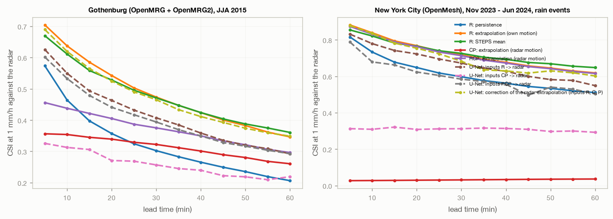
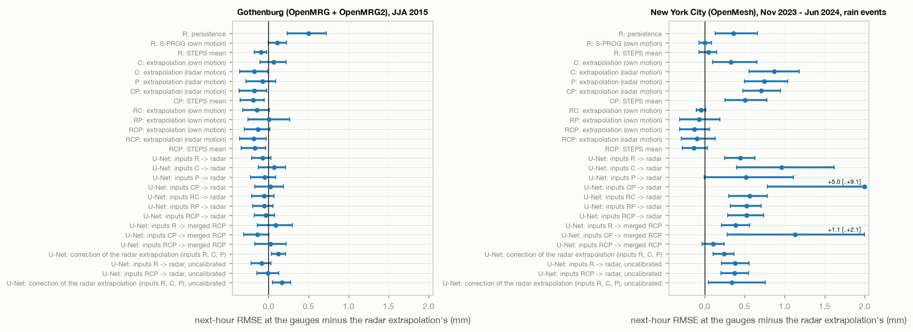

# multisensor_nowcasting - results

Computed by `python projects/multisensor_nowcasting/src/run.py evaluate --network <network>` and `report`. Every forecast is scored on the same issue times (the test weeks), the same cells and the same gauges. Rain rates in mm/h.

## Gothenburg (OpenMRG + OpenMRG2), JJA 2015

Grid 44 x 35 pixels of 2 km, 5-minute steps (26496 in the cube); 358 links, 28 PWS after quality control (of 30); 645 issue times on 36 storm days in the test weeks.

### Against the radar

Pooled over all issue times, on the cells the radar's motion can reach; the last column only within 10 km of a link or PWS.

| forecast | CSI 1 mm/h, 15 min | 30 min | 60 min | FSS 10 km, 60 min | MAE 60 min (mm/h) | bias 60 min | CSI 60 min, sensor area |
|---|---|---|---|---|---|---|---|
| R: persistence | 0.40 | 0.30 | 0.21 | 0.51 | 0.74 | -0.03 | 0.21 |
| R: extrapolation (own motion) | 0.59 | 0.47 | 0.35 | 0.71 | 0.58 | -0.06 | 0.35 |
| R: S-PROG (own motion) | 0.58 | 0.48 | 0.35 | 0.68 | 0.65 | 0.11 | 0.36 |
| R: STEPS mean | 0.56 | 0.47 | 0.36 | 0.71 | 0.53 | -0.15 | 0.36 |
| C: extrapolation (own motion) | 0.32 | 0.28 | 0.21 | 0.45 | 0.73 | 0.07 | 0.22 |
| C: extrapolation (radar motion) | 0.34 | 0.32 | 0.26 | 0.53 | 0.64 | -0.01 | 0.26 |
| P: extrapolation (radar motion) | 0.28 | 0.26 | 0.21 | 0.47 | 0.60 | -0.39 | 0.21 |
| CP: extrapolation (radar motion) | 0.34 | 0.32 | 0.26 | 0.54 | 0.63 | -0.02 | 0.26 |
| CP: STEPS mean | 0.34 | 0.32 | 0.26 | 0.52 | 0.63 | -0.02 | 0.26 |
| RC: extrapolation (own motion) | 0.38 | 0.32 | 0.24 | 0.53 | 0.71 | 0.06 | 0.24 |
| RP: extrapolation (own motion) | 0.40 | 0.33 | 0.23 | 0.54 | 0.68 | -0.09 | 0.23 |
| RCP: extrapolation (own motion) | 0.38 | 0.32 | 0.23 | 0.53 | 0.69 | -0.01 | 0.23 |
| RCP: extrapolation (radar motion) | 0.42 | 0.38 | 0.30 | 0.63 | 0.66 | 0.11 | 0.30 |
| RCP: STEPS mean | 0.38 | 0.33 | 0.25 | 0.54 | 0.64 | -0.01 | 0.25 |
| U-Net: inputs R -> radar | 0.49 | 0.41 | 0.29 | 0.57 | 0.61 | -0.09 | 0.29 |
| U-Net: inputs C -> radar | 0.26 | 0.21 | 0.15 | 0.35 | 0.61 | -0.49 | 0.15 |
| U-Net: inputs P -> radar | 0.28 | 0.25 | 0.19 | 0.42 | 0.66 | -0.24 | 0.19 |
| U-Net: inputs CP -> radar | 0.31 | 0.26 | 0.22 | 0.46 | 0.59 | -0.42 | 0.22 |
| U-Net: inputs RC -> radar | 0.49 | 0.39 | 0.23 | 0.50 | 0.59 | -0.36 | 0.23 |
| U-Net: inputs RP -> radar | 0.50 | 0.42 | 0.30 | 0.57 | 0.59 | -0.20 | 0.30 |
| U-Net: inputs RCP -> radar | 0.48 | 0.39 | 0.29 | 0.55 | 0.62 | -0.09 | 0.29 |
| U-Net: inputs R -> merged RCP | 0.41 | 0.35 | 0.28 | 0.51 | 0.77 | 0.44 | 0.28 |
| U-Net: inputs CP -> merged RCP | 0.32 | 0.30 | 0.24 | 0.47 | 0.68 | -0.01 | 0.24 |
| U-Net: inputs RCP -> merged RCP | 0.41 | 0.34 | 0.25 | 0.49 | 0.77 | 0.30 | 0.25 |
| U-Net: correction of the radar extrapolation (inputs R, C, P) | 0.56 | 0.47 | 0.35 | 0.66 | 0.89 | 0.79 | 0.35 |
| U-Net: inputs R -> radar, uncalibrated | 0.49 | 0.41 | 0.29 | 0.57 | 0.66 | 0.13 | 0.29 |
| U-Net: inputs RCP -> radar, uncalibrated | 0.46 | 0.38 | 0.29 | 0.56 | 0.70 | 0.18 | 0.29 |
| U-Net: correction of the radar extrapolation (inputs R, C, P), uncalibrated | 0.56 | 0.46 | 0.35 | 0.67 | 0.93 | 0.95 | 0.35 |

### At the independent gauges (the 10 city gauges)

5-minute rates (mm/h) at 30 min lead, and the next-hour total (the mean of the 12 lead times against the gauge's total over the same hour).

| forecast | rate at 30 min: RMSE | corr | next hour: RMSE (mm) | corr  | bias |
|---|---|---|---|---|---|
| R: persistence | 2.34 | 0.25 | 1.71 | 0.46 | 0.01 |
| R: extrapolation (own motion) | 2.04 | 0.41 | 1.20 | 0.56 | -0.20 |
| R: S-PROG (own motion) | 2.34 | 0.41 | 1.31 | 0.55 | -0.09 |
| R: STEPS mean | 1.80 | 0.44 | 1.11 | 0.57 | -0.27 |
| C: extrapolation (own motion) | 2.06 | 0.33 | 1.27 | 0.58 | 0.09 |
| C: extrapolation (radar motion) | 1.81 | 0.49 | 1.03 | 0.65 | -0.17 |
| P: extrapolation (radar motion) | 1.85 | 0.40 | 1.13 | 0.57 | -0.49 |
| CP: extrapolation (radar motion) | 1.81 | 0.49 | 1.02 | 0.66 | -0.17 |
| CP: STEPS mean | 1.74 | 0.48 | 1.01 | 0.65 | -0.17 |
| RC: extrapolation (own motion) | 2.02 | 0.45 | 1.06 | 0.65 | -0.05 |
| RP: extrapolation (own motion) | 2.07 | 0.37 | 1.21 | 0.55 | -0.23 |
| RCP: extrapolation (own motion) | 1.96 | 0.42 | 1.07 | 0.63 | -0.08 |
| RCP: extrapolation (radar motion) | 1.95 | 0.43 | 1.02 | 0.66 | -0.14 |
| RCP: STEPS mean | 1.81 | 0.44 | 1.03 | 0.64 | -0.04 |
| U-Net: inputs R -> radar | 1.84 | 0.37 | 1.13 | 0.54 | -0.20 |
| U-Net: inputs C -> radar | 1.92 | 0.26 | 1.27 | 0.35 | -0.43 |
| U-Net: inputs P -> radar | 1.89 | 0.32 | 1.16 | 0.52 | -0.36 |
| U-Net: inputs CP -> radar | 1.92 | 0.28 | 1.23 | 0.46 | -0.60 |
| U-Net: inputs RC -> radar | 1.84 | 0.38 | 1.15 | 0.52 | -0.35 |
| U-Net: inputs RP -> radar | 1.84 | 0.38 | 1.15 | 0.52 | -0.17 |
| U-Net: inputs RCP -> radar | 1.86 | 0.36 | 1.17 | 0.51 | -0.09 |
| U-Net: inputs R -> merged RCP | 1.94 | 0.41 | 1.30 | 0.58 | 0.40 |
| U-Net: inputs CP -> merged RCP | 1.80 | 0.43 | 1.07 | 0.63 | -0.18 |
| U-Net: inputs RCP -> merged RCP | 1.94 | 0.34 | 1.23 | 0.52 | 0.03 |
| U-Net: correction of the radar extrapolation (inputs R, C, P) | 2.20 | 0.42 | 1.32 | 0.55 | 0.04 |
| U-Net: inputs R -> radar, uncalibrated | 1.84 | 0.37 | 1.12 | 0.55 | 0.02 |
| U-Net: inputs RCP -> radar, uncalibrated | 1.89 | 0.36 | 1.19 | 0.52 | 0.26 |
| U-Net: correction of the radar extrapolation (inputs R, C, P), uncalibrated | 2.30 | 0.42 | 1.37 | 0.55 | 0.22 |

### Differences to the radar's extrapolation, with 95% intervals

Paired bootstrap over storm days (1000 resamples). The radar extrapolation's own row gives its value; every other row its difference to it. Positive CSI and negative MAE / RMSE differences are better.

| forecast | CSI_1 30 min domain | CSI_1 60 min domain | CSI_1 60 min area | MAE 60 min domain | gauge next-hour RMSE 60 min gauges |
|---|---|---|---|---|---|
| R: persistence | -0.171 [-0.192, -0.149] | -0.140 [-0.177, -0.110] | -0.143 [-0.180, -0.113] | +0.155 [+0.074, +0.218] | +0.501 [+0.229, +0.722] |
| R: extrapolation (own motion) | +0.473 [+0.379, +0.536] | +0.346 [+0.260, +0.418] | +0.350 [+0.263, +0.420] | +0.583 [+0.437, +0.717] | - |
| R: S-PROG (own motion) | +0.010 [+0.003, +0.017] | +0.007 [-0.002, +0.016] | +0.007 [-0.002, +0.017] | +0.067 [+0.043, +0.098] | +0.108 [-0.002, +0.225] |
| R: STEPS mean | -0.003 [-0.021, +0.015] | +0.014 [-0.004, +0.035] | +0.015 [-0.004, +0.035] | -0.055 [-0.093, -0.025] | -0.095 [-0.181, -0.020] |
| C: extrapolation (own motion) | -0.197 [-0.253, -0.147] | -0.134 [-0.200, -0.082] | -0.134 [-0.199, -0.081] | +0.149 [+0.084, +0.213] | +0.062 [-0.107, +0.217] |
| C: extrapolation (radar motion) | -0.153 [-0.204, -0.110] | -0.087 [-0.155, -0.026] | -0.087 [-0.153, -0.025] | +0.059 [+0.006, +0.114] | -0.176 [-0.361, -0.012] |
| P: extrapolation (radar motion) | -0.214 [-0.254, -0.170] | -0.139 [-0.191, -0.079] | -0.139 [-0.191, -0.078] | +0.013 [-0.058, +0.071] | -0.076 [-0.281, +0.089] |
| CP: extrapolation (radar motion) | -0.151 [-0.202, -0.108] | -0.086 [-0.153, -0.026] | -0.085 [-0.150, -0.024] | +0.052 [-0.001, +0.107] | -0.181 [-0.365, -0.023] |
| CP: STEPS mean | -0.158 [-0.224, -0.111] | -0.089 [-0.170, -0.025] | -0.089 [-0.169, -0.024] | +0.044 [-0.007, +0.089] | -0.190 [-0.356, -0.057] |
| RC: extrapolation (own motion) | -0.152 [-0.203, -0.109] | -0.109 [-0.171, -0.056] | -0.111 [-0.172, -0.058] | +0.127 [+0.086, +0.167] | -0.147 [-0.319, +0.009] |
| RP: extrapolation (own motion) | -0.144 [-0.176, -0.114] | -0.116 [-0.158, -0.074] | -0.118 [-0.160, -0.077] | +0.099 [+0.036, +0.160] | +0.006 [-0.257, +0.266] |
| RCP: extrapolation (own motion) | -0.155 [-0.202, -0.113] | -0.116 [-0.170, -0.062] | -0.118 [-0.172, -0.065] | +0.109 [+0.062, +0.151] | -0.132 [-0.303, +0.015] |
| RCP: extrapolation (radar motion) | -0.098 [-0.142, -0.062] | -0.050 [-0.091, -0.018] | -0.052 [-0.093, -0.019] | +0.079 [+0.038, +0.124] | -0.185 [-0.361, -0.031] |
| RCP: STEPS mean | -0.141 [-0.180, -0.104] | -0.095 [-0.147, -0.044] | -0.097 [-0.147, -0.047] | +0.060 [+0.004, +0.103] | -0.170 [-0.341, -0.032] |
| U-Net: inputs R -> radar | -0.066 [-0.086, -0.044] | -0.054 [-0.091, -0.022] | -0.058 [-0.094, -0.026] | +0.028 [-0.044, +0.083] | -0.078 [-0.210, +0.028] |
| U-Net: inputs C -> radar | -0.259 [-0.313, -0.200] | -0.198 [-0.272, -0.127] | -0.200 [-0.273, -0.129] | +0.030 [-0.027, +0.083] | +0.068 [-0.125, +0.211] |
| U-Net: inputs P -> radar | -0.224 [-0.259, -0.182] | -0.154 [-0.213, -0.099] | -0.157 [-0.213, -0.103] | +0.074 [+0.013, +0.128] | -0.046 [-0.224, +0.086] |
| U-Net: inputs CP -> radar | -0.217 [-0.246, -0.180] | -0.127 [-0.167, -0.087] | -0.127 [-0.167, -0.087] | +0.008 [-0.046, +0.054] | +0.024 [-0.175, +0.184] |
| U-Net: inputs RC -> radar | -0.085 [-0.101, -0.063] | -0.118 [-0.172, -0.065] | -0.121 [-0.178, -0.069] | +0.005 [-0.060, +0.058] | -0.053 [-0.211, +0.067] |
| U-Net: inputs RP -> radar | -0.056 [-0.076, -0.033] | -0.048 [-0.088, -0.015] | -0.051 [-0.089, -0.018] | +0.005 [-0.059, +0.061] | -0.057 [-0.198, +0.056] |
| U-Net: inputs RCP -> radar | -0.080 [-0.102, -0.055] | -0.054 [-0.095, -0.020] | -0.057 [-0.096, -0.024] | +0.038 [-0.027, +0.097] | -0.033 [-0.178, +0.076] |
| U-Net: inputs R -> merged RCP | -0.119 [-0.142, -0.089] | -0.064 [-0.104, -0.024] | -0.067 [-0.104, -0.028] | +0.183 [+0.076, +0.283] | +0.091 [-0.141, +0.300] |
| U-Net: inputs CP -> merged RCP | -0.178 [-0.215, -0.143] | -0.110 [-0.162, -0.064] | -0.111 [-0.163, -0.065] | +0.102 [+0.037, +0.165] | -0.138 [-0.311, +0.005] |
| U-Net: inputs RCP -> merged RCP | -0.129 [-0.156, -0.097] | -0.095 [-0.135, -0.059] | -0.099 [-0.138, -0.065] | +0.184 [+0.102, +0.274] | +0.022 [-0.171, +0.220] |
| U-Net: correction of the radar extrapolation (inputs R, C, P) | -0.009 [-0.018, +0.005] | +0.002 [-0.021, +0.023] | +0.002 [-0.022, +0.023] | +0.304 [+0.220, +0.394] | +0.121 [+0.035, +0.212] |
| U-Net: inputs R -> radar, uncalibrated | -0.066 [-0.086, -0.045] | -0.054 [-0.092, -0.022] | -0.058 [-0.095, -0.027] | +0.082 [+0.004, +0.143] | -0.087 [-0.215, +0.032] |
| U-Net: inputs RCP -> radar, uncalibrated | -0.097 [-0.120, -0.071] | -0.054 [-0.095, -0.020] | -0.057 [-0.096, -0.024] | +0.114 [+0.038, +0.181] | -0.011 [-0.145, +0.128] |
| U-Net: correction of the radar extrapolation (inputs R, C, P), uncalibrated | -0.012 [-0.022, +0.004] | +0.005 [-0.018, +0.025] | +0.004 [-0.019, +0.025] | +0.345 [+0.276, +0.419] | +0.165 [+0.050, +0.276] |

### STEPS ensembles (10 members): CRPS (mm/h)

| product | area, 15 min | area, 30 min | area, 60 min | domain, 15 min | domain, 30 min | domain, 60 min | gauges, 15 min | gauges, 30 min | gauges, 60 min |
|---|---|---|---|---|---|---|---|---|---|
| CP | 0.47 | 0.47 | 0.47 | 0.47 | 0.47 | 0.46 | 0.45 | 0.45 | 0.53 |
| R | 0.30 | 0.36 | 0.40 | 0.30 | 0.36 | 0.40 | 0.45 | 0.44 | 0.53 |
| RCP | 0.43 | 0.46 | 0.46 | 0.42 | 0.45 | 0.46 | 0.43 | 0.44 | 0.50 |

### Training

| name | n_train | n_val | c_in | n_weights | epochs | best validation loss | seconds | variant | chosen |
|---|---|---|---|---|---|---|---|---|---|
| U-Net: inputs R -> radar | 2302 | 884 | 12 | 119164 | 8 | 0.2082 | 474 | plain | False |
| U-Net: inputs R -> radar | 2302 | 884 | 12 | 119164 | 25 | 0.1964 | 1502 | aug | True |
| U-Net: inputs C -> radar | 2302 | 884 | 13 | 119308 | 14 | 0.2745 | 836 | plain | False |
| U-Net: inputs C -> radar | 2302 | 884 | 13 | 119308 | 11 | 0.2708 | 650 | aug | True |
| U-Net: inputs P -> radar | 2302 | 884 | 13 | 119308 | 9 | 0.2976 | 537 | plain | False |
| U-Net: inputs P -> radar | 2302 | 884 | 13 | 119308 | 7 | 0.2890 | 412 | aug | True |
| U-Net: inputs CP -> radar | 2302 | 884 | 26 | 121180 | 13 | 0.2711 | 827 | plain | True |
| U-Net: inputs CP -> radar | 2302 | 884 | 26 | 121180 | 11 | 0.2741 | 699 | aug | False |
| U-Net: inputs RC -> radar | 2302 | 884 | 25 | 121036 | 15 | 0.2071 | 997 | plain | True |
| U-Net: inputs RC -> radar | 2302 | 884 | 25 | 121036 | 13 | 0.2114 | 840 | aug | False |
| U-Net: inputs RP -> radar | 2302 | 884 | 25 | 121036 | 17 | 0.2111 | 1137 | plain | False |
| U-Net: inputs RP -> radar | 2302 | 884 | 25 | 121036 | 22 | 0.2025 | 1416 | aug | True |
| U-Net: inputs RCP -> radar | 2302 | 884 | 38 | 122908 | 8 | 0.2231 | 576 | plain | False |
| U-Net: inputs RCP -> radar | 2302 | 884 | 38 | 122908 | 17 | 0.2069 | 1168 | aug | True |
| U-Net: inputs R -> merged RCP | 2302 | 884 | 12 | 119164 | 8 | 0.2905 | 502 | plain | False |
| U-Net: inputs R -> merged RCP | 2302 | 884 | 12 | 119164 | 11 | 0.2577 | 667 | aug | True |
| U-Net: inputs C -> merged RCP | 2302 | 884 | 13 | 119308 | 10 | 0.2945 | 652 | plain | True |
| U-Net: inputs C -> merged RCP | 2302 | 884 | 13 | 119308 | 10 | 0.2956 | 593 | aug | False |
| U-Net: inputs P -> merged RCP | 2302 | 884 | 13 | 119308 | 11 | 0.3459 | 702 | plain | False |
| U-Net: inputs P -> merged RCP | 2302 | 884 | 13 | 119308 | 9 | 0.3393 | 526 | aug | True |
| U-Net: inputs CP -> merged RCP | 2302 | 884 | 26 | 121180 | 19 | 0.2955 | 1228 | plain | True |
| U-Net: inputs CP -> merged RCP | 2302 | 884 | 26 | 121180 | 9 | 0.3003 | 542 | aug | False |
| U-Net: inputs RC -> merged RCP | 2302 | 884 | 25 | 121036 | 8 | 0.2493 | 538 | plain | True |
| U-Net: inputs RC -> merged RCP | 2302 | 884 | 25 | 121036 | 14 | 0.2505 | 912 | aug | False |
| U-Net: inputs RP -> merged RCP | 2302 | 884 | 25 | 121036 | 20 | 0.2574 | 1040 | plain | True |
| U-Net: inputs RP -> merged RCP | 2302 | 884 | 25 | 121036 | 16 | 0.2655 | 1039 | aug | False |
| U-Net: inputs RCP -> merged RCP | 2302 | 884 | 38 | 122908 | 15 | 0.2590 | 858 | plain | False |
| U-Net: inputs RCP -> merged RCP | 2302 | 884 | 38 | 122908 | 30 | 0.2462 | 1830 | aug | True |
| U-Net: correction of the radar extrapolation (inputs R, C, P) | 771 | 314 | 50 | 124636 | 12 | 0.2147 | 299 | plain | False |
| U-Net: correction of the radar extrapolation (inputs R, C, P) | 771 | 314 | 50 | 124636 | 14 | 0.2123 | 359 | aug | True |

### Motion of each product against the radar's (km/h, wet cells, mean over issue times)

| C | P | CP | RC | RP | RCP |
|---|---|---|---|---|---|
| 42.4 | 95.4 | 48.0 | 19.1 | 26.7 | 20.8 |

### S-PROG runs that failed (nearly dry field) and fell back to extrapolation

| forecast | fallback_to | issues | of |
|---|---|---|---|
| R|sprog | R|extrapolation | 3 | 645 |
| C|sprog | C|extrapolation | 42 | 645 |
| C|sprog_Rmotion | C|extrapolation_Rmotion | 35 | 645 |
| P|sprog | P|extrapolation | 177 | 645 |
| P|sprog_Rmotion | P|extrapolation_Rmotion | 168 | 645 |
| CP|sprog | CP|extrapolation | 50 | 645 |
| CP|sprog_Rmotion | CP|extrapolation_Rmotion | 42 | 645 |
| RC|sprog | RC|extrapolation | 5 | 645 |
| RC|sprog_Rmotion | RC|extrapolation_Rmotion | 3 | 645 |
| RP|sprog | RP|extrapolation | 4 | 645 |
| RP|sprog_Rmotion | RP|extrapolation_Rmotion | 3 | 645 |
| RCP|sprog | RCP|extrapolation | 3 | 645 |
| RCP|sprog_Rmotion | RCP|extrapolation_Rmotion | 3 | 645 |

## New York City (OpenMesh), Nov 2023 - Jun 2024, rain events

Grid 120 x 120 pixels of 2 km, 5-minute steps (10115 in the cube); 26 links, 34 PWS after quality control (of 37); 694 issue times on 34 storm days in the test weeks.

### Against the radar

Pooled over all issue times, on the cells the radar's motion can reach; the last column only within 10 km of a link or PWS.

| forecast | CSI 1 mm/h, 15 min | 30 min | 60 min | FSS 10 km, 60 min | MAE 60 min (mm/h) | bias 60 min | CSI 60 min, sensor area |
|---|---|---|---|---|---|---|---|
| R: persistence | 0.68 | 0.60 | 0.51 | 0.75 | 1.10 | -0.02 | 0.52 |
| R: extrapolation (own motion) | 0.79 | 0.72 | 0.62 | 0.84 | 0.87 | -0.05 | 0.62 |
| R: S-PROG (own motion) | 0.80 | 0.73 | 0.64 | 0.84 | 0.86 | -0.03 | 0.65 |
| R: STEPS mean | 0.78 | 0.73 | 0.65 | 0.85 | 0.79 | -0.08 | 0.65 |
| C: extrapolation (own motion) | 0.02 | 0.02 | 0.02 | 0.05 | 1.25 | -0.96 | 0.47 |
| C: extrapolation (radar motion) | 0.02 | 0.02 | 0.03 | 0.06 | 1.24 | -0.96 | 0.01 |
| P: extrapolation (radar motion) | 0.03 | 0.03 | 0.03 | 0.07 | 1.26 | -0.93 | 0.02 |
| CP: extrapolation (radar motion) | 0.03 | 0.03 | 0.04 | 0.08 | 1.24 | -0.94 | 0.02 |
| CP: STEPS mean | 0.03 | 0.04 | 0.05 | 0.10 | 1.22 | -0.94 | 0.03 |
| RC: extrapolation (own motion) | 0.79 | 0.71 | 0.61 | 0.84 | 0.88 | -0.04 | 0.61 |
| RP: extrapolation (own motion) | 0.78 | 0.71 | 0.61 | 0.84 | 0.91 | -0.02 | 0.61 |
| RCP: extrapolation (own motion) | 0.78 | 0.71 | 0.61 | 0.84 | 0.90 | -0.03 | 0.61 |
| RCP: extrapolation (radar motion) | 0.79 | 0.71 | 0.62 | 0.84 | 0.89 | -0.02 | 0.61 |
| RCP: STEPS mean | 0.77 | 0.72 | 0.64 | 0.84 | 0.80 | -0.07 | 0.64 |
| U-Net: inputs R -> radar | 0.74 | 0.67 | 0.55 | 0.76 | 1.01 | -0.43 | 0.55 |
| U-Net: inputs C -> radar | 0.27 | 0.29 | 0.28 | 0.57 | 1.54 | -0.09 | 0.46 |
| U-Net: inputs P -> radar | 0.32 | 0.33 | 0.31 | 0.57 | 1.53 | 0.03 | 0.45 |
| U-Net: inputs CP -> radar | 0.32 | 0.31 | 0.29 | 0.60 | 1.47 | -0.14 | 0.48 |
| U-Net: inputs RC -> radar | 0.72 | 0.66 | 0.55 | 0.77 | 0.98 | -0.37 | 0.56 |
| U-Net: inputs RP -> radar | 0.74 | 0.67 | 0.53 | 0.75 | 1.06 | -0.47 | 0.52 |
| U-Net: inputs RCP -> radar | 0.66 | 0.58 | 0.50 | 0.72 | 1.03 | -0.35 | 0.52 |
| U-Net: inputs R -> merged RCP | 0.73 | 0.67 | 0.57 | 0.78 | 0.96 | -0.33 | 0.57 |
| U-Net: inputs CP -> merged RCP | 0.32 | 0.32 | 0.31 | 0.61 | 1.48 | -0.07 | 0.48 |
| U-Net: inputs RCP -> merged RCP | 0.70 | 0.62 | 0.51 | 0.73 | 1.06 | -0.42 | 0.53 |
| U-Net: correction of the radar extrapolation (inputs R, C, P) | 0.78 | 0.68 | 0.60 | 0.83 | 0.84 | -0.25 | 0.59 |
| U-Net: inputs R -> radar, uncalibrated | 0.74 | 0.67 | 0.56 | 0.76 | 1.11 | 0.07 | 0.55 |
| U-Net: inputs RCP -> radar, uncalibrated | 0.69 | 0.62 | 0.53 | 0.74 | 1.19 | 0.18 | 0.53 |
| U-Net: correction of the radar extrapolation (inputs R, C, P), uncalibrated | 0.78 | 0.70 | 0.60 | 0.81 | 1.17 | 0.50 | 0.62 |

### At the independent gauges (the ASOS stations with 1-minute data: EWR, JFK, LGA)

5-minute rates (mm/h) at 30 min lead, and the next-hour total (the mean of the 12 lead times against the gauge's total over the same hour).

| forecast | rate at 30 min: RMSE | corr | next hour: RMSE (mm) | corr  | bias |
|---|---|---|---|---|---|
| R: persistence | 3.51 | 0.42 | 2.24 | 0.61 | -0.19 |
| R: extrapolation (own motion) | 3.03 | 0.64 | 1.88 | 0.74 | -0.16 |
| R: S-PROG (own motion) | 2.64 | 0.73 | 1.88 | 0.74 | -0.20 |
| R: STEPS mean | 3.10 | 0.64 | 1.93 | 0.77 | -0.22 |
| C: extrapolation (own motion) | 3.50 | 0.43 | 2.21 | 0.62 | -0.28 |
| C: extrapolation (radar motion) | 4.00 | 0.19 | 2.75 | 0.50 | -0.74 |
| P: extrapolation (radar motion) | 4.35 | 0.20 | 2.62 | 0.48 | -0.59 |
| CP: extrapolation (radar motion) | 4.04 | 0.24 | 2.58 | 0.53 | -0.64 |
| CP: STEPS mean | 3.97 | 0.27 | 2.38 | 0.58 | -0.50 |
| RC: extrapolation (own motion) | 3.06 | 0.63 | 1.83 | 0.75 | -0.13 |
| RP: extrapolation (own motion) | 3.56 | 0.58 | 1.81 | 0.77 | 0.00 |
| RCP: extrapolation (own motion) | 3.19 | 0.62 | 1.75 | 0.77 | -0.03 |
| RCP: extrapolation (radar motion) | 3.33 | 0.61 | 1.78 | 0.76 | -0.04 |
| RCP: STEPS mean | 3.03 | 0.64 | 1.74 | 0.80 | -0.15 |
| U-Net: inputs R -> radar | 3.55 | 0.42 | 2.32 | 0.61 | -0.40 |
| U-Net: inputs C -> radar | 3.69 | 0.35 | 2.84 | 0.47 | 0.00 |
| U-Net: inputs P -> radar | 3.44 | 0.45 | 2.39 | 0.72 | 0.32 |
| U-Net: inputs CP -> radar | 10.27 | 0.14 | 6.89 | 0.33 | 0.62 |
| U-Net: inputs RC -> radar | 3.60 | 0.47 | 2.44 | 0.62 | -0.52 |
| U-Net: inputs RP -> radar | 3.59 | 0.42 | 2.40 | 0.58 | -0.44 |
| U-Net: inputs RCP -> radar | 3.59 | 0.43 | 2.40 | 0.59 | -0.49 |
| U-Net: inputs R -> merged RCP | 3.51 | 0.45 | 2.27 | 0.63 | -0.36 |
| U-Net: inputs CP -> merged RCP | 4.09 | 0.43 | 3.01 | 0.66 | 0.57 |
| U-Net: inputs RCP -> merged RCP | 3.43 | 0.49 | 1.99 | 0.74 | -0.25 |
| U-Net: correction of the radar extrapolation (inputs R, C, P) | 3.17 | 0.59 | 2.12 | 0.67 | -0.33 |
| U-Net: inputs R -> radar, uncalibrated | 3.51 | 0.42 | 2.26 | 0.59 | -0.16 |
| U-Net: inputs RCP -> radar, uncalibrated | 3.49 | 0.42 | 2.25 | 0.58 | -0.12 |
| U-Net: correction of the radar extrapolation (inputs R, C, P), uncalibrated | 3.45 | 0.59 | 2.22 | 0.64 | 0.03 |

### Differences to the radar's extrapolation, with 95% intervals

Paired bootstrap over storm days (1000 resamples). The radar extrapolation's own row gives its value; every other row its difference to it. Positive CSI and negative MAE / RMSE differences are better.

| forecast | CSI_1 30 min domain | CSI_1 60 min domain | CSI_1 60 min area | MAE 60 min domain | gauge next-hour RMSE 60 min gauges |
|---|---|---|---|---|---|
| R: persistence | -0.120 [-0.151, -0.096] | -0.108 [-0.136, -0.084] | -0.099 [-0.138, -0.066] | +0.230 [+0.183, +0.283] | +0.364 [+0.136, +0.663] |
| R: extrapolation (own motion) | +0.718 [+0.667, +0.764] | +0.619 [+0.553, +0.678] | +0.618 [+0.540, +0.698] | +0.865 [+0.718, +1.007] | - |
| R: S-PROG (own motion) | +0.013 [+0.008, +0.018] | +0.018 [+0.012, +0.025] | +0.031 [+0.013, +0.046] | -0.007 [-0.020, +0.008] | +0.005 [-0.072, +0.087] |
| R: STEPS mean | +0.008 [-0.001, +0.016] | +0.029 [+0.015, +0.042] | +0.036 [+0.011, +0.057] | -0.076 [-0.105, -0.049] | +0.049 [-0.067, +0.150] |
| C: extrapolation (own motion) | -0.695 [-0.738, -0.648] | -0.594 [-0.652, -0.532] | -0.152 [-0.244, -0.088] | +0.385 [+0.244, +0.555] | +0.330 [+0.101, +0.651] |
| C: extrapolation (radar motion) | -0.694 [-0.738, -0.645] | -0.591 [-0.648, -0.528] | -0.607 [-0.690, -0.526] | +0.374 [+0.232, +0.541] | +0.869 [+0.558, +1.180] |
| P: extrapolation (radar motion) | -0.688 [-0.732, -0.640] | -0.585 [-0.641, -0.522] | -0.601 [-0.687, -0.516] | +0.394 [+0.245, +0.569] | +0.748 [+0.497, +1.038] |
| CP: extrapolation (radar motion) | -0.687 [-0.731, -0.639] | -0.583 [-0.639, -0.521] | -0.601 [-0.684, -0.516] | +0.379 [+0.236, +0.546] | +0.706 [+0.478, +0.948] |
| CP: STEPS mean | -0.681 [-0.723, -0.634] | -0.571 [-0.624, -0.512] | -0.587 [-0.669, -0.507] | +0.355 [+0.217, +0.514] | +0.503 [+0.256, +0.778] |
| RC: extrapolation (own motion) | -0.007 [-0.009, -0.005] | -0.007 [-0.010, -0.004] | -0.007 [-0.014, -0.001] | +0.015 [+0.010, +0.020] | -0.043 [-0.104, +0.012] |
| RP: extrapolation (own motion) | -0.010 [-0.012, -0.008] | -0.011 [-0.015, -0.007] | -0.009 [-0.021, +0.000] | +0.044 [+0.026, +0.066] | -0.069 [-0.310, +0.189] |
| RCP: extrapolation (own motion) | -0.009 [-0.011, -0.007] | -0.009 [-0.012, -0.006] | -0.009 [-0.020, -0.001] | +0.035 [+0.021, +0.052] | -0.128 [-0.314, +0.060] |
| RCP: extrapolation (radar motion) | -0.005 [-0.006, -0.004] | -0.003 [-0.004, -0.002] | -0.005 [-0.012, -0.001] | +0.026 [+0.015, +0.039] | -0.093 [-0.293, +0.133] |
| RCP: STEPS mean | +0.000 [-0.009, +0.008] | +0.022 [+0.008, +0.034] | +0.026 [+0.001, +0.048] | -0.064 [-0.091, -0.038] | -0.138 [-0.279, +0.032] |
| U-Net: inputs R -> radar | -0.045 [-0.072, -0.023] | -0.070 [-0.101, -0.040] | -0.067 [-0.113, -0.029] | +0.143 [+0.085, +0.208] | +0.446 [+0.247, +0.630] |
| U-Net: inputs C -> radar | -0.431 [-0.459, -0.406] | -0.335 [-0.370, -0.302] | -0.158 [-0.255, -0.090] | +0.677 [+0.620, +0.738] | +0.961 [+0.401, +1.618] |
| U-Net: inputs P -> radar | -0.389 [-0.412, -0.367] | -0.304 [-0.331, -0.278] | -0.169 [-0.219, -0.128] | +0.667 [+0.619, +0.714] | +0.515 [-0.002, +1.114] |
| U-Net: inputs CP -> radar | -0.406 [-0.427, -0.384] | -0.326 [-0.354, -0.300] | -0.142 [-0.187, -0.103] | +0.603 [+0.548, +0.665] | +5.017 [+0.786, +9.102] |
| U-Net: inputs RC -> radar | -0.055 [-0.082, -0.033] | -0.066 [-0.094, -0.038] | -0.059 [-0.099, -0.027] | +0.119 [+0.063, +0.180] | +0.562 [+0.304, +0.784] |
| U-Net: inputs RP -> radar | -0.047 [-0.075, -0.024] | -0.093 [-0.125, -0.062] | -0.096 [-0.136, -0.062] | +0.191 [+0.128, +0.263] | +0.523 [+0.319, +0.710] |
| U-Net: inputs RCP -> radar | -0.134 [-0.161, -0.108] | -0.115 [-0.143, -0.086] | -0.099 [-0.139, -0.067] | +0.168 [+0.111, +0.230] | +0.524 [+0.287, +0.737] |
| U-Net: inputs R -> merged RCP | -0.050 [-0.079, -0.027] | -0.053 [-0.082, -0.024] | -0.051 [-0.093, -0.013] | +0.097 [+0.043, +0.159] | +0.390 [+0.209, +0.561] |
| U-Net: inputs CP -> merged RCP | -0.393 [-0.417, -0.370] | -0.314 [-0.342, -0.286] | -0.138 [-0.186, -0.097] | +0.618 [+0.565, +0.675] | +1.129 [+0.281, +2.094] |
| U-Net: inputs RCP -> merged RCP | -0.101 [-0.131, -0.075] | -0.111 [-0.140, -0.083] | -0.084 [-0.130, -0.047] | +0.198 [+0.134, +0.268] | +0.108 [-0.028, +0.246] |
| U-Net: correction of the radar extrapolation (inputs R, C, P) | -0.035 [-0.045, -0.027] | -0.017 [-0.028, -0.007] | -0.029 [-0.042, -0.015] | -0.025 [-0.065, +0.020] | +0.245 [+0.106, +0.366] |
| U-Net: inputs R -> radar, uncalibrated | -0.048 [-0.076, -0.024] | -0.060 [-0.092, -0.030] | -0.064 [-0.115, -0.016] | +0.247 [+0.144, +0.369] | +0.378 [+0.213, +0.557] |
| U-Net: inputs RCP -> radar, uncalibrated | -0.102 [-0.131, -0.075] | -0.088 [-0.115, -0.059] | -0.088 [-0.129, -0.053] | +0.325 [+0.219, +0.444] | +0.372 [+0.205, +0.552] |
| U-Net: correction of the radar extrapolation (inputs R, C, P), uncalibrated | -0.017 [-0.032, -0.004] | -0.020 [-0.040, -0.001] | +0.004 [-0.017, +0.021] | +0.307 [+0.226, +0.422] | +0.344 [+0.050, +0.756] |

### STEPS ensembles (10 members): CRPS (mm/h)

| product | area, 15 min | area, 30 min | area, 60 min | domain, 15 min | domain, 30 min | domain, 60 min | gauges, 15 min | gauges, 30 min | gauges, 60 min |
|---|---|---|---|---|---|---|---|---|---|
| CP | 1.16 | 1.23 | 1.29 | 1.28 | 1.26 | 1.21 | 1.31 | 1.44 | 1.66 |
| R | 0.39 | 0.49 | 0.60 | 0.43 | 0.51 | 0.59 | 1.00 | 1.05 | 1.18 |
| RCP | 0.57 | 0.55 | 0.60 | 0.44 | 0.52 | 0.59 | 0.92 | 1.01 | 1.15 |

### Training

| name | n_train | n_val | c_in | n_weights | epochs | best validation loss | seconds | variant | chosen |
|---|---|---|---|---|---|---|---|---|---|
| U-Net: inputs R -> radar | 1796 | 540 | 12 | 119164 | 22 | 0.5579 | 3576 | aug | True |
| U-Net: inputs C -> radar | 1796 | 540 | 13 | 119308 | 9 | 1.3858 | 1860 | aug | True |
| U-Net: inputs P -> radar | 1796 | 540 | 13 | 119308 | 14 | 1.3754 | 2566 | aug | True |
| U-Net: inputs CP -> radar | 1796 | 540 | 26 | 121180 | 12 | 1.3442 | 2461 | aug | True |
| U-Net: inputs RC -> radar | 1796 | 540 | 25 | 121036 | 15 | 0.5871 | 2148 | aug | True |
| U-Net: inputs RP -> radar | 1796 | 540 | 25 | 121036 | 22 | 0.5710 | 3009 | aug | True |
| U-Net: inputs RCP -> radar | 1796 | 540 | 38 | 122908 | 9 | 0.6744 | 1353 | aug | True |
| U-Net: inputs R -> merged RCP | 1796 | 540 | 12 | 119164 | 15 | 0.5850 | 1871 | aug | True |
| U-Net: inputs C -> merged RCP | 1796 | 540 | 13 | 119308 | 18 | 1.3517 | 2271 | aug | True |
| U-Net: inputs P -> merged RCP | 1796 | 540 | 13 | 119308 | 12 | 1.3468 | 1504 | aug | True |
| U-Net: inputs CP -> merged RCP | 1796 | 540 | 26 | 121180 | 15 | 1.3394 | 2045 | aug | True |
| U-Net: inputs RC -> merged RCP | 1796 | 540 | 25 | 121036 | 15 | 0.5937 | 2020 | aug | True |
| U-Net: inputs RP -> merged RCP | 1796 | 540 | 25 | 121036 | 30 | 0.5576 | 3364 | aug | True |
| U-Net: inputs RCP -> merged RCP | 1796 | 540 | 38 | 122908 | 15 | 0.6058 | 2019 | aug | True |
| U-Net: correction of the radar extrapolation (inputs R, C, P) | 1198 | 355 | 50 | 124636 | 17 | 0.6495 | 1276 | aug | True |

### Motion of each product against the radar's (km/h, wet cells, mean over issue times)

| C | P | CP | RC | RP | RCP |
|---|---|---|---|---|---|
| 63.3 | 68.8 | 65.7 | 3.3 | 3.5 | 3.5 |

### S-PROG runs that failed (nearly dry field) and fell back to extrapolation

| forecast | fallback_to | issues | of |
|---|---|---|---|
| C|sprog | C|extrapolation | 40 | 694 |
| C|sprog_Rmotion | C|extrapolation_Rmotion | 35 | 694 |
| P|sprog | P|extrapolation | 116 | 694 |
| P|sprog_Rmotion | P|extrapolation_Rmotion | 116 | 694 |
| CP|sprog | CP|extrapolation | 64 | 694 |
| CP|sprog_Rmotion | CP|extrapolation_Rmotion | 64 | 694 |
