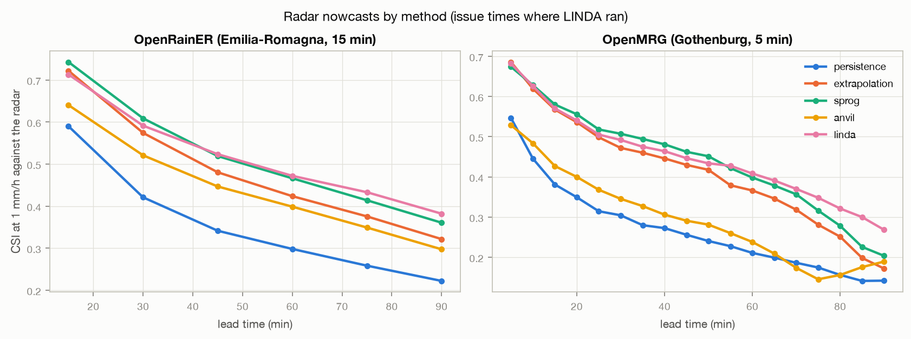
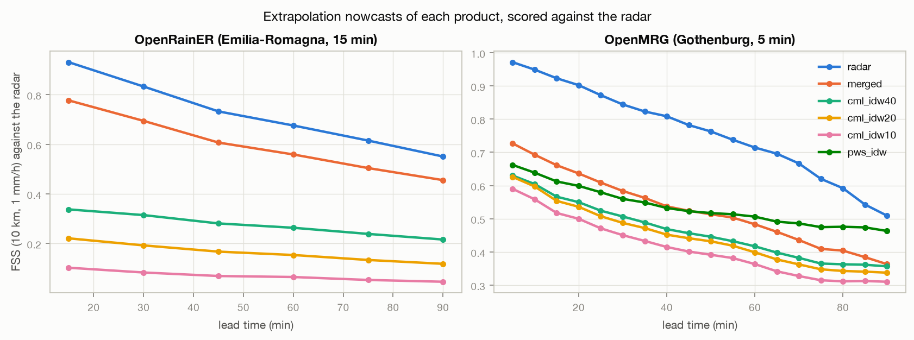
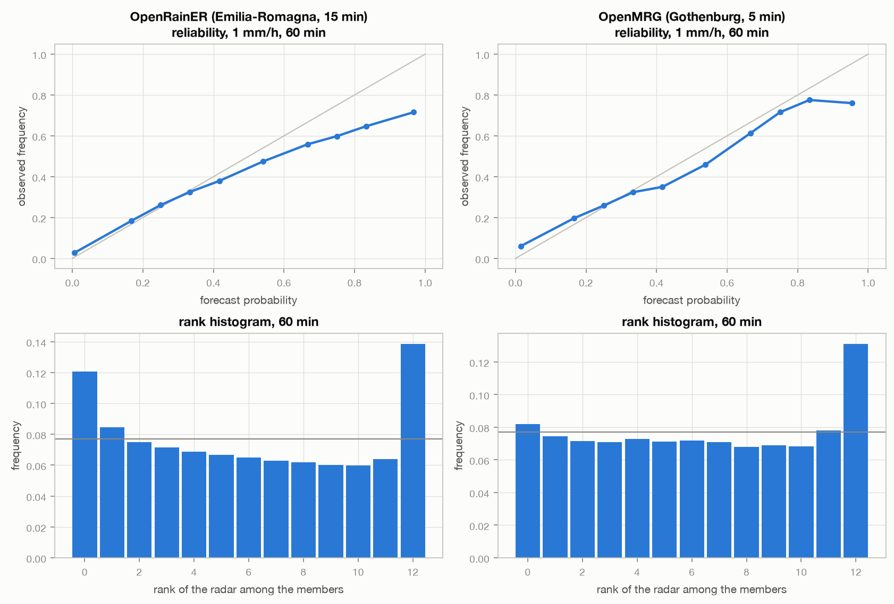

# os_nowcasting - results

Computed by `python projects/nowcasting/pysteps/src/run.py report` from the checkpointed studies. Scores are pooled over all issue times of a network (one contingency table, one set of sums). `own`: against the product's own later field; `radar`: against the radar; `gauges`: at the independent gauges (OpenRainER: ARPAE, OpenMRG: the city gauges), at their grid cells. Rain rates in mm/h at the network's step.

## Design

| network | events | event ids | issue times | max lead (min) | nowcasting time (h) |
|---|---|---|---|---|---|
| OpenRainER (Emilia-Romagna, 15 min) | 4 of 4 | 20220806T09, 20220811T22, 20220817T10, 20220830T11 | 143 | 90 | 1.7 |
| OpenMRG (Gothenburg, 5 min) | 5 of 5 | 20150602T04, 20150707T17, 20150728T03, 20150825T02, 20150827T01 | 128 | 90 | 0.5 |

## OpenRainER (Emilia-Romagna, 15 min)

Scores count only cells the product's own motion can reach from inside the domain; the rest is rain advected in from outside, unknown to every method. Share of the domain that is left (mean over issue times):

| product | % of domain verifiable at 45 min | % of domain verifiable at 90 min |
|---|---|---|
| radar | 87 | 76 |
| merged | 88 | 77 |
| cml_idw40 | 96 | 92 |
| cml_idw20 | 98 | 96 |
| cml_idw10 | 98 | 97 |

### Radar: the nowcasting methods

All issue times (LINDA, being slow, is in the next table):

| method | CSI 1 mm/h, 30 min | 60 min | 90 min | FSS 10 km, 60 min | MAE 60 min (mm/h) | corr 60 min | gauges: corr 60 min | gauges: RMSE 60 min | forecasts |
|---|---|---|---|---|---|---|---|---|---|
| persistence | 0.41 | 0.27 | 0.20 | 0.51 | 1.14 | 0.20 | 0.12 | 4.97 | 143 |
| extrapolation | 0.56 | 0.40 | 0.29 | 0.68 | 0.92 | 0.36 | 0.25 | 4.42 | 143 |
| sprog | 0.60 | 0.44 | 0.33 | 0.70 | 0.92 | 0.37 | 0.24 | 4.61 | 143 |
| anvil | 0.50 | 0.36 | 0.27 | 0.64 | 0.94 | 0.34 | 0.20 | 4.72 | 143 |
| linda | 0.59 | 0.47 | 0.38 | 0.72 | 1.00 | 0.47 | 0.36 | 4.25 | 49 |

On the issue times where LINDA ran (every third), all methods on the same forecasts:

| method | CSI 1 mm/h, 30 min | 60 min | 90 min | FSS 10 km, 60 min | MAE 60 min (mm/h) | corr 60 min | gauges: corr 60 min | gauges: RMSE 60 min | forecasts |
|---|---|---|---|---|---|---|---|---|---|
| persistence | 0.42 | 0.30 | 0.22 | 0.55 | 1.12 | 0.22 | 0.14 | 4.99 | 49 |
| extrapolation | 0.57 | 0.42 | 0.32 | 0.71 | 0.91 | 0.37 | 0.26 | 4.32 | 49 |
| sprog | 0.61 | 0.47 | 0.36 | 0.73 | 0.91 | 0.39 | 0.26 | 4.55 | 49 |
| anvil | 0.52 | 0.40 | 0.30 | 0.68 | 0.93 | 0.36 | 0.28 | 4.34 | 49 |
| linda | 0.59 | 0.47 | 0.38 | 0.72 | 1.00 | 0.47 | 0.36 | 4.25 | 49 |

### Every product, extrapolation nowcast at 60 min

| product | own: CSI 1 | own: CSI 1, persistence | own: FSS 10 km | radar: CSI 1 | radar: FSS 10 km | radar: MAE | gauges: corr | gauges: RMSE | gauges: ME |
|---|---|---|---|---|---|---|---|---|---|
| radar | 0.40 | 0.27 | 0.68 | 0.40 | 0.68 | 0.92 | 0.25 | 4.42 | 0.30 |
| merged | 0.26 | 0.19 | 0.51 | 0.30 | 0.56 | 0.94 | 0.22 | 4.36 | 0.11 |
| cml_idw40 | 0.16 | 0.17 | 0.30 | 0.12 | 0.26 | 0.90 | 0.16 | 4.21 | -0.14 |
| cml_idw20 | 0.16 | 0.17 | 0.31 | 0.07 | 0.15 | 0.83 | 0.08 | 4.20 | -0.25 |
| cml_idw10 | 0.14 | 0.16 | 0.28 | 0.03 | 0.06 | 0.80 | 0.05 | 4.04 | -0.41 |

S-PROG at 60 min:

| product | own: CSI 1 | own: CSI 1, persistence | own: FSS 10 km | radar: CSI 1 | radar: FSS 10 km | radar: MAE | gauges: corr | gauges: RMSE | gauges: ME |
|---|---|---|---|---|---|---|---|---|---|
| radar | 0.44 | 0.27 | 0.70 | 0.44 | 0.70 | 0.92 | 0.24 | 4.61 | 0.38 |
| merged | 0.29 | 0.19 | 0.53 | 0.33 | 0.58 | 0.95 | 0.19 | 4.46 | 0.11 |
| cml_idw40 | 0.16 | 0.17 | 0.30 | 0.13 | 0.27 | 0.91 | 0.16 | 4.46 | -0.08 |
| cml_idw20 | 0.15 | 0.17 | 0.30 | 0.07 | 0.16 | 0.85 | 0.09 | 4.40 | -0.23 |
| cml_idw10 | 0.13 | 0.16 | 0.27 | 0.03 | 0.07 | 0.82 | 0.04 | 4.23 | -0.41 |

### STEPS ensembles (and LINDA-P on its subset)

| product | ensemble | CRPS 30 min (mm/h) | CRPS 60 min | ROC area 1 mm/h, 60 min | ens. mean CSI 1, 60 min | gauges: CRPS 60 min | forecasts |
|---|---|---|---|---|---|---|---|
| radar | steps | 0.48 | 0.62 | 0.86 | 0.44 | 0.69 | 143 |
| radar | linda_p | 0.42 | 0.59 | 0.88 | 0.44 | 0.62 | 26 |
| merged | steps | 0.56 | 0.65 | 0.80 | 0.35 | 0.58 | 143 |
| cml_idw40 | steps | 0.77 | 0.79 | 0.60 | 0.15 | 0.65 | 143 |
| cml_idw20 | steps | 0.77 | 0.78 | 0.55 | 0.08 | 0.64 | 143 |
| cml_idw10 | steps | 0.78 | 0.78 | 0.52 | 0.03 | 0.60 | 143 |
| radar (LINDA-P subset) | steps | 0.43 | 0.59 | 0.85 | 0.44 | 0.59 | 26 |
| radar (LINDA-P subset) | linda_p | 0.42 | 0.59 | 0.88 | 0.44 | 0.62 | 26 |

### Motion methods (radar, extrapolation nowcast against the radar)

| motion | CSI 1, 30 min | 60 min | 90 min | MAE 60 min | FSS 10 km, 60 min |
|---|---|---|---|---|---|
| LK | 0.56 | 0.40 | 0.30 | 0.95 | 0.68 |
| LK (no dB) | 0.55 | 0.39 | 0.30 | 0.96 | 0.67 |
| VET | 0.57 | 0.41 | 0.30 | 0.96 | 0.69 |
| DARTS | 0.46 | 0.30 | 0.22 | 1.10 | 0.56 |
| proesmans | 0.57 | 0.40 | 0.30 | 0.98 | 0.69 |

### How far each product's motion is from the radar's (LK, wet cells)

| product | issue times | median vector difference to radar motion (km/h) | median radar speed (km/h) |
|---|---|---|---|
| merged | 143 | 3 | 23 |
| cml_idw40 | 84 | 22 | 22 |
| cml_idw20 | 84 | 20 | 22 |
| cml_idw10 | 84 | 21 | 22 |

### SAL at 60 min against the radar (mean over forecasts with objects in both)

| product | method | S | A | L | forecasts |
|---|---|---|---|---|---|
| radar | persistence | 0.05 | 0.11 | 0.19 | 143 |
| radar | extrapolation | 0.05 | 0.07 | 0.17 | 143 |
| radar | sprog | 0.30 | 0.12 | 0.20 | 143 |
| radar | anvil | -0.06 | -0.00 | 0.17 | 142 |
| radar (LINDA subset) | linda | 0.77 | 0.36 | 0.12 | 49 |
| merged | extrapolation | -0.23 | -0.20 | 0.19 | 143 |
| cml_idw40 | extrapolation | 0.32 | -1.06 | 0.36 | 84 |
| cml_idw20 | extrapolation | -0.19 | -1.39 | 0.35 | 84 |
| cml_idw10 | extrapolation | -0.89 | -1.70 | 0.35 | 84 |

## OpenMRG (Gothenburg, 5 min)

Scores count only cells the product's own motion can reach from inside the domain; the rest is rain advected in from outside, unknown to every method. Share of the domain that is left (mean over issue times):

| product | % of domain verifiable at 45 min | % of domain verifiable at 90 min |
|---|---|---|
| radar | 45 | 19 |
| merged | 57 | 33 |
| cml_idw40 | 86 | 80 |
| cml_idw20 | 86 | 80 |
| cml_idw10 | 91 | 86 |
| pws_idw | 60 | 47 |

### Radar: the nowcasting methods

All issue times (LINDA, being slow, is in the next table):

| method | CSI 1 mm/h, 30 min | 60 min | 90 min | FSS 10 km, 60 min | MAE 60 min (mm/h) | corr 60 min | gauges: corr 60 min | gauges: RMSE 60 min | forecasts |
|---|---|---|---|---|---|---|---|---|---|
| persistence | 0.30 | 0.21 | 0.12 | 0.52 | 1.03 | 0.12 | 0.14 | 3.12 | 111 |
| extrapolation | 0.47 | 0.33 | 0.18 | 0.71 | 0.76 | 0.33 | 0.07 | 2.88 | 111 |
| sprog | 0.49 | 0.35 | 0.20 | 0.70 | 0.89 | 0.32 | 0.06 | 3.22 | 111 |
| anvil | 0.35 | 0.25 | 0.20 | 0.60 | 0.86 | 0.23 | 0.06 | 3.04 | 111 |
| linda | 0.49 | 0.41 | 0.27 | 0.73 | 1.74 | 0.42 | 0.10 | 3.47 | 39 |

On the issue times where LINDA ran (every third), all methods on the same forecasts:

| method | CSI 1 mm/h, 30 min | 60 min | 90 min | FSS 10 km, 60 min | MAE 60 min (mm/h) | corr 60 min | gauges: corr 60 min | gauges: RMSE 60 min | forecasts |
|---|---|---|---|---|---|---|---|---|---|
| persistence | 0.30 | 0.21 | 0.14 | 0.53 | 1.03 | 0.16 | 0.10 | 3.24 | 39 |
| extrapolation | 0.47 | 0.37 | 0.17 | 0.78 | 0.75 | 0.42 | 0.05 | 2.77 | 39 |
| sprog | 0.51 | 0.40 | 0.20 | 0.78 | 0.86 | 0.43 | 0.11 | 2.65 | 39 |
| anvil | 0.35 | 0.24 | 0.19 | 0.59 | 0.96 | 0.20 | 0.05 | 2.95 | 39 |
| linda | 0.49 | 0.41 | 0.27 | 0.73 | 1.74 | 0.42 | 0.10 | 3.47 | 39 |

### Every product, extrapolation nowcast at 60 min

| product | own: CSI 1 | own: CSI 1, persistence | own: FSS 10 km | radar: CSI 1 | radar: FSS 10 km | radar: MAE | gauges: corr | gauges: RMSE | gauges: ME |
|---|---|---|---|---|---|---|---|---|---|
| radar | 0.33 | 0.21 | 0.71 | 0.33 | 0.71 | 0.76 | 0.07 | 2.88 | -0.10 |
| merged | 0.19 | 0.16 | 0.45 | 0.20 | 0.48 | 0.95 | 0.14 | 2.80 | 0.05 |
| cml_idw40 | 0.22 | 0.21 | 0.42 | 0.19 | 0.42 | 1.00 | 0.13 | 3.23 | 0.10 |
| cml_idw20 | 0.21 | 0.20 | 0.40 | 0.18 | 0.40 | 1.05 | 0.07 | 3.96 | 0.30 |
| cml_idw10 | 0.20 | 0.20 | 0.41 | 0.15 | 0.36 | 1.00 | 0.12 | 3.13 | 0.01 |
| pws_idw | 0.29 | 0.30 | 0.52 | 0.25 | 0.51 | 1.26 | 0.13 | 2.77 | -0.07 |

S-PROG at 60 min:

| product | own: CSI 1 | own: CSI 1, persistence | own: FSS 10 km | radar: CSI 1 | radar: FSS 10 km | radar: MAE | gauges: corr | gauges: RMSE | gauges: ME |
|---|---|---|---|---|---|---|---|---|---|
| radar | 0.35 | 0.21 | 0.70 | 0.35 | 0.70 | 0.89 | 0.06 | 3.22 | 0.12 |
| merged | 0.18 | 0.16 | 0.42 | 0.21 | 0.46 | 1.06 | 0.13 | 3.20 | 0.23 |
| cml_idw40 | 0.24 | 0.21 | 0.45 | 0.20 | 0.43 | 0.91 | 0.24 | 2.84 | 0.17 |
| cml_idw20 | 0.24 | 0.20 | 0.46 | 0.22 | 0.47 | 0.87 | 0.22 | 2.98 | 0.05 |
| cml_idw10 | 0.25 | 0.20 | 0.48 | 0.21 | 0.46 | 0.92 | 0.16 | 3.10 | 0.06 |
| pws_idw | 0.31 | 0.30 | 0.54 | 0.28 | 0.53 | 1.49 | 0.14 | 3.07 | 0.17 |

### STEPS ensembles (and LINDA-P on its subset)

| product | ensemble | CRPS 30 min (mm/h) | CRPS 60 min | ROC area 1 mm/h, 60 min | ens. mean CSI 1, 60 min | gauges: CRPS 60 min | forecasts |
|---|---|---|---|---|---|---|---|
| radar | steps | 0.50 | 0.52 | 0.78 | 0.34 | 0.57 | 111 |
| radar | linda_p | 0.55 | 0.65 | 0.83 | 0.44 | 0.69 | 22 |
| merged | steps | 0.64 | 0.64 | 0.65 | 0.21 | 0.65 | 120 |
| cml_idw40 | steps | 0.69 | 0.69 | 0.65 | 0.21 | 0.78 | 60 |
| cml_idw20 | steps | 0.66 | 0.66 | 0.67 | 0.23 | 0.94 | 63 |
| cml_idw10 | steps | 0.78 | 0.73 | 0.64 | 0.22 | 0.78 | 63 |
| pws_idw | steps | 0.78 | 0.92 | 0.68 | 0.27 | 0.87 | 100 |
| radar (LINDA-P subset) | steps | 0.46 | 0.52 | 0.81 | 0.39 | 0.33 | 22 |
| radar (LINDA-P subset) | linda_p | 0.55 | 0.65 | 0.83 | 0.44 | 0.69 | 22 |

### Motion methods (radar, extrapolation nowcast against the radar)

| motion | CSI 1, 30 min | 60 min | 90 min | MAE 60 min | FSS 10 km, 60 min |
|---|---|---|---|---|---|
| LK | 0.48 | 0.34 | 0.20 | 0.78 | 0.74 |
| LK (no dB) | 0.47 | 0.33 | 0.18 | 0.79 | 0.73 |
| VET | 0.45 | 0.31 | 0.17 | 0.84 | 0.70 |
| DARTS | 0.36 | 0.28 | 0.14 | 0.90 | 0.64 |
| proesmans | 0.46 | 0.33 | 0.18 | 0.84 | 0.72 |

### How far each product's motion is from the radar's (LK, wet cells)

| product | issue times | median vector difference to radar motion (km/h) | median radar speed (km/h) |
|---|---|---|---|
| merged | 128 | 19 | 50 |
| cml_idw40 | 107 | 47 | 51 |
| cml_idw20 | 107 | 48 | 51 |
| cml_idw10 | 107 | 47 | 51 |
| pws_idw | 108 | 55 | 51 |

### SAL at 60 min against the radar (mean over forecasts with objects in both)

| product | method | S | A | L | forecasts |
|---|---|---|---|---|---|
| radar | persistence | -0.06 | 0.04 | 0.22 | 98 |
| radar | extrapolation | 0.08 | -0.41 | 0.18 | 97 |
| radar | sprog | 0.28 | -0.23 | 0.21 | 95 |
| radar | anvil | -0.06 | -0.49 | 0.20 | 85 |
| radar (LINDA subset) | linda | 1.15 | 0.41 | 0.19 | 36 |
| merged | extrapolation | 0.07 | -0.33 | 0.25 | 110 |
| cml_idw40 | extrapolation | 0.66 | -0.33 | 0.37 | 96 |
| cml_idw20 | extrapolation | 0.60 | -0.38 | 0.37 | 93 |
| cml_idw10 | extrapolation | 0.49 | -0.47 | 0.38 | 100 |
| pws_idw | extrapolation | 0.93 | -0.15 | 0.34 | 82 |

## Hourly totals from 5-min scans: plain vs advection interpolation (OpenMRG, city gauges)

| hourly total | subset | gauge-hours | RMSE (mm) | MAE (mm) | corr | bias (%) |
|---|---|---|---|---|---|---|
| advection | all hours | 1489 | 1.15 | 0.43 | 0.73 | -4.0 |
| advection | gauge >= 1 mm | 320 | 2.18 | 1.41 | 0.58 | -19.1 |
| plain | all hours | 1489 | 1.19 | 0.44 | 0.72 | -5.2 |
| plain | gauge >= 1 mm | 320 | 2.25 | 1.46 | 0.56 | -20.1 |

## Figures

