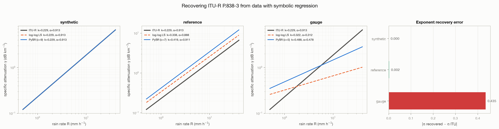
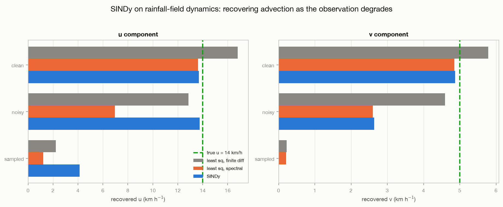

# physics_ml — physics and machine learning for CML rain retrieval

Three experiments on FieldSense's own quantities, each asking whether a
physics-aware method finds what the physics says is there:

- a **hybrid retrieval** that fuses a learnable ITU-R power-law branch with a
  GRU branch, against physics alone;
- **PySR** on measured attenuation: does `gamma = k R^alpha` fall out, with
  ITU-R P.838-3's coefficients?
- **SINDy** on moving rain fields: does the advection velocity fall out of
  the field's own evolution?

## Findings at a glance

- **The hybrid does not beat its own physics branch** (fused RMSE 4.0 mm/h
  against 0.5 for physics alone at 38 GHz, 0.05 dB noise). The gate leans on
  the neural branch, whose input sequences carry no temporal information.
- **The exponent of the power law is recoverable from real data, the
  prefactor is not:** alpha = 0.911 against ITU's 0.913, k 83% high - the
  same wet-antenna offset `opensense_pipeline` measures independently.
- **SINDy recovers the velocity from exact fields** (13.7 / 4.9 km/h for
  14 / 5) **and fails through a CML network** (4.1 / 0.0): interpolation
  smooths away the gradients advection lives in.

## Quick start

```bash
pip install -e ".[notebooks,dev]" && pip install -r projects/physics_ml/requirements.txt
python projects/physics_ml/src/discover_advection.py --all     # SINDy, ~1 min
python projects/physics_ml/src/discover_itu.py --all --band 30 # PySR, needs OpenMRG
python -m pytest projects/physics_ml/tests
```

Then `notebooks/hybrid_retrieval.ipynb`: both hybrid experiments in ~20
lines of calls, every number computed. `src/main_experiment.py` is the
original sweep script (run from `src/`; the modules import each other by bare
name), configured by `ExperimentConfig` at its top.

## Layout

```
physics_ml/
├── src/
│   ├── rain_simulator.py     # synthetic attenuation: ITU-R P.838-3, AR(1) rain, noise
│   ├── hybrid_nn.py          # learnable power-law branch, GRU branch, fusion gate
│   ├── hybrid_training.py    # staged vs joint training, tracking gate and learned (k, alpha)
│   ├── mixing.py             # six ways to combine a physics and a data estimate
│   ├── training_utils.py     # training loops, device selection, curves
│   ├── data_analysis.py      # dataset generation and inspection
│   ├── main_experiment.py    # the original sweep script
│   ├── plots.py              # figures for hybrid_retrieval.ipynb
│   ├── discover_itu.py       # PySR: recover ITU-R k, alpha from CML attenuation
│   └── discover_advection.py # SINDy: recover rain-field advection
├── notebooks/
│   ├── hybrid_retrieval.ipynb        # start here
│   ├── 01_sindy_basics.ipynb         # SINDy on the Lorenz system (tutorial)
│   ├── 02_pysr_basics.ipynb          # symbolic regression (tutorial)
│   └── TUTORIALS.md
├── results/                  # discover_*.json/png, training_curves.png
└── tests/test_physics_ml.py
```

## Why each method is here

This project holds two things: a hybrid CML retrieval, and two experiments
that run equation discovery **on FieldSense's own quantities**. Every method
present has a job:

| method | question it answers | script | tutorial |
|---|---|---|---|
| **PySR** (symbolic regression) | does the ITU-R power law fall out of measured attenuation, and with what coefficients? | `src/discover_itu.py` | `notebooks/02_pysr_basics.ipynb` |
| **SINDy** (sparse regression) | does a rain field's advection fall out of the field's own evolution? | `src/discover_advection.py` | `notebooks/01_sindy_basics.ipynb` |
| **physics + NN hybrid** | can a learnable ITU branch and a GRU branch be fused per sample? | `src/hybrid_nn.py`, `src/hybrid_training.py` | `notebooks/hybrid_retrieval.ipynb` |

**Why SINDy specifically.** A rain field crossing a region is a dynamical
system, and field estimation is where that matters: a nowcast has to
propagate the field forward, which means knowing how it moves.
`projects/spatial_interpolation` benchmarks POD-SINDy against a Transformer
and a GRU for exactly this, on real data and on these same moving fields.
The Lorenz notebook teaches the method; `discover_advection.py` runs it on
rainfall with a velocity known exactly, so the answer can be checked.

The N-body and PINN-gravity material has no such counterpart and is not part
of this repository. See `core/scientific_packages/` for PySINDy and PySR
reference notes.

## The hybrid, measured

`notebooks/hybrid_retrieval.ipynb` answers two questions on synthetic links,
all numbers computed in the notebook.

**Combining two estimates depends on frequency.** At 5 GHz a 1 km link
attenuates so weakly that inverting the power law turns noise into an MSE of
~3,000 (mm/h)²; every learned combination is ~40x better. At 60-70 GHz physics
alone is within ~5% of the best, and a learned gate on attenuation edges it.

**The hybrid physics + GRU model does not beat its own physics branch.** At
38 GHz, with the original notebook's training budget:

| noise | method | fused RMSE | physics branch | neural branch | gate |
|---|---|---|---|---|---|
| 0.05 dB | staged | 4.00 | **0.49** | 4.04 | 0.13 |
| 0.5 dB | staged | 4.12 | **1.26** | 4.16 | 0.13 |
| 2.0 dB | staged | 4.68 | **3.74** | 4.73 | 0.23 |

(RMSE in mm/h; joint training is worse than staged at every level.) The gate
leans on the neural branch although physics is 1.3-8x more accurate. A likely
cause is the input: `prepare_sequences` builds each GRU "sequence" as random
noise around one attenuation value, so the network has no temporal
information to learn from.

### About the original notebook

`src/` was consolidated from an earlier working notebook
(`Simulation_MBML.ipynb`, no longer in the repository). It was not a reliable
source of results: it defines the hybrid model three times, calls a
`ThreeStageTrainer` that is defined nowhere in it (reconstructed as
`hybrid_training.train(..., "staged")`), and its summary figures (cells 17,
18, 22) plot numbers typed into the cells rather than computed. Those show
the hybrid ahead; the code above does not reproduce that.

## Rediscovering ITU-R P.838-3 with symbolic regression

Every retrieval here *inverts* `gamma = k * R^alpha`. `src/discover_itu.py`
asks the opposite question: given attenuation and rain rate, does PySR find
the power law, and does it recover the tabulated coefficients?

```bash
python projects/physics_ml/src/discover_itu.py --all --band 30
```

Three experiments in deliberate order, all in the 30 GHz band where OpenMRG
has 172 links (ITU: k = 0.229, alpha = 0.913):

| experiment | rain rate from | recovered k | recovered alpha | alpha error |
|---|---|---|---|---|
| synthetic | ITU + noise, truth known | 0.230 | 0.912 | **0.001** |
| reference | OpenSense's published retrieval | 0.419 | 0.911 | **0.002** |
| gauge | municipal rain gauges | 0.488 | 0.478 | **0.435** |

**The exponent is recoverable from real data; the prefactor is not.** Against
the reference retrieval PySR lands on alpha = 0.911 against ITU's 0.913 — but
k comes out 83% high. The fitted curve is *parallel* to ITU and displaced
upward, which is the signature of a constant added to the attenuation rather
than an error in the power law.

That offset is almost certainly unmodelled wet-antenna attenuation, and the
size is telling: +83% here, against the ~1.86x over-read that
`opensense_pipeline/src/validate_retrieval.py` measures for the same chain
against the same reference. Two independent methods, the same bias, and both
locate it in the prefactor.

**The gauge experiment fails, for a statistical reason worth naming.** Alpha
collapses to 0.478 and the naive log-log fit to 0.312. This is regression
dilution: the predictor is a point gauge, the response is a path average over
kilometres, and when the predictor carries that much independent noise the
fitted slope is biased toward zero. It is not evidence against the power law
— it is evidence that gauge-link pairs are the wrong data to fit one with.

Two notes on method. PySR needs `^` in its operator set or the search cannot
reach a power law at all and spends its budget on polynomial approximations
that fit acceptably and explain nothing. And `model_selection="best"` tends
to pick a straight line at CML frequencies, because alpha sits within ~0.15
of 1 across 15–40 GHz; the script therefore reduces *every* Pareto candidate
to the `k * R^alpha` it is equivalent to, rather than trusting the single
"best" expression.



## Recovering field dynamics with SINDy

`src/discover_advection.py` is the temporal counterpart to the ITU experiment.
A rain field advects, so to first order

```
dR/dt = -u dR/dx - v dR/dy
```

and fitting a library of spatial derivatives against the time derivative
should return the wind in its coefficients. The field is a smooth Gaussian
field with the stratiform spectrum (`--field rain` uses the intermittent
stratiform model itself), translated exactly by
`core.simulation.moving_fields` at a velocity we choose, so the answer is
known.

```bash
python projects/physics_ml/src/discover_advection.py --all
```

True velocity u = 14.0, v = 5.0 km/h:

| observation | SINDy u | SINDy v | active terms |
|---|---|---|---|
| exact fields | **13.68** | **4.87** | 2 — the two correct ones |
| + 5% noise | 13.77 | 2.64 | 3 — one spurious |
| through 90 CML paths, IDW back to a grid | 4.14 | 0.00 | 2 |

**Clean recovery works, and the sparsity is real** — the library offers
second derivatives and quadratic terms that the true dynamics do not use, and
on exact fields SINDy selects neither.

**Noise costs the weaker component first.** At 5% multiplicative noise `u`
survives but `v` halves, which is what you would expect: v = 5 km/h carries
less signal than u = 14, so the same absolute derivative error eats a larger
fraction of it.

**Through a CML network it fails completely.** Sampling the field along 90
link paths and interpolating back with IDW leaves u = 4.1 and v = 0. This is
consistent with what the rest of the repository finds about IDW —
`rainfall_field_sim` measures it destroying intermittency and 83–87% of peak
intensity. Advection lives in the *gradients* of the field, and those are
exactly what the interpolation smooths away. A nowcast fitted on IDW-derived
fields is fitting the reconstruction, not the weather.

### A methodological trap worth knowing

Naive finite differences bias the recovered velocity **high by 20%** on exact,
noise-free data — 16.8 km/h for a true 14.0. A central difference computes
`sin(k dx)/dx` instead of `k`, so it under-reads high-wavenumber content, and
it under-reads the *spatial* derivative more than the temporal one, because
the field moves only a fraction of a cell per timestep. Their ratio is the
velocity, so the errors do not cancel. Spectral spatial derivatives are exact
for a periodic field and give 13.6.

The time derivative stays a finite difference: the sequence is not periodic in
time — the field translates out of one edge and into the other — so a spectral
time derivative picks up Gibbs error and reads 12.8 instead.



## References

- ITU-R P.838-3, *Specific attenuation model for rain for use in prediction methods*.
- Brunton, Proctor & Kutz (2016), SINDy, *PNAS* 113(15); Cranmer (2023), PySR, arXiv:2305.01582.
