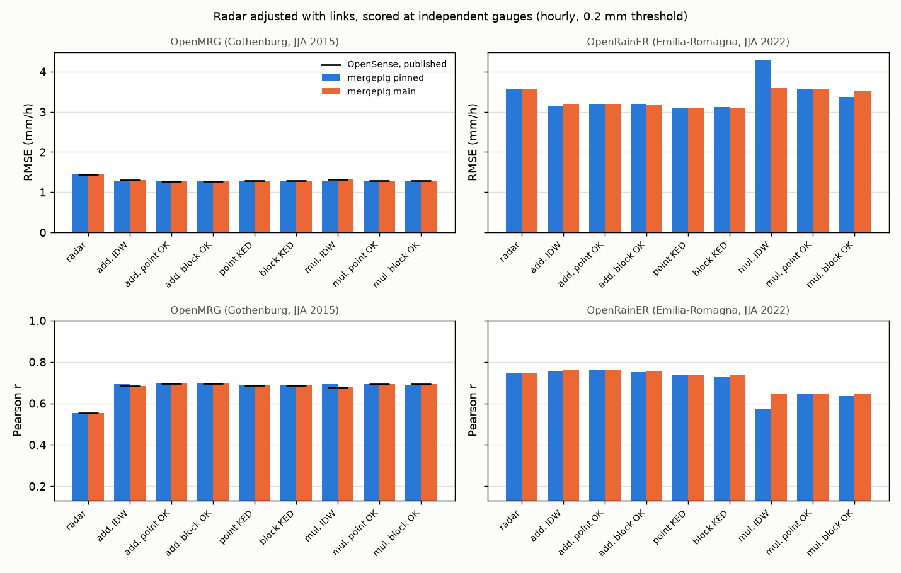
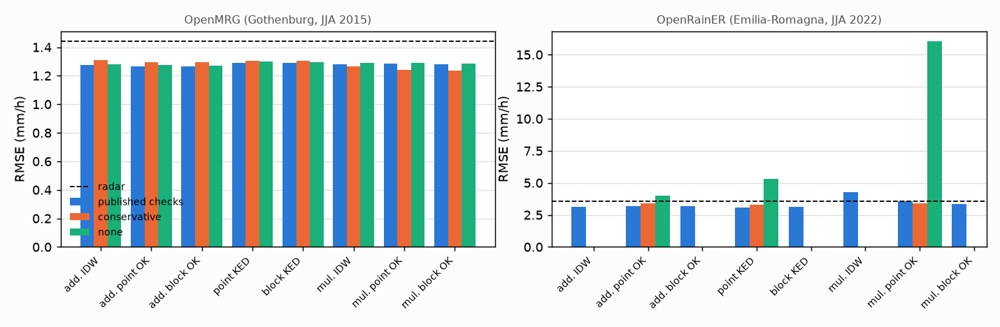
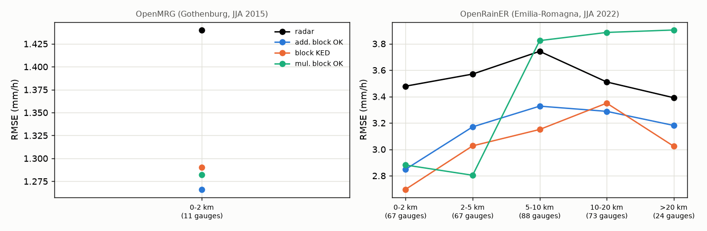
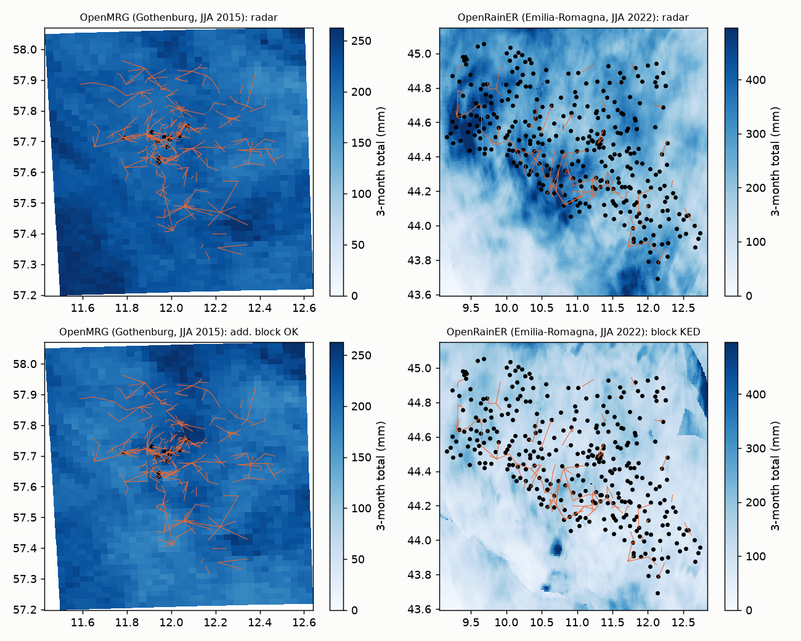

# radar_adjustment - results

Every number below is computed by `run.py report` from the runs saved by `run.py adjust` and `run.py extend`. Hourly, at the gauges, which no adjustment uses; poligrain's `calculate_rainfall_metrics`, 0.2 mm threshold on both sides (`n_pairs`: gauge-hours left).

## 1. Replication of the OpenSense result (OpenMRG)

`published` = the table printed in the OpenSense repository's `4_analysis`; `pinned` = mergeplg 9894b9c (the submodule it records), `main` = mergeplg dd380b1; range checks of `3_adjust_radar` (difference 10 mm, ratio 0.1-15).

| product | rmse published | rmse pinned | rmse main | pcc published | pcc pinned | pcc main | pbias published | pbias pinned | pbias main |
|---|---|---|---|---|---|---|---|---|---|
| radar | 1.4401 | 1.4401 | 1.4401 | 0.5524 | 0.5524 | 0.5524 | -18.81 | -18.81 | -18.81 |
| add. IDW | 1.3057 | 1.2774 | 1.3057 | 0.6826 | 0.6932 | 0.6826 | -10.18 | -10.70 | -10.18 |
| add. point OK | 1.2666 | 1.2666 | 1.2666 | 0.6960 | 0.6960 | 0.6960 | -10.31 | -10.31 | -10.31 |
| add. block OK | 1.2662 | 1.2666 | 1.2662 | 0.6966 | 0.6952 | 0.6966 | -10.39 | -12.72 | -10.39 |
| point KED | 1.2902 | 1.2902 | 1.2902 | 0.6869 | 0.6869 | 0.6869 | -11.28 | -11.28 | -11.28 |
| block KED | 1.2897 | 1.2891 | 1.2903 | 0.6876 | 0.6861 | 0.6873 | -11.34 | -13.38 | -11.35 |
| mul. IDW | 1.3180 | 1.2794 | 1.3180 | 0.6775 | 0.6914 | 0.6775 | -6.68 | -7.29 | -6.68 |
| mul. point OK | 1.2830 | 1.2830 | 1.2830 | 0.6918 | 0.6918 | 0.6918 | -6.20 | -6.20 | -6.20 |
| mul. block OK | 1.2822 | 1.2795 | 1.2822 | 0.6924 | 0.6904 | 0.6924 | -6.32 | -9.24 | -6.32 |

## 2. The intercomparison, both networks

**OpenMRG (Gothenburg, JJA 2015) - mergeplg pinned, published range checks**

| product | pcc | rmse | mae | pbias | n_pairs | n_nan |
|---|---|---|---|---|---|---|
| radar | 0.552 | 1.440 | 0.836 | -18.8 | 2394 | 0 |
| add. block OK | 0.695 | 1.267 | 0.669 | -12.7 | 2137 | 0 |
| add. IDW | 0.693 | 1.277 | 0.680 | -10.7 | 2135 | 0 |
| add. point OK | 0.696 | 1.267 | 0.675 | -10.3 | 2146 | 0 |
| block KED | 0.686 | 1.289 | 0.678 | -13.4 | 2122 | 0 |
| point KED | 0.687 | 1.290 | 0.683 | -11.3 | 2125 | 0 |
| mul. block OK | 0.690 | 1.280 | 0.673 | -9.2 | 2164 | 0 |
| mul. IDW | 0.691 | 1.279 | 0.681 | -7.3 | 2187 | 0 |
| mul. point OK | 0.692 | 1.283 | 0.682 | -6.2 | 2178 | 0 |

**OpenMRG (Gothenburg, JJA 2015) - mergeplg pinned, conservative checks (diff 5, ratio 0.2-8)**

| product | pcc | rmse | mae | pbias | n_pairs | n_nan |
|---|---|---|---|---|---|---|
| radar | 0.552 | 1.440 | 0.836 | -18.8 | 2394 | 0 |
| add. block OK | 0.677 | 1.295 | 0.675 | -14.3 | 2137 | 0 |
| add. IDW | 0.670 | 1.312 | 0.686 | -12.6 | 2135 | 0 |
| add. point OK | 0.676 | 1.296 | 0.680 | -12.2 | 2146 | 0 |
| block KED | 0.675 | 1.304 | 0.674 | -15.2 | 2122 | 0 |
| point KED | 0.674 | 1.306 | 0.679 | -13.4 | 2125 | 0 |
| mul. block OK | 0.705 | 1.234 | 0.659 | -8.8 | 2237 | 0 |
| mul. IDW | 0.693 | 1.263 | 0.676 | -6.4 | 2259 | 0 |
| mul. point OK | 0.705 | 1.239 | 0.669 | -6.1 | 2245 | 0 |

**OpenMRG (Gothenburg, JJA 2015) - mergeplg pinned, no range checks**

| product | pcc | rmse | mae | pbias | n_pairs | n_nan |
|---|---|---|---|---|---|---|
| radar | 0.552 | 1.440 | 0.836 | -18.8 | 2394 | 0 |
| add. block OK | 0.697 | 1.270 | 0.672 | -11.8 | 2137 | 0 |
| add. IDW | 0.696 | 1.280 | 0.683 | -10.0 | 2135 | 0 |
| add. point OK | 0.698 | 1.273 | 0.681 | -9.2 | 2146 | 0 |
| block KED | 0.686 | 1.297 | 0.683 | -12.4 | 2122 | 0 |
| point KED | 0.687 | 1.301 | 0.690 | -10.1 | 2125 | 0 |
| mul. block OK | 0.693 | 1.284 | 0.680 | -12.4 | 2109 | 0 |
| mul. IDW | 0.692 | 1.291 | 0.688 | -10.2 | 2118 | 0 |
| mul. point OK | 0.694 | 1.288 | 0.689 | -9.2 | 2126 | 0 |

**OpenMRG (Gothenburg, JJA 2015) - mergeplg main, published range checks**

| product | pcc | rmse | mae | pbias | n_pairs | n_nan |
|---|---|---|---|---|---|---|
| radar | 0.552 | 1.440 | 0.836 | -18.8 | 2394 | 0 |
| add. block OK | 0.697 | 1.266 | 0.674 | -10.4 | 2144 | 0 |
| add. IDW | 0.683 | 1.306 | 0.701 | -10.2 | 2123 | 0 |
| add. point OK | 0.696 | 1.267 | 0.675 | -10.3 | 2146 | 0 |
| block KED | 0.687 | 1.290 | 0.683 | -11.4 | 2122 | 0 |
| point KED | 0.687 | 1.290 | 0.683 | -11.3 | 2125 | 0 |
| mul. block OK | 0.692 | 1.282 | 0.681 | -6.3 | 2177 | 0 |
| mul. IDW | 0.677 | 1.318 | 0.701 | -6.7 | 2170 | 0 |
| mul. point OK | 0.692 | 1.283 | 0.682 | -6.2 | 2178 | 0 |

**OpenMRG (Gothenburg, JJA 2015) - mergeplg main, conservative checks (diff 5, ratio 0.2-8)**

| product | pcc | rmse | mae | pbias | n_pairs | n_nan |
|---|---|---|---|---|---|---|
| radar | 0.552 | 1.440 | 0.836 | -18.8 | 2394 | 0 |
| add. block OK | 0.677 | 1.295 | 0.678 | -12.3 | 2144 | 0 |
| add. IDW | 0.666 | 1.325 | 0.703 | -11.7 | 2123 | 0 |
| add. point OK | 0.676 | 1.296 | 0.680 | -12.2 | 2146 | 0 |
| block KED | 0.674 | 1.306 | 0.679 | -13.5 | 2122 | 0 |
| point KED | 0.674 | 1.306 | 0.679 | -13.4 | 2125 | 0 |
| mul. block OK | 0.705 | 1.238 | 0.667 | -6.2 | 2246 | 0 |
| mul. IDW | 0.693 | 1.268 | 0.685 | -6.2 | 2242 | 0 |
| mul. point OK | 0.705 | 1.239 | 0.669 | -6.1 | 2245 | 0 |

**OpenMRG (Gothenburg, JJA 2015) - mergeplg main, no range checks**

| product | pcc | rmse | mae | pbias | n_pairs | n_nan |
|---|---|---|---|---|---|---|
| radar | 0.552 | 1.440 | 0.836 | -18.8 | 2394 | 0 |
| add. block OK | 0.699 | 1.272 | 0.679 | -9.3 | 2144 | 0 |
| add. IDW | 0.686 | 1.308 | 0.703 | -9.6 | 2123 | 0 |
| add. point OK | 0.698 | 1.273 | 0.681 | -9.2 | 2146 | 0 |
| block KED | 0.688 | 1.301 | 0.689 | -10.2 | 2122 | 0 |
| point KED | 0.687 | 1.301 | 0.690 | -10.1 | 2125 | 0 |
| mul. block OK | 0.694 | 1.288 | 0.688 | -9.4 | 2122 | 0 |
| mul. IDW | 0.684 | 1.314 | 0.706 | -9.8 | 2118 | 0 |
| mul. point OK | 0.694 | 1.288 | 0.689 | -9.2 | 2126 | 0 |

**OpenRainER (Emilia-Romagna, JJA 2022) - mergeplg pinned, published range checks**

| product | pcc | rmse | mae | pbias | n_pairs | n_nan |
|---|---|---|---|---|---|---|
| radar | 0.749 | 3.576 | 2.020 | +107.1 | 26516 | 66287 |
| add. block OK | 0.750 | 3.189 | 1.557 | +29.1 | 20477 | 66287 |
| add. IDW | 0.758 | 3.143 | 1.539 | +31.6 | 20777 | 66287 |
| add. point OK | 0.758 | 3.197 | 1.569 | +33.5 | 20317 | 66287 |
| block KED | 0.731 | 3.111 | 1.264 | -11.0 | 19344 | 66287 |
| point KED | 0.734 | 3.082 | 1.260 | -6.2 | 19504 | 66287 |
| mul. block OK | 0.635 | 3.374 | 1.341 | +9.1 | 23580 | 66287 |
| mul. IDW | 0.574 | 4.269 | 1.401 | +24.1 | 23508 | 66287 |
| mul. point OK | 0.645 | 3.572 | 1.361 | +27.5 | 24107 | 66287 |

**OpenRainER (Emilia-Romagna, JJA 2022) - mergeplg pinned, conservative checks (diff 5, ratio 0.2-8)**

| product | pcc | rmse | mae | pbias | n_pairs | n_nan |
|---|---|---|---|---|---|---|
| radar | 0.749 | 3.576 | 2.020 | +107.1 | 26516 | 66287 |
| add. point OK | 0.751 | 3.419 | 1.709 | +48.1 | 20603 | 66287 |
| point KED | 0.704 | 3.268 | 1.332 | -2.0 | 19428 | 66287 |
| mul. point OK | 0.669 | 3.429 | 1.421 | +42.7 | 25630 | 66287 |

**OpenRainER (Emilia-Romagna, JJA 2022) - mergeplg pinned, no range checks**

| product | pcc | rmse | mae | pbias | n_pairs | n_nan |
|---|---|---|---|---|---|---|
| radar | 0.749 | 3.576 | 2.020 | +107.1 | 26516 | 66287 |
| add. point OK | 0.680 | 4.016 | 1.707 | +40.6 | 20319 | 66287 |
| point KED | 0.510 | 5.318 | 1.528 | +10.7 | 19561 | 66287 |
| mul. point OK | 0.181 | 16.028 | 2.127 | +38.7 | 19579 | 66287 |

**OpenRainER (Emilia-Romagna, JJA 2022) - mergeplg main, published range checks**

| product | pcc | rmse | mae | pbias | n_pairs | n_nan |
|---|---|---|---|---|---|---|
| radar | 0.749 | 3.576 | 2.020 | +107.1 | 26516 | 66287 |
| add. block OK | 0.758 | 3.186 | 1.560 | +32.5 | 20349 | 66287 |
| add. IDW | 0.758 | 3.189 | 1.560 | +32.9 | 20413 | 66287 |
| add. point OK | 0.758 | 3.197 | 1.569 | +33.5 | 20317 | 66287 |
| block KED | 0.735 | 3.080 | 1.258 | -7.0 | 19462 | 66287 |
| point KED | 0.734 | 3.082 | 1.260 | -6.2 | 19504 | 66287 |
| mul. block OK | 0.648 | 3.505 | 1.343 | +24.5 | 24010 | 66287 |
| mul. IDW | 0.645 | 3.581 | 1.343 | +24.7 | 23859 | 66287 |
| mul. point OK | 0.645 | 3.572 | 1.361 | +27.5 | 24107 | 66287 |

**OpenRainER (Emilia-Romagna, JJA 2022) - mergeplg main, conservative checks (diff 5, ratio 0.2-8)**

| product | pcc | rmse | mae | pbias | n_pairs | n_nan |
|---|---|---|---|---|---|---|
| radar | 0.749 | 3.576 | 2.020 | +107.1 | 26516 | 66287 |
| add. block OK | 0.751 | 3.408 | 1.699 | +47.2 | 20628 | 66287 |
| add. IDW | 0.751 | 3.412 | 1.702 | +48.3 | 20704 | 66287 |
| add. point OK | 0.751 | 3.419 | 1.709 | +48.1 | 20603 | 66287 |
| block KED | 0.704 | 3.268 | 1.330 | -2.7 | 19399 | 66287 |
| point KED | 0.704 | 3.268 | 1.332 | -2.0 | 19428 | 66287 |
| mul. block OK | 0.667 | 3.407 | 1.408 | +40.2 | 25560 | 66287 |
| mul. IDW | 0.664 | 3.470 | 1.399 | +39.7 | 25510 | 66287 |
| mul. point OK | 0.669 | 3.429 | 1.421 | +42.7 | 25630 | 66287 |

**OpenRainER (Emilia-Romagna, JJA 2022) - mergeplg main, no range checks**

| product | pcc | rmse | mae | pbias | n_pairs | n_nan |
|---|---|---|---|---|---|---|
| radar | 0.749 | 3.576 | 2.020 | +107.1 | 26516 | 66287 |
| add. block OK | 0.687 | 3.904 | 1.681 | +38.3 | 20354 | 66287 |
| add. IDW | 0.683 | 3.957 | 1.660 | +37.3 | 20397 | 66287 |
| add. point OK | 0.680 | 4.016 | 1.707 | +40.6 | 20319 | 66287 |
| block KED | 0.521 | 5.101 | 1.500 | +8.2 | 19517 | 66287 |
| point KED | 0.510 | 5.318 | 1.528 | +10.7 | 19561 | 66287 |
| mul. block OK | 0.179 | 15.925 | 2.099 | +35.6 | 19512 | 66287 |
| mul. IDW | 0.221 | 15.453 | 2.108 | +38.5 | 19562 | 66287 |
| mul. point OK | 0.181 | 16.028 | 2.127 | +38.7 | 19579 | 66287 |

## 3. By intensity of the gauge value (main, published checks): RMSE (mm/h)

**OpenMRG (Gothenburg, JJA 2015)**

| product | [0.2,2.5) (n=1521) | [2.5,10) (n=330) | [10,50) (n=8) |
|---|---|---|---|
| radar | 0.807 | 2.936 | 10.264 |
| add. IDW | 0.622 | 2.598 | 8.730 |
| add. point OK | 0.612 | 2.527 | 8.540 |
| add. block OK | 0.611 | 2.527 | 8.522 |
| point KED | 0.619 | 2.558 | 8.726 |
| block KED | 0.617 | 2.560 | 8.697 |
| mul. IDW | 0.671 | 2.591 | 9.114 |
| mul. point OK | 0.672 | 2.536 | 8.554 |
| mul. block OK | 0.671 | 2.537 | 8.522 |

**OpenRainER (Emilia-Romagna, JJA 2022)**

| product | [0.2,2.5) (n=11008) | [2.5,10) (n=2739) | [10,50) (n=1040) | >=50 (n=6) |
|---|---|---|---|---|
| radar | 3.180 | 6.540 | 8.547 | 25.453 |
| add. IDW | 2.086 | 4.867 | 8.587 | 26.595 |
| add. point OK | 2.088 | 4.876 | 8.548 | 26.268 |
| add. block OK | 2.073 | 4.847 | 8.576 | 26.321 |
| point KED | 1.362 | 3.903 | 10.249 | 34.540 |
| block KED | 1.350 | 3.873 | 10.271 | 34.609 |
| mul. IDW | 1.786 | 6.046 | 11.527 | 32.392 |
| mul. point OK | 1.881 | 6.101 | 11.371 | 31.040 |
| mul. block OK | 1.830 | 5.880 | 11.257 | 31.127 |

## 4. By distance of the gauge to the nearest link (main, published checks): RMSE (mm/h)

**OpenMRG (Gothenburg, JJA 2015)**

| product | 0-2 km (11 gauges) |
|---|---|
| radar | 1.440 |
| add. IDW | 1.306 |
| add. point OK | 1.267 |
| add. block OK | 1.266 |
| point KED | 1.290 |
| block KED | 1.290 |
| mul. IDW | 1.318 |
| mul. point OK | 1.283 |
| mul. block OK | 1.282 |

**OpenRainER (Emilia-Romagna, JJA 2022)**

| product | 0-2 km (67 gauges) | 2-5 km (67 gauges) | 5-10 km (88 gauges) | 10-20 km (73 gauges) | >20 km (24 gauges) |
|---|---|---|---|---|---|
| radar | 3.479 | 3.570 | 3.742 | 3.510 | 3.391 |
| add. IDW | 2.857 | 3.197 | 3.350 | 3.251 | 3.157 |
| add. point OK | 2.867 | 3.185 | 3.339 | 3.292 | 3.180 |
| add. block OK | 2.849 | 3.170 | 3.327 | 3.288 | 3.181 |
| point KED | 2.705 | 3.026 | 3.154 | 3.347 | 3.026 |
| block KED | 2.697 | 3.026 | 3.150 | 3.350 | 3.023 |
| mul. IDW | 3.259 | 2.985 | 3.897 | 3.748 | 3.880 |
| mul. point OK | 2.923 | 2.825 | 3.907 | 3.987 | 3.960 |
| mul. block OK | 2.881 | 2.804 | 3.824 | 3.886 | 3.904 |

## 5. Extensions (mergeplg main)

`run`: `links (default)` the intercomparison's main run; `mapping` maps with no radar and RADOLAN; `stations` the radar adjusted with PWS or links + PWS (`[pws]`, `[cml+pws]`); `vg5km`, `vgfit`, `c0within` block kriging with mergeplg's default variogram, one fitted to the radar, and the nugget from the link geometry.

**OpenMRG (Gothenburg, JJA 2015)**

| run | product | pcc | rmse | mae | pbias | n_pairs | n_nan |
|---|---|---|---|---|---|---|---|
| mapping | IDW map (no radar) [pws] | 0.819 | 1.008 | 0.533 | -13.7 | 2138 | 0 |
| mapping | point OK map (no radar) [pws] | 0.806 | 1.030 | 0.546 | -11.7 | 2187 | 0 |
| mapping | block OK map (no radar) [pws] | 0.806 | 1.030 | 0.546 | -11.7 | 2187 | 0 |
| stations | RADOLAN [cml+pws] | 0.722 | 1.177 | 0.601 | -10.2 | 2392 | 0 |
| mapping | RADOLAN | 0.717 | 1.187 | 0.601 | -9.9 | 2400 | 0 |
| stations | block KED [pws] | 0.727 | 1.214 | 0.638 | -18.9 | 2106 | 0 |
| stations | add. IDW [pws] | 0.726 | 1.218 | 0.647 | -16.4 | 2086 | 0 |
| stations | RADOLAN [pws] | 0.711 | 1.224 | 0.636 | -21.4 | 2239 | 0 |
| stations | add. block OK [pws] | 0.718 | 1.228 | 0.657 | -16.1 | 2108 | 0 |
| mapping | block OK map (no radar) [cml+pws] | 0.710 | 1.247 | 0.652 | -10.7 | 2112 | 0 |
| mapping | point OK map (no radar) [cml+pws] | 0.710 | 1.248 | 0.653 | -10.7 | 2113 | 0 |
| stations | mul. block OK [cml+pws] | 0.705 | 1.250 | 0.664 | -6.1 | 2184 | 0 |
| stations | add. block OK [cml+pws] | 0.702 | 1.256 | 0.669 | -10.8 | 2137 | 0 |
| mapping | IDW map (no radar) [cml+pws] | 0.706 | 1.257 | 0.659 | -11.1 | 2111 | 0 |
| links (default) | add. block OK | 0.697 | 1.266 | 0.674 | -10.4 | 2144 | 0 |
| c0within | add. block OK | 0.697 | 1.267 | 0.676 | -10.1 | 2144 | 0 |
| vgfit | add. block OK | 0.696 | 1.267 | 0.675 | -10.4 | 2142 | 0 |
| mapping | block OK map (no radar) | 0.701 | 1.268 | 0.662 | -10.1 | 2117 | 0 |
| mapping | point OK map (no radar) | 0.700 | 1.269 | 0.663 | -10.0 | 2119 | 0 |
| mapping | IDW map (no radar) | 0.698 | 1.275 | 0.665 | -10.7 | 2119 | 0 |
| stations | block KED [cml+pws] | 0.695 | 1.275 | 0.672 | -11.8 | 2113 | 0 |
| links (default) | mul. block OK | 0.692 | 1.282 | 0.681 | -6.3 | 2177 | 0 |
| links (default) | block KED | 0.687 | 1.290 | 0.683 | -11.4 | 2122 | 0 |
| stations | add. IDW [cml+pws] | 0.688 | 1.295 | 0.696 | -10.3 | 2118 | 0 |
| links (default) | add. IDW | 0.683 | 1.306 | 0.701 | -10.2 | 2123 | 0 |
| vg5km | add. block OK | 0.680 | 1.316 | 0.712 | -11.3 | 2119 | 0 |
| links (default) | radar | 0.552 | 1.440 | 0.836 | -18.8 | 2394 | 0 |
| stations | mul. block OK [pws] | 0.610 | 1.540 | 0.742 | +5.0 | 2364 | 0 |

**OpenRainER (Emilia-Romagna, JJA 2022)**

| run | product | pcc | rmse | mae | pbias | n_pairs | n_nan |
|---|---|---|---|---|---|---|---|
| mapping | RADOLAN | 0.736 | 2.974 | 1.298 | +32.7 | 25292 | 66287 |
| links (default) | block KED | 0.735 | 3.080 | 1.258 | -7.0 | 19462 | 66287 |
| links (default) | add. block OK | 0.758 | 3.186 | 1.560 | +32.5 | 20349 | 66287 |
| links (default) | add. IDW | 0.758 | 3.189 | 1.560 | +32.9 | 20413 | 66287 |
| vgfit | add. block OK | 0.759 | 3.196 | 1.571 | +33.7 | 20300 | 66287 |
| c0within | add. block OK | 0.759 | 3.197 | 1.569 | +33.9 | 20350 | 66287 |
| vg5km | add. block OK | 0.749 | 3.295 | 1.636 | +36.2 | 20254 | 66287 |
| links (default) | mul. block OK | 0.648 | 3.505 | 1.343 | +24.5 | 24010 | 66287 |
| links (default) | radar | 0.749 | 3.576 | 2.020 | +107.1 | 26516 | 66287 |
| mapping | block OK map (no radar) | 0.425 | 4.141 | 1.623 | -2.0 | 23778 | 66746 |
| mapping | point OK map (no radar) | 0.412 | 4.228 | 1.641 | +0.5 | 24018 | 66746 |
| mapping | IDW map (no radar) | 0.366 | 5.145 | 1.744 | +1.3 | 22272 | 66746 |

Fitted variograms (spherical, sill 1, from standardised wet radar hours):

```
{
 "openmrg": {
  "sill": 1.0,
  "range": 59561.99208061386,
  "nugget": 0.14994142356939583,
  "n_hours": 352
 },
 "openrainer": {
  "sill": 1.0,
  "range": 68241.44874647858,
  "nugget": 0.3173320499869313,
  "n_hours": 136
 }
}
```

## 6. New York City: MRMS radar-only adjusted, at the 4 ASOS gauges

The storms of `projects/multisensor_maps` with every product (9; left out for missing inputs: openmesh_20240306T17), 663 ASOS station-hours, the same for every product. `links rnn` / `links nearby`: link rain from the RNN of `projects/cml_rnn` / the nearby-link power law; `pws`: the WU PWS; `MRMS Pass 2`: the radar corrected by NOAA with gauges, as a reference product.

| product | pcc | rmse | mae | pbias | n_pairs | n_nan |
|---|---|---|---|---|---|---|
| radolan [pws] | 0.913 | 1.394 | 0.867 | -5.2 | 581 | 0 |
| idw_map [pws] | 0.899 | 1.499 | 0.926 | -6.1 | 553 | 0 |
| okb_map [pws] | 0.891 | 1.550 | 0.969 | -4.8 | 556 | 0 |
| idw_map [links rnn+pws] | 0.894 | 1.568 | 0.959 | -8.4 | 558 | 0 |
| radolan [links nearby+pws] | 0.894 | 1.589 | 0.972 | -11.4 | 581 | 0 |
| MRMS Pass 2 | 0.884 | 1.591 | 0.918 | -3.6 | 567 | 0 |
| okb_map [links rnn+pws] | 0.881 | 1.639 | 0.997 | -8.1 | 560 | 0 |
| radolan [links rnn+pws] | 0.885 | 1.654 | 0.975 | -8.5 | 578 | 0 |
| idw_map [links nearby+pws] | 0.886 | 1.664 | 1.009 | -15.1 | 556 | 0 |
| add_p_idw [pws] | 0.876 | 1.696 | 0.979 | -12.1 | 549 | 0 |
| add_b_ok [pws] | 0.875 | 1.729 | 1.003 | -13.1 | 546 | 0 |
| okb_map [links nearby+pws] | 0.868 | 1.756 | 1.072 | -14.2 | 553 | 0 |
| ked_b [pws] | 0.862 | 1.766 | 1.044 | -11.0 | 545 | 0 |
| add_p_idw [links rnn+pws] | 0.863 | 1.819 | 1.016 | -13.7 | 552 | 0 |
| add_b_ok [links rnn+pws] | 0.850 | 1.917 | 1.071 | -15.5 | 551 | 0 |
| add_p_idw [links nearby+pws] | 0.851 | 1.951 | 1.107 | -20.8 | 547 | 0 |
| ked_b [links rnn+pws] | 0.825 | 1.986 | 1.163 | -15.0 | 551 | 0 |
| add_b_ok [links nearby+pws] | 0.839 | 2.060 | 1.173 | -23.3 | 547 | 0 |
| ked_b [links nearby+pws] | 0.786 | 2.217 | 1.304 | -22.2 | 548 | 0 |
| radolan [links rnn] | 0.735 | 2.373 | 1.418 | -13.7 | 578 | 0 |
| add_p_idw [links rnn] | 0.726 | 2.408 | 1.479 | -13.4 | 560 | 0 |
| idw_map [links rnn] | 0.703 | 2.467 | 1.512 | -12.0 | 568 | 0 |
| add_b_ok [links rnn] | 0.712 | 2.497 | 1.514 | -17.6 | 559 | 0 |
| radar only | 0.759 | 2.526 | 1.468 | -29.5 | 584 | 0 |
| okb_map [links rnn] | 0.696 | 2.526 | 1.529 | -16.2 | 569 | 0 |
| radolan [links nearby] | 0.761 | 2.625 | 1.555 | -36.2 | 582 | 0 |
| ked_b [links rnn] | 0.638 | 2.680 | 1.664 | -18.8 | 557 | 0 |
| idw_map [links nearby] | 0.725 | 2.795 | 1.698 | -42.7 | 560 | 0 |
| add_p_idw [links nearby] | 0.761 | 3.046 | 1.883 | -53.6 | 545 | 0 |
| okb_map [links nearby] | 0.590 | 3.102 | 1.962 | -46.0 | 553 | 0 |
| add_b_ok [links nearby] | 0.630 | 3.392 | 2.149 | -59.9 | 543 | 0 |
| ked_b [links nearby] | 0.354 | 3.756 | 2.402 | -60.6 | 540 | 0 |

## Figures








