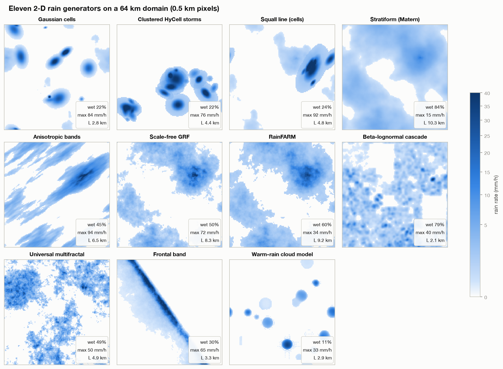
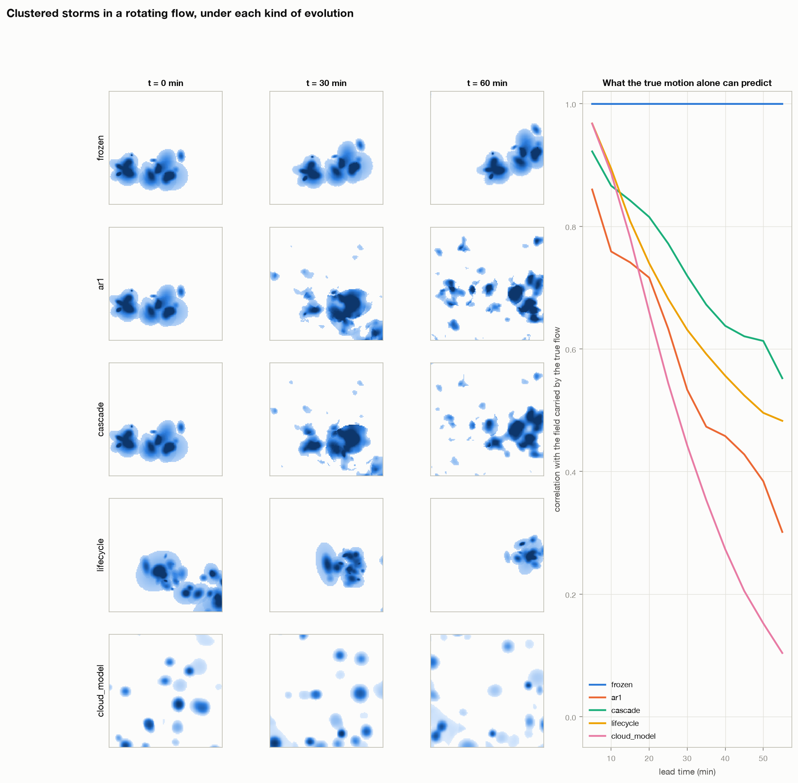
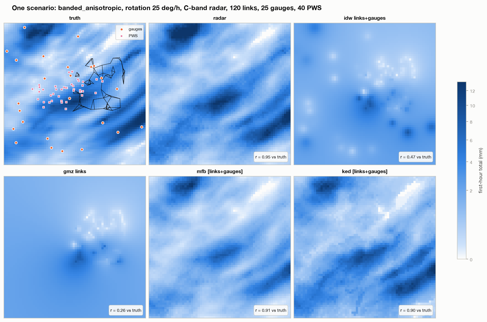
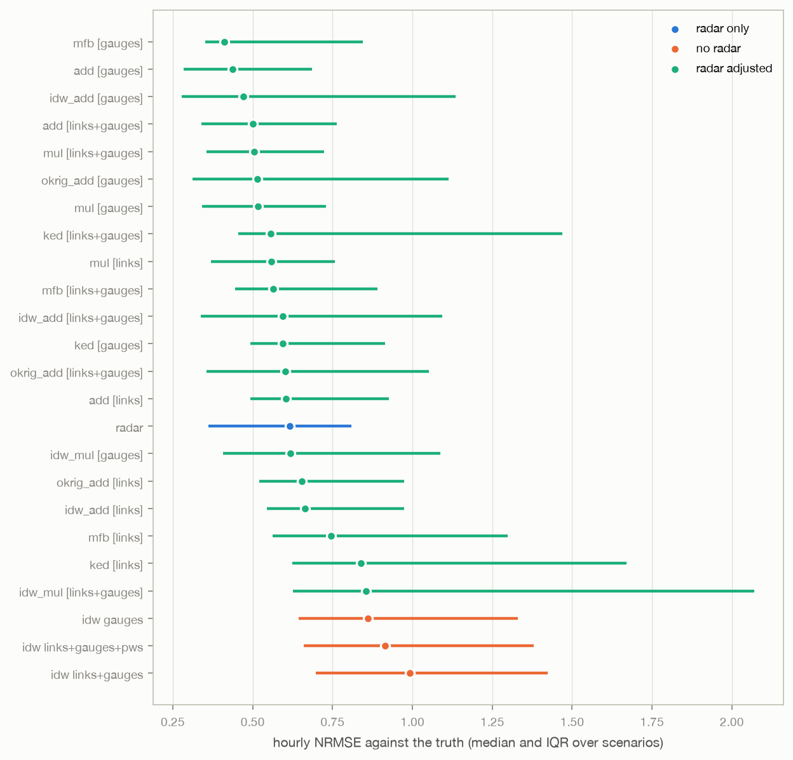
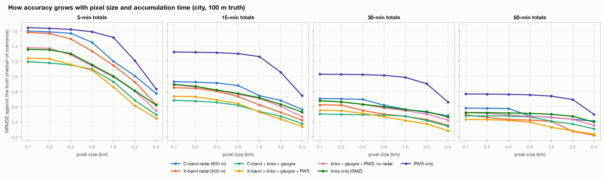
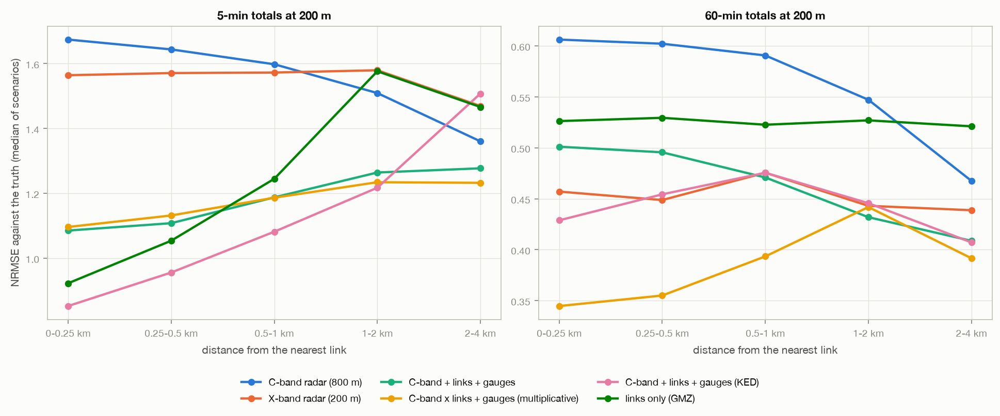
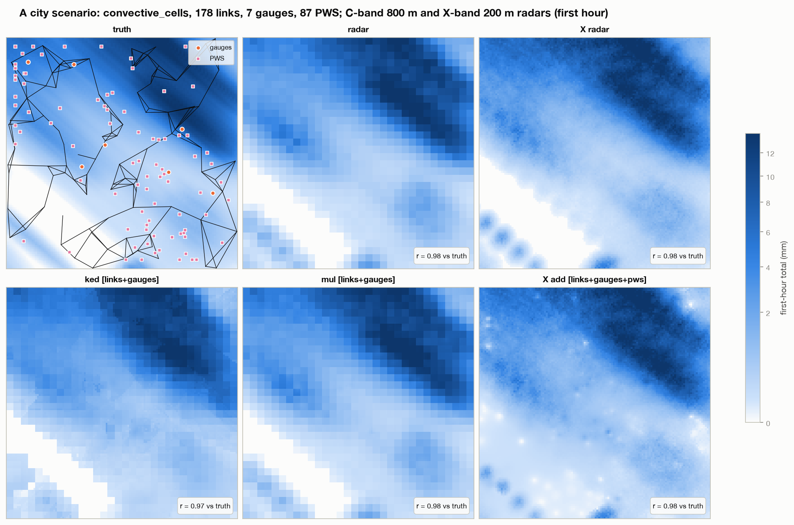
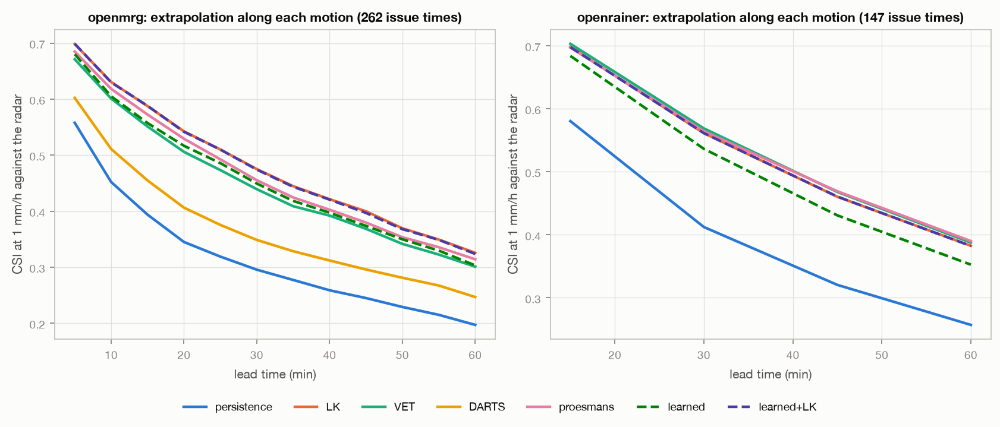
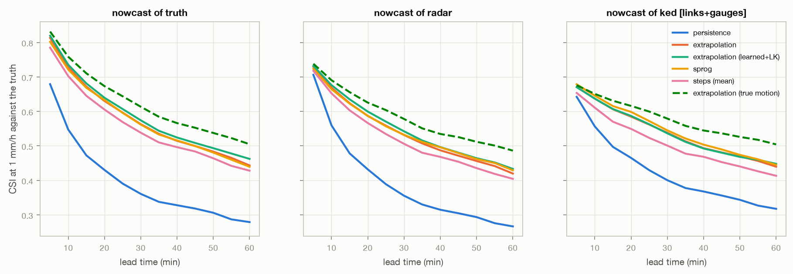

# synthetic_testbed: every FieldSense method against a rain field whose truth is known

**Question.** On real data the truth is never known. Maps are scored against gauges that are
point samples themselves, merged products against the radar they corrected, and motion against
nothing at all. When the rain, its motion and every sensor are simulated, how accurate is each
method - at street level and at city scale, over five minutes and over an hour - and what
improves it most?

The project builds a simulator for that and runs the repository's methods on it unchanged:
2-D rain from ten stochastic models and one physical model, moving in non-uniform flows and
evolving in time, seen by weather radars, commercial microwave links (CMLs), rain gauges and
personal weather stations (PWS) in random numbers. Three studies:

| study | domain and truth | sensors | what is scored |
|---|---|---|---|
| **regional** | 64 km, 500 m, 1 min; 24 random scenarios (+12 of convective cells with a life cycle) | S/C/X radar at 1 km, 19-176 links, 6-50 gauges, 4-60 PWS | 27 map and merging products; 6 motion estimators; 6 nowcasting methods |
| **city** | 25.6 km, **100 m**, 1 min; 9 random scenarios | C-band radar at 800 m, X-band at 200 m, 178-288 links, 2-12 gauges, 22-135 PWS | 30 products from **100 m to 6.4 km and 5 to 60 min**, and by distance to the nearest link |
| **real radar** | OpenMRG (SMHI, 5 min) and OpenRainER (ARPAE, 15 min), 2 km | - | motion learned from simulations, by the nowcast it makes |

## What improves the estimate, and by how much

Each row: one change, everything else equal, median over the scenarios (NRMSE: RMSE / mean of
the truth; lower is better).

| change | from | to | study, scale |
|---|---|---|---|
| radar -> radar adjusted with gauges (additive) | 0.62 | **0.44** (better in 23/24) | regional, 1 km, 1 h |
| radar -> radar adjusted with links + gauges (KED) | 1.60 | **1.12** (-30%) | city, 100 m, 5 min |
| ... within 250 m of a link | 1.67 | **0.85** (-49%) | city, 200 m, 5 min |
| radar -> radar x links + gauges (multiplicative) | 0.58 | **0.39** (-33%) | city, 100 m, 1 h |
| C-band 800 m -> X-band 200 m (attenuation corrected) | 0.58 | **0.49** | city, 100 m, 1 h |
| ... the same X-band, uncorrected | bias -42% | | regional |
| 5-min totals -> hourly totals (KED, links + gauges) | 1.12 | **0.46** | city, 100 m |
| 100 m pixels -> 6.4 km (KED, links + gauges) | 1.12 | **0.51** | city, 5 min |
| CML retrieval without -> with wet/dry classification | bias +31% | **-8%** | regional |
| ... and the KED map made with those links | 0.80 | **0.72** | regional, 1 km, 1 h |
| motion: Lucas-Kanade -> learned correction of it, rotating flow | 12.7 km/h | **6.8 km/h** | regional |
| nowcast: extrapolation along LK -> along the *true* motion | CSI 0.42 | **0.49** | regional, 60 min |

## In short

- **No map resolves a street over five minutes.** In the city, the best map's error at 100 m
  and 5 min is larger than the rain itself (NRMSE 1.12, KED with links and gauges; the radar
  alone 1.60). The error barely changes from 100 to 800 m - every product is effectively a
  ~1 km map - and falls steeply above that: 0.51 at 6.4 km. Over an hour it is 0.38-0.46 even
  at 100 m.
- **Near links, links matter most.** Within 250 m of a link, KED with links and gauges halves
  the radar's error of 5-min totals (0.85 vs 1.67); links alone (GMZ) also beat the radar there
  (0.92). At 1-2 km the gain is a fifth. On real data `radar_adjustment` found the same
  near-link effect.
- **Dense city links help; a city network on a regional domain does not.** In the city (one
  tower per ~9 km^2 over all of it) adjustment with links cuts the radar's 5-min error by a
  quarter to a third. On the 64 km domain the same density covers only part of it: there the
  gauges, spread everywhere, make the best adjustment (0.44 vs 0.62, better in 23 of 24
  scenarios) and links add nothing domain-wide.
- **Which product is best depends on the scale.** For 5-min totals, additive and KED adjustment
  with links lead; for hourly totals, multiplicative adjustment with links and gauges and the
  X-band radar with every sensor (0.38-0.39 at 100 m). A fine radar is worth most for hourly
  totals: at 5 min its sharper but slightly misplaced detail costs as much as it gains.
- **Wet/dry classification decides whether links are usable.** Retrieving every sample turns
  baseline offsets and noise into rain (+31%, up to +152% in a scenario); with the standard
  chain the bias is -8%, and error-free links would improve the maps by little more.
- **Motion: VET on simulations, LK on real radar; DARTS is broken; learning helps as a
  correction.** Against the true flow, VET is best (3.1 km/h from the radar), DARTS
  underestimates the speed by 15-70% even for pure translation. A network trained on the
  simulator's true flow alone is worse than both; trained as a correction to LK it beats
  LK overall (3.5 vs 4.3 km/h), most in rotating and sheared flow, and comes close to VET. On real OpenMRG radar the network trained only
  on simulations nowcasts as well as VET (CSI 0.303 vs 0.301 at 60 min) and better than DARTS
  (0.247); LK is best there (0.326). On OpenRainER, whose 15-min steps lie outside its 5-min
  training, it falls behind (0.353 vs 0.38-0.39); the hybrid ties the classical methods on both.
- **Better motion barely moves the nowcast; perfect motion would.** CSI at 1 mm/h, 60 min,
  from the radar: persistence 0.27, extrapolation 0.42, S-PROG 0.43, STEPS mean 0.40,
  extrapolation along the true motion 0.49. The rest is evolution, which no advection method
  forecasts. For convective cells that are born and die
  (12 more scenarios) the gap to perfect motion doubles (0.26 vs 0.38), and LK beats VET.

## Notebooks

| notebook | what it shows | runtime |
|---|---|---|
| [01 · Generators and motion](notebooks/01_generators_and_motion.ipynb) | every generator and its parameters, flows, evolutions, the cloud model, other fields | ~1 min |
| [02 · The sensors and one scenario](notebooks/02_sensors_and_one_scenario.ipynb) | radar bands and attenuation, why links need wet/dry, gauges and PWS, every map of one scenario | ~2 min |
| [03 · Maps and merging](notebooks/03_maps_and_merging.ipynb) | the regional study: 27 products, regimes, radar bands, links vs gauges, the link counterfactual | < 1 min |
| [04 · Street level](notebooks/04_street_level.ipynb) | the city study: accuracy from 100 m to 6.4 km and 5 to 60 min, and near the links | < 1 min |
| [05 · Motion, learning, nowcasting](notebooks/05_motion_learning_nowcasting.ipynb) | motion against the true flow, the learned estimators, real radar, nowcasts | < 1 min |

The result notebooks read the tables in `results/tables`; [tutorial 10](../../../tutorials/10_simulated_rain_testbed.ipynb)
builds the simulator from scratch.

```bash
python projects/simulation/testbed/src/run.py gallery                   # generators, evolutions (2 min)
python projects/simulation/testbed/src/run.py learn [--prior LK]        # learned motion (~25 min each)
python projects/simulation/testbed/src/run.py regional --n 24           # regional study (~1 h)
python projects/simulation/testbed/src/run.py regional --set lifecycle --n 12 --first-seed 200
python projects/simulation/testbed/src/run.py city --seeds 0:9 --workers 3   # city study (~1 h)
python projects/simulation/testbed/src/run.py real --network openmrg --issue-every 6
python projects/simulation/testbed/src/run.py real --network openrainer --issue-every 4 --skip DARTS
python projects/simulation/testbed/src/run.py links --n 8               # the link counterfactual
python projects/simulation/testbed/src/run.py figures                   # every figure from the tables
```

## The simulator

All of it is in `core/simulation/`, documented in [`core/README.md`](../../../core/README.md).

**Generators** (`generators.py`): every model is a dataclass with `build(grid)`, chosen by name
(`gen.make("squall_line", n_cells=40, profile="hycell")`).

| key | model | reference |
|---|---|---|
| `gaussian_cells` | elliptical cells: Gaussian, exponential or HyCell profiles; uniform or Neyman-Scott clustered in storms; stratiform background; multiplicative small-scale texture | Feral et al. 2003; Cox & Isham 1988 |
| `metagaussian` | Matern / exponential / Gaussian / power-law covariance with anisotropy, mapped to rain with an exact wet fraction and a gamma / lognormal / exponential / Weibull wet distribution | STREAP (Paschalis et al. 2013) |
| `rainfarm` | exponential of a power-law field; stochastic downscaling of a coarse field | Rebora et al. 2006 |
| `cascade` | discrete beta-lognormal multiplicative cascade | Over & Gupta 1996 |
| `multifractal` | universal multifractal, fractionally integrated flux (`alpha`, `C1`, `H`) | Schertzer & Lovejoy 1987 |
| `stratiform`, `convective`, `frontal` | the three models of `rainfall_field_sim` | |
| `cloud_model.WarmRainModel` | vapour, cloud and rain water; condensation in thermals with a life cycle, Kessler microphysics, evaporation, outflow triggering | Kessler 1969 |



`met_fields.py` adds temperature, humidity, pressure, wind and cloud cover; `fields_1d.py`
transects and Bartlett-Lewis / Neyman-Scott point series (`fig03`).

**Motion and evolution** (`flows.py`, `spacetime.py`): uniform, rotating, sheared, deforming
and random divergence-free flows; four evolutions - frozen, AR(1) in the moving frame (STREAP,
SAMPO), a scale-dependent cascade (`tau_j ~ L_j`, as S-PROG and STEPS assume), cells with a life
cycle. The true velocity comes with every sequence. How much of the future the true motion
alone predicts (correlation at 30 / 60 min, `tau` or lifetime 60 min, 4 seeds):

| model | AR(1) | cascade | life cycle |
|---|---|---|---|
| convective_cells | 0.40 / 0.17 | 0.51 / 0.29 | 0.39 / 0.10 |
| clustered_storms | 0.41 / 0.28 | 0.59 / 0.52 | 0.53 / 0.52 |
| squall_line | 0.30 / 0.12 | 0.45 / 0.23 | 0.70 / 0.71 |
| stratiform_matern | 0.61 / 0.46 | 0.81 / 0.66 | |
| multifractal | 0.49 / 0.34 | 0.49 / 0.36 | |
| frontal | 0.93 / 0.92 | 0.93 / 0.91 | |



**Sensors** (`sensors.py`), each reporting accumulations per 5-min interval:

- **radar** - Z-R with spatially correlated DSD noise; two-way attenuation along each ray
  (ITU-R P.838-3 at S, C or X band), optionally corrected as dual polarisation does; beam
  broadening, beam height and overshooting; blockage; averaging to the radar pixel;
  calibration error, noise, a range-dependent detection limit, 0.5 dB quantisation;
- **CMLs** - a backhaul topology at one tower per ~9 km^2; every minute the path integral of
  `k R^alpha`, wet antenna, a drifting baseline offset, noise, quantisation, outages; then the
  standard processing: rolling-std wet/dry, baseline from the preceding dry hour, a deliberately
  mismatched wet-antenna correction, the power law;
- **gauges** - 0.2 mm tipping buckets, ~5% undercatch; **PWS** - 0.1 mm, ~15% undercatch with a
  wide spread, 5% dead and 8% stuck at zero (no quality control is applied: the holes they leave
  in a map are visible in `fig11`).

`scenario.py` hands everything over as the xarray data `core.maps` and `core.nowcast` read from
real networks; `benchmark.py` runs and scores every method.



## The regional study

27 products per scenario: the radar; IDW of gauges, links, both and all; GMZ of links; the radar
adjusted with gauges, links or both by mean-field bias, additive and multiplicative IDW
(`core.maps.merge`) and by mergeplg's additive / multiplicative IDW, ordinary kriging of the
difference and KED (`core.maps.mergeplg_methods`). Hourly totals, median of 24 scenarios:

| method | NRMSE | beats the radar in | correlation | bias | CSI (1 mm) |
|---|---|---|---|---|---|
| mfb [gauges] | 0.41 | 62% | 0.89 | -7% | 0.87 |
| add [gauges] | 0.44 | 96% | 0.93 | 0% | 0.87 |
| add [links+gauges] | 0.50 | 75% | 0.92 | -2% | 0.83 |
| mul [links+gauges] | 0.51 | 96% | 0.93 | -4% | 0.86 |
| mul [gauges] | 0.52 | **100%** | 0.92 | -2% | 0.87 |
| ked [gauges] / [links+gauges] | 0.59 / 0.56 | 38% | 0.89 / 0.85 | +26% / +18% | 0.73 / 0.77 |
| **radar** | **0.62** | - | 0.92 | -3% | 0.85 |
| add [links] | 0.60 | 42% | 0.87 | +2% | 0.77 |
| idw gauges (no radar) | 0.86 | 17% | 0.66 | -10% | 0.65 |
| gmz links / idw links (no radar) | 1.16 / 1.16 | 0% | 0.18 | 0% | 0.36 |
| idw_mul [links] (mergeplg) | 2.52 | 0% | 0.55 | +36% | 0.67 |

Convective and organised rain is two to three times harder than widespread rain for every
method (radar 1.31 vs 0.46); an uncorrected X-band radar reads 42% low (NRMSE 0.79 vs 0.53
for C-band). mergeplg's multiplicative IDW with links breaks down without range checks, as
`radar_adjustment` found on real data.



**What the links' errors cost** (`run.py links`, the first 8 scenarios with the links processed
three ways; hourly NRMSE, radar 0.74 on these):

| links | path-average bias | add [links] | add [links+gauges] | ked [links+gauges] |
|---|---|---|---|---|
| every sample retrieved, no wet/dry | +31% | 0.73 | 0.57 | 0.80 |
| the study's chain | -8% | 0.65 | 0.58 | 0.72 |
| error-free | 0% | 0.69 | 0.56 | 0.72 |

With gauges alone the additive adjustment is 0.59 here: on this domain even perfect links add
little, because they are where the city is.

## The city study: street level

A 25.6 km city, 100 m and 1 min of truth (cell models with a small-scale texture so the rain
has structure at the street scale), two radars, a dense link network, gauges and PWS. Every map
on a 200 m grid every 5 min, scored at 100 m (each map pixel read for its four street pixels)
to 6.4 km, and over 5 to 60 min. Median NRMSE of 9 scenarios:

| product | 5 min, 100 m | 5 min, 800 m | 5 min, 6.4 km | 60 min, 100 m | 60 min, 800 m | 60 min, 6.4 km |
|---|---|---|---|---|---|---|
| C-band radar, 800 m | 1.60 | 1.45 | 0.77 | 0.58 | 0.48 | 0.41 |
| X-band radar, 200 m, corrected | 1.58 | 1.33 | 0.63 | 0.49 | 0.42 | 0.22 |
| C-band + links + gauges, KED | **1.12** | **1.01** | 0.51 | 0.46 | 0.42 | 0.34 |
| C-band + links + gauges, additive | 1.19 | 1.09 | 0.49 | 0.48 | 0.46 | 0.31 |
| C-band x links + gauges, multiplicative | 1.19 | 1.10 | 0.51 | 0.39 | 0.37 | 0.28 |
| C-band + links + gauges + PWS, additive | 1.18 | 1.08 | **0.44** | 0.41 | 0.40 | 0.25 |
| X-band x links + gauges + PWS, multiplicative | 1.31 | 1.13 | 0.48 | **0.38** | **0.34** | **0.17** |
| links + gauges + PWS, no radar | 1.38 | 1.14 | 0.54 | 0.52 | 0.47 | 0.35 |
| links only, GMZ | 1.36 | 1.15 | 0.62 | 0.52 | 0.51 | 0.40 |
| PWS only | 1.64 | 1.59 | 0.83 | 0.77 | 0.75 | 0.50 |



By distance from the nearest link (200 m pixels; bands holding at least 2% of the city):

| | 5 min: < 250 m | 0.5-1 km | 1-2 km | 60 min: < 250 m | 0.5-1 km | 1-2 km |
|---|---|---|---|---|---|---|
| C-band radar | 1.67 | 1.60 | 1.51 | 0.61 | 0.59 | 0.55 |
| KED, links + gauges | **0.85** | 1.08 | 1.22 | 0.43 | 0.48 | 0.45 |
| multiplicative, links + gauges | 1.10 | 1.19 | 1.23 | **0.34** | 0.39 | 0.44 |
| links only, GMZ | 0.92 | 1.24 | 1.58 | 0.53 | 0.52 | 0.53 |





## Motion and nowcasting

Median endpoint error where it rains (km/h), from the last four 5-min fields, regional study:

| product | LK | VET | DARTS | Proesmans | learned | learned+LK |
|---|---|---|---|---|---|---|
| truth | 4.2 | **2.4** | 14.7 | 9.3 | 6.5 | 3.2 |
| radar | 4.3 | **3.1** | 14.9 | 10.9 | 7.1 | 3.5 |
| KED, links + gauges | 5.2 | 5.1 | 20.8 | 17.6 | 8.0 | 4.7 |
| IDW of links | 23.3 | 67.2 | 28.6 | 44.3 | 31.9 | 23.5 |

From the radar, by flow (LK / VET / learned+LK): uniform 1.4 / 2.3 / 1.3; rotation 12.7 / 4.7 /
6.8; shear 9.9 / 6.6 / 7.1; random 6.3 / 4.6 / 5.4. A link-only map has no motion of its own
(20-70 km/h off), as `os_nowcasting` concluded on real data.

**The learned estimators** (`core/nowcast/learned_motion.py`): a U-Net trained on 700 simulated
sequences (2,796 samples; random generator, flow, evolution and pixel size, degraded like a
sensor would) with their true flow. Validation error 1.32 px/step from the fields alone, 0.70
as a correction to LK (LK alone: 1.91). Case by case from the radar, `learned+LK` beats LK
(better in 62%) and ties VET (better in 49%).

**On real radar** each motion field is judged by the extrapolation it makes, scored against the
radar that followed (CSI at 1 mm/h):

| CSI at 1 mm/h, 15 / 30 / 60 min | OpenMRG, 5 min, 262 issue times | OpenRainER, 15 min, 147 issue times |
|---|---|---|
| persistence | 0.39 / 0.30 / 0.20 | 0.58 / 0.41 / 0.26 |
| LK | **0.59 / 0.48 / 0.33** | 0.70 / 0.56 / 0.38 |
| VET | 0.55 / 0.44 / 0.30 | **0.70 / 0.57 / 0.39** |
| Proesmans | 0.57 / 0.46 / 0.31 | 0.70 / 0.56 / **0.39** |
| DARTS | 0.45 / 0.35 / 0.25 | (not run: slow on this grid, broken above) |
| learned (simulations only) | 0.56 / 0.45 / 0.30 | 0.68 / 0.54 / 0.35 |
| learned+LK | 0.59 / 0.47 / 0.32 | 0.70 / 0.56 / 0.38 |

A motion network that has never seen real radar nowcasts the 5-min SMHI radar as well as VET
and Proesmans; at 15-min steps - displacements larger than in its training - it does not. The
correction network inherits LK's quality on both and adds nothing measurable there: on real
radar the flows are smooth enough for LK.



**Nowcasts against the truth** (regional; CSI at 1 mm/h, 30 / 60 min):

| method | truth | radar | KED, links + gauges |
|---|---|---|---|
| persistence | 0.36 / 0.28 | 0.36 / 0.27 | 0.40 / 0.32 |
| extrapolation (LK) | 0.56 / 0.44 | 0.53 / 0.42 | 0.54 / 0.44 |
| extrapolation (learned+LK) | 0.57 / 0.46 | 0.54 / 0.43 | 0.54 / 0.45 |
| S-PROG | 0.56 / 0.44 | 0.53 / 0.43 | 0.54 / 0.44 |
| STEPS, mean of 8 | 0.54 / 0.43 | 0.51 / 0.40 | 0.50 / 0.41 |
| extrapolation along the true motion | 0.61 / 0.50 | 0.58 / 0.49 | 0.58 / 0.50 |



**Convective cells with a life cycle** (`run.py regional --set lifecycle`, 12 scenarios of
cells, clustered storms and squall lines whose cells are born, grow and decay over 30-90 min):
every method is worse (hourly NRMSE: radar 1.04, the best adjustment - multiplicative with
gauges - 0.84, additive with links and gauges 0.85); LK estimates the motion better than VET
(4.0 vs 5.5 km/h from the radar; learned+LK 4.4), because cells appearing and vanishing break the
smooth-field assumption VET relies on; and the nowcast loses more to imperfect motion:

| CSI at 1 mm/h, 30 / 60 min, from the radar | |
|---|---|
| persistence | 0.18 / 0.12 |
| extrapolation (LK) | 0.40 / 0.26 |
| extrapolation (learned+LK) | 0.41 / 0.26 |
| S-PROG | 0.42 / 0.27 |
| STEPS, mean of 8 | 0.38 / 0.24 |
| extrapolation along the true motion | 0.48 / 0.38 |

## Caveats

- 24 + 12 regional and 9 city scenarios: the medians are stable, splits by regime are not.
- The multifractal generator was fixed in October 2026 (it filtered the stable noise with the
  wrong exponent, so its fields were too smooth: K(2) 0.08 instead of 0.17). Its fields are now
  rougher and less predictable (correlation at 60 min 0.34-0.36, was 0.40-0.60). Every study was
  rerun; 4 of the 24 regional scenarios are multifractal. The learned motion networks, retrained
  on the corrected simulations, improved: the LK correction now beats LK (3.5 vs 4.3 km/h from
  the radar). Map rankings and the other findings are unchanged.
- Sensor parameters are plausible, not fitted to a network; the radar's calibration error is
  random per scenario. PWS are used without quality control.
- Maps are made on 1 km (regional) and 200 m (city) grids; at 100 m each pixel is read as its
  map pixel. Scores are on every cell, not at gauges.
- The learned motion is trained on the same generators it is tested on (other seeds, flows and
  evolutions); on real radar it is judged only through extrapolation nowcasts.

## Layout

```
synthetic_testbed/
├── notebooks/                 # 01-05, executed
├── src/
│   ├── run.py                 # gallery | learn | regional | city | real | links | figures
│   └── synthetic_testbed/
│       ├── settings.py        # paths and study designs
│       ├── gallery.py         # what the generators make
│       ├── regional.py        # the 64 km study (mixed and life-cycle sets)
│       ├── city.py            # the street-level study
│       ├── learned.py         # learned motion: training, real radar
│       ├── links.py           # the link counterfactual
│       └── figures.py
└── results/
    ├── figures/               # fig01-fig11
    ├── tables/                # CSV of every study (not committed)
    └── models/                # trained networks and their training data (not committed)
```

The simulator, sensors and scoring are in `core/simulation/`, the learned motion in
`core/nowcast/learned_motion.py`, the tests in `tests/test_simulation_testbed.py`.

## References

- Bowler, N. E., Pierce, C. E. and Seed, A. W. (2006). STEPS. *Q. J. R. Meteorol. Soc.* 132, 2127-2155.
- Cox, D. R. and Isham, V. (1988). A simple spatial-temporal model of rainfall. *Proc. R. Soc. Lond. A* 415, 317-328.
- Feral, L., Sauvageot, H., Castanet, L. and Lemorton, J. (2003). HYCELL - A new hybrid model of the rain horizontal distribution for propagation studies: 1. *Radio Sci.* 38, doi:10.1029/2002RS002802.
- Kessler, E. (1969). On the distribution and continuity of water substance in atmospheric circulations. *Meteor. Monogr.* 10(32).
- Leblois, E. and Creutin, J.-D. (2013). Space-time simulation of intermittent rainfall with prescribed advection field (SAMPO). *Water Resour. Res.* 49, 3375-3387.
- Over, T. M. and Gupta, V. K. (1996). A space-time theory of mesoscale rainfall using random cascades. *J. Geophys. Res.* 101, 26319-26331.
- Paschalis, A., Molnar, P., Fatichi, S. and Burlando, P. (2013). A stochastic model for high-resolution space-time precipitation simulation (STREAP). *Water Resour. Res.* 49, 8400-8417.
- Rebora, N., Ferraris, L., von Hardenberg, J. and Provenzale, A. (2006). RainFARM: rainfall downscaling by a filtered autoregressive model. *J. Hydrometeor.* 7, 724-738.
- Schertzer, D. and Lovejoy, S. (1987). Physical modeling and analysis of rain and clouds by anisotropic scaling multiplicative processes. *J. Geophys. Res.* 92, 9693-9714.
- Schleiss, M. and Berne, A. (2010). Identification of dry and rainy periods using telecommunication microwave links. *IEEE GRSL* 7, 611-615.
- Seed, A. W. (2003). A dynamic and spatial scaling approach to advection forecasting (S-PROG). *J. Appl. Meteor.* 42, 381-388.
- Venugopal, V., Foufoula-Georgiou, E. and Sapozhnikov, V. (1999). Evidence of dynamic scaling in space-time rainfall. *J. Geophys. Res.* 104, 31599-31610.
